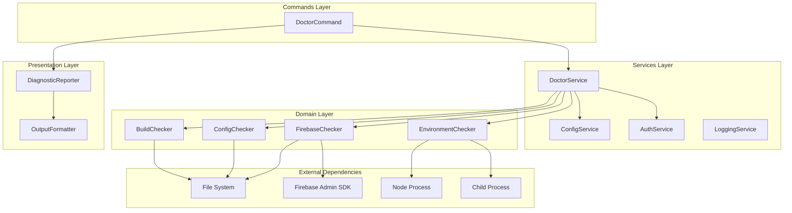
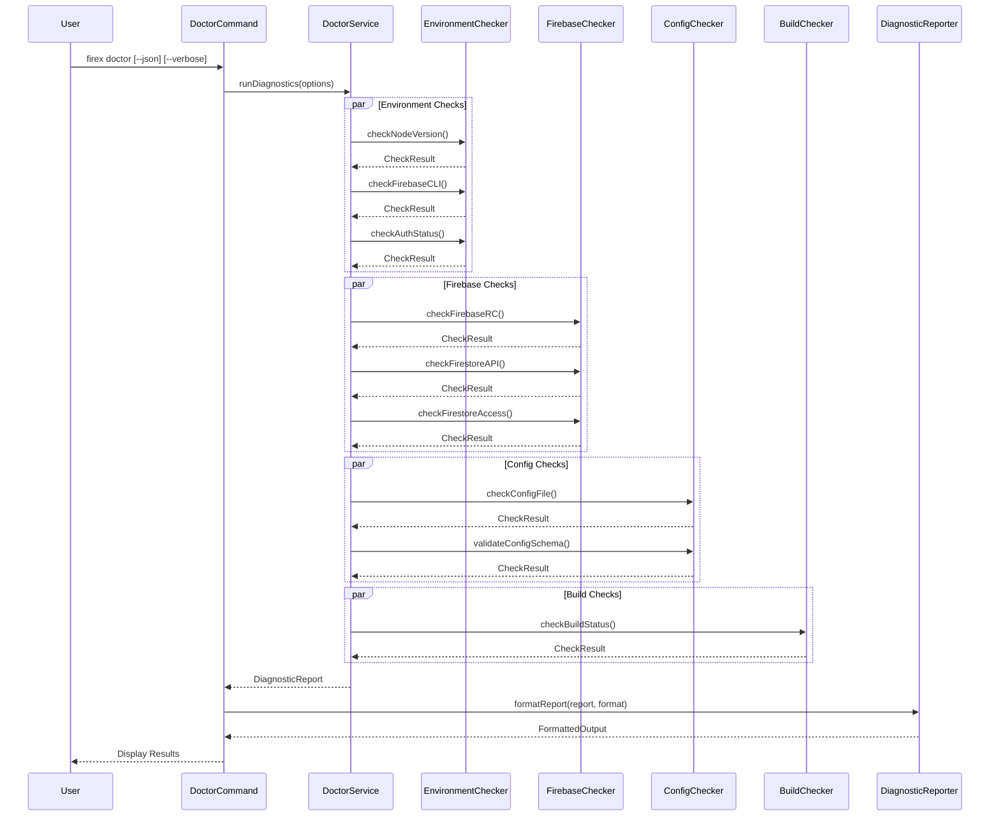
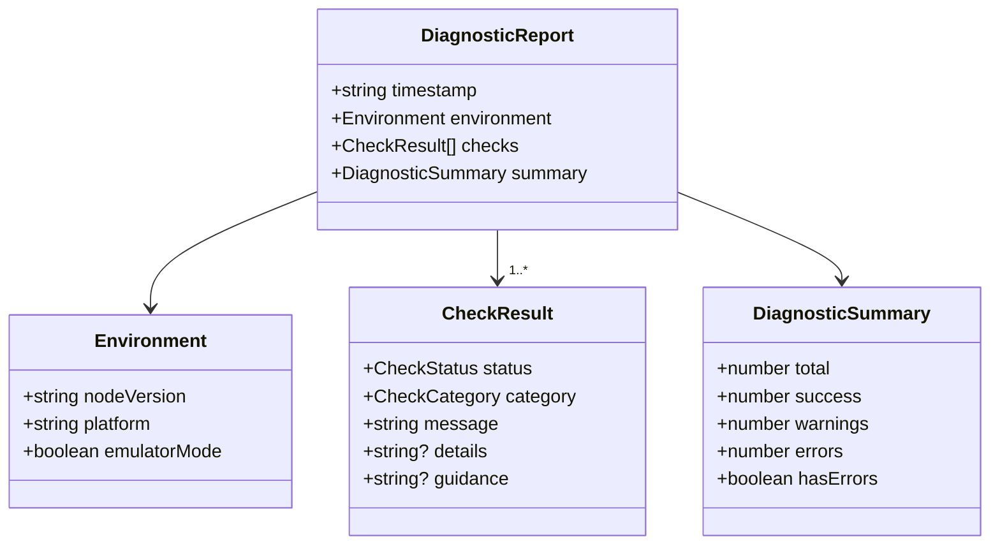

# Design: doctor-command

## Overview

**Purpose**: `firex doctor` コマンドは、firex CLI の実行環境と設定の健全性を診断する機能を提供する。開発者が firex を使用する前に、必要な前提条件（Node.js、Firebase CLI、認証、プロジェクト設定、設定ファイル）が満たされているかを確認し、問題がある場合は具体的な診断結果と修正方法を提示する。

**Users**: firex を使用する開発者および DevOps エンジニアが、環境セットアップの問題を迅速に特定・解決するために使用する。

**Impact**: 既存のコマンド体系に新しい診断コマンドを追加。既存コンポーネント（ConfigService、AuthService）を活用しつつ、新規の DoctorService を導入する。

### Goals

- 環境要件（Node.js、Firebase CLI、認証状態）の自動検証
- Firebase プロジェクト設定（.firebaserc、Firestore API、アクセス権限）の検証
- firex 設定ファイル（.firex.yaml/.firex.json）の構文・スキーマ検証
- ビルド状態の検証（開発環境向け）
- エミュレータ環境への対応
- 明確なステータス表示と修正ガイダンスの提供

### Non-Goals

- MCP 関連のチェック（対象外と明記されている）
- 自動修復機能（診断と報告のみ）
- ネットワーク診断（Firestore 接続テスト以外）
- 他の Firebase サービス（Functions、Storage 等）のチェック

## Architecture

### Existing Architecture Analysis

現在の firex アーキテクチャは以下のレイヤー構成を持つ:

- **Commands Layer**: oclif ベースの CLI コマンド（BaseCommand を継承）
- **Services Layer**: ConfigService、AuthService、LoggingService、ErrorHandler
- **Domain Layer**: FirestoreOps、QueryBuilder 等のビジネスロジック
- **Presentation Layer**: OutputFormatter、PromptService
- **Shared Layer**: types.ts、i18n.ts

doctor コマンドは既存のパターンに従い、新規の DoctorService を Services Layer に追加する。

### Architecture Pattern & Boundary Map



**Architecture Integration**:
- **Selected pattern**: レイヤードアーキテクチャ（既存パターン維持）
- **Domain/feature boundaries**: DoctorService が各 Checker を統合、各 Checker は単一責任
- **Existing patterns preserved**: BaseCommand 継承、Result 型、i18n、OutputFormatter
- **New components rationale**: Checker の分離により、テスト容易性と拡張性を確保
- **Steering compliance**: TypeScript Strict、neverthrow、cosmiconfig パターン維持

### Technology Stack

| Layer | Choice / Version | Role in Feature | Notes |
|-------|------------------|-----------------|-------|
| CLI Framework | oclif 3.x | DoctorCommand 実装 | BaseCommand 継承 |
| Validation | zod 4.x | 設定ファイルスキーマ検証 | 既存依存関係 |
| Error Handling | neverthrow 7.x | Result 型による型安全なエラー処理 | 既存パターン |
| Firebase | firebase-admin 13.x | 認証・Firestore 接続テスト | 既存依存関係 |
| Output | cli-table3, yaml | 診断結果の整形出力 | 既存依存関係 |

## System Flows

### Diagnostic Flow



**Flow decisions**:
- 各チェックは独立して実行可能（部分的な失敗を許容）
- エミュレータモード検出時は本番認証チェックをスキップ
- `--verbose` 時は各チェックの詳細ログを出力
- 終了コード: エラーあり=1、警告のみ=0、全て成功=0

## Requirements Traceability

| Requirement | Summary | Components | Interfaces | Flows |
|-------------|---------|------------|------------|-------|
| 1.1 | Node.js バージョン検出・検証 | EnvironmentChecker | checkNodeVersion() | Diagnostic Flow |
| 1.2 | Firebase CLI 検出 | EnvironmentChecker | checkFirebaseCLI() | Diagnostic Flow |
| 1.3 | Firebase CLI 未インストール時の警告 | DiagnosticReporter | formatWarning() | Diagnostic Flow |
| 1.4 | Firebase 認証状態確認 | EnvironmentChecker | checkAuthStatus() | Diagnostic Flow |
| 1.5 | 認証情報なし時のガイダンス | DiagnosticReporter | formatAuthGuidance() | Diagnostic Flow |
| 2.1 | .firebaserc 存在確認 | FirebaseChecker | checkFirebaseRC() | Diagnostic Flow |
| 2.2 | プロジェクト ID 読み取り | FirebaseChecker | checkFirebaseRC() | Diagnostic Flow |
| 2.3 | .firebaserc 不在時の警告 | DiagnosticReporter | formatWarning() | Diagnostic Flow |
| 2.4 | Firestore API 有効化確認 | FirebaseChecker | checkFirestoreAPI() | Diagnostic Flow |
| 2.5 | Firestore API 無効時の手順表示 | DiagnosticReporter | formatAPIGuidance() | Diagnostic Flow |
| 2.6 | Firestore アクセス権限テスト | FirebaseChecker | checkFirestoreAccess() | Diagnostic Flow |
| 2.7 | 権限不足時のガイダンス | DiagnosticReporter | formatPermissionGuidance() | Diagnostic Flow |
| 3.1 | 設定ファイル存在確認 | ConfigChecker | checkConfigFile() | Diagnostic Flow |
| 3.2 | 設定ファイル構文検証 | ConfigChecker | validateConfigSyntax() | Diagnostic Flow |
| 3.3 | 構文エラー詳細表示 | DiagnosticReporter | formatSyntaxError() | Diagnostic Flow |
| 3.4 | スキーマバリデーション | ConfigChecker | validateConfigSchema() | Diagnostic Flow |
| 3.5 | スキーマ違反詳細表示 | DiagnosticReporter | formatSchemaError() | Diagnostic Flow |
| 3.6 | コレクションパス形式検証 | ConfigChecker | validateCollectionPaths() | Diagnostic Flow |
| 3.7 | 設定ファイル不在時の情報表示 | DiagnosticReporter | formatInfo() | Diagnostic Flow |
| 4.1 | dist ディレクトリ確認 | BuildChecker | checkBuildStatus() | Diagnostic Flow |
| 4.2 | ソース/ビルドタイムスタンプ比較 | BuildChecker | checkBuildStatus() | Diagnostic Flow |
| 4.3 | リビルド必要時の警告 | DiagnosticReporter | formatWarning() | Diagnostic Flow |
| 4.4 | npm パッケージ時のスキップ | BuildChecker | checkBuildStatus() | Diagnostic Flow |
| 5.1 | ステータスアイコン付き結果表示 | DiagnosticReporter | formatCheckResult() | Diagnostic Flow |
| 5.2 | サマリー表示 | DiagnosticReporter | formatSummary() | Diagnostic Flow |
| 5.3 | 全成功時のメッセージ | DiagnosticReporter | formatSummary() | Diagnostic Flow |
| 5.4 | 問題数と重要度の表示 | DiagnosticReporter | formatSummary() | Diagnostic Flow |
| 5.5 | 終了コード制御 | DoctorCommand | run() | Diagnostic Flow |
| 5.6 | JSON 出力対応 | DiagnosticReporter | formatAsJSON() | Diagnostic Flow |
| 5.7 | verbose ログ出力 | DoctorCommand, DoctorService | run(), runDiagnostics() | Diagnostic Flow |
| 6.1 | エミュレータモード検出 | DoctorService | detectEmulatorMode() | Diagnostic Flow |
| 6.2 | エミュレータ時の認証スキップ | DoctorService | runDiagnostics() | Diagnostic Flow |
| 6.3 | エミュレータ接続テスト | FirebaseChecker | checkEmulatorConnection() | Diagnostic Flow |
| 6.4 | エミュレータ接続失敗時のガイダンス | DiagnosticReporter | formatEmulatorGuidance() | Diagnostic Flow |

## Components and Interfaces

| Component | Domain/Layer | Intent | Req Coverage | Key Dependencies | Contracts |
|-----------|--------------|--------|--------------|------------------|-----------|
| DoctorCommand | Commands | CLI エントリーポイント | 5.5, 5.7 | DoctorService (P0), DiagnosticReporter (P0) | - |
| DoctorService | Services | 診断統合・実行 | 6.1, 6.2 | EnvironmentChecker (P0), FirebaseChecker (P0), ConfigChecker (P0), BuildChecker (P1) | Service |
| EnvironmentChecker | Domain | 環境要件チェック | 1.1-1.5 | - | Service |
| FirebaseChecker | Domain | Firebase 設定チェック | 2.1-2.7, 6.3 | AuthService (P0) | Service |
| ConfigChecker | Domain | 設定ファイルチェック | 3.1-3.7 | ConfigService (P0) | Service |
| BuildChecker | Domain | ビルド状態チェック | 4.1-4.4 | - | Service |
| DiagnosticReporter | Presentation | 診断結果整形 | 5.1-5.6, Various Guidance | OutputFormatter (P0) | Service |

### Commands Layer

#### DoctorCommand

| Field | Detail |
|-------|--------|
| Intent | firex doctor コマンドの CLI エントリーポイント |
| Requirements | 5.5, 5.7 |

**Responsibilities & Constraints**
- BaseCommand を継承し、oclif コマンドパターンに従う
- フラグ解析（--json, --verbose）とオプション構築
- DoctorService への診断委譲と結果の出力
- 終了コードの制御（エラー=1、警告のみ/成功=0）

**Dependencies**
- Inbound: CLI user invocation
- Outbound: DoctorService - 診断実行 (P0)
- Outbound: DiagnosticReporter - 結果整形 (P0)

**Contracts**: Service [ ]

##### Service Interface

```typescript
// DoctorCommand extends BaseCommand (no additional service interface)
// Uses inherited patterns from BaseCommand

interface DoctorCommandFlags {
  json: boolean;
  verbose: boolean;
}
```

### Services Layer

#### DoctorService

| Field | Detail |
|-------|--------|
| Intent | 診断ロジックの統合と実行制御 |
| Requirements | 6.1, 6.2 |

**Responsibilities & Constraints**
- 各 Checker の実行順序とエラーハンドリング
- エミュレータモード検出と条件分岐
- 診断結果の集約

**Dependencies**
- Inbound: DoctorCommand - 診断実行要求 (P0)
- Outbound: EnvironmentChecker - 環境チェック (P0)
- Outbound: FirebaseChecker - Firebase チェック (P0)
- Outbound: ConfigChecker - 設定チェック (P0)
- Outbound: BuildChecker - ビルドチェック (P1)
- External: process.env - エミュレータ検出

**Contracts**: Service [x]

##### Service Interface

```typescript
interface DoctorServiceOptions {
  verbose: boolean;
  skipBuildCheck?: boolean;
}

interface DoctorService {
  runDiagnostics(options: DoctorServiceOptions): Promise<Result<DiagnosticReport, DoctorError>>;
  detectEmulatorMode(): boolean;
}
```
- Preconditions: なし（環境検証が目的のため）
- Postconditions: DiagnosticReport に全チェック結果が含まれる
- Invariants: 各チェッカーの失敗が他のチェックに影響しない

### Domain Layer

#### EnvironmentChecker

| Field | Detail |
|-------|--------|
| Intent | Node.js、Firebase CLI、認証状態の検証 |
| Requirements | 1.1, 1.2, 1.3, 1.4, 1.5 |

**Responsibilities & Constraints**
- Node.js バージョン検出と最小要件（18.0.0）の検証
- Firebase CLI のインストール状態とバージョン検出
- 認証状態（ADC、サービスアカウント）の確認

**Dependencies**
- External: process.version - Node.js バージョン
- External: child_process - Firebase CLI 実行
- External: fs - 認証ファイル確認

**Contracts**: Service [x]

##### Service Interface

```typescript
interface CheckResult {
  status: 'success' | 'warning' | 'error';
  category: CheckCategory;
  message: string;
  details?: string;
  guidance?: string;
}

type CheckCategory =
  | 'node-version'
  | 'firebase-cli'
  | 'auth-status'
  | 'firebaserc'
  | 'firestore-api'
  | 'firestore-access'
  | 'config-file'
  | 'config-syntax'
  | 'config-schema'
  | 'collection-paths'
  | 'build-status'
  | 'emulator-connection';

interface EnvironmentChecker {
  checkNodeVersion(): Result<CheckResult, CheckerError>;
  checkFirebaseCLI(): Promise<Result<CheckResult, CheckerError>>;
  checkAuthStatus(): Result<CheckResult, CheckerError>;
}
```
- Preconditions: Node.js 環境で実行されている
- Postconditions: CheckResult に検出結果とガイダンスが含まれる

#### FirebaseChecker

| Field | Detail |
|-------|--------|
| Intent | Firebase プロジェクト設定と Firestore 接続の検証 |
| Requirements | 2.1, 2.2, 2.3, 2.4, 2.5, 2.6, 2.7, 6.3 |

**Responsibilities & Constraints**
- .firebaserc ファイルの存在確認とプロジェクト ID 抽出
- Firestore API 有効化状態の確認
- Firestore データベースへのアクセス権限テスト
- エミュレータ接続テスト

**Dependencies**
- Outbound: AuthService - Firestore インスタンス取得 (P0)
- External: fs - .firebaserc 読み込み
- External: firebase-admin - Firestore 接続テスト

**Contracts**: Service [x]

##### Service Interface

```typescript
interface FirebaseChecker {
  checkFirebaseRC(searchPath?: string): Promise<Result<CheckResult, CheckerError>>;
  checkFirestoreAPI(projectId: string): Promise<Result<CheckResult, CheckerError>>;
  checkFirestoreAccess(config: Config): Promise<Result<CheckResult, CheckerError>>;
  checkEmulatorConnection(host: string): Promise<Result<CheckResult, CheckerError>>;
}
```
- Preconditions: checkFirestoreAccess は有効な Config が必要
- Postconditions: 接続テスト結果とエラー詳細が含まれる

##### Implementation Notes

**checkFirestoreAPI vs checkFirestoreAccess の責務分離**:

| メソッド | 目的 | 実装方法 | 成功条件 |
|---------|------|----------|----------|
| `checkFirestoreAPI()` | Firestore API が有効化されているか確認 | `listCollections()` を呼び出し、API エラーを検出 | API が有効で呼び出し可能 |
| `checkFirestoreAccess()` | 認証情報でアクセス権限があるか確認 | `listCollections()` の結果を評価 | 権限エラーなしでコレクション一覧取得可能 |

**checkFirestoreAPI の実装方針**:
- 既存の AuthService パターン（`listCollections()` による接続検証）を再利用
- API が無効の場合: `PERMISSION_DENIED` または `NOT_FOUND` エラー → error ステータス + 有効化手順を guidance に含める
- API が有効の場合: success ステータス

**checkFirestoreAccess の実装方針**:
- checkFirestoreAPI が成功した後に実行
- 権限不足の場合: `PERMISSION_DENIED` エラー → error ステータス + IAM ロール設定手順を guidance に含める
- 権限あり: success ステータス + 検出されたコレクション数を details に含める

#### ConfigChecker

| Field | Detail |
|-------|--------|
| Intent | firex 設定ファイルの検証 |
| Requirements | 3.1, 3.2, 3.3, 3.4, 3.5, 3.6, 3.7 |

**Responsibilities & Constraints**
- .firex.yaml / .firex.json の存在確認
- YAML/JSON 構文の検証
- zod スキーマによるバリデーション
- コレクションパス形式の検証

**Dependencies**
- Outbound: ConfigService - 設定ファイル探索 (P0)
- External: zod - スキーマ検証
- External: yaml - YAML パース

**Contracts**: Service [x]

##### Service Interface

```typescript
interface ConfigChecker {
  checkConfigFile(searchPath?: string): Promise<Result<CheckResult, CheckerError>>;
  validateConfigSyntax(filePath: string): Result<CheckResult, CheckerError>;
  validateConfigSchema(config: unknown): Result<CheckResult, CheckerError>;
  validateCollectionPaths(paths: string[]): Result<CheckResult, CheckerError>;
}
```
- Preconditions: validateConfigSyntax は有効なファイルパスが必要
- Postconditions: 構文/スキーマエラーの位置と内容が詳細に含まれる

#### BuildChecker

| Field | Detail |
|-------|--------|
| Intent | ビルド状態の検証（開発環境向け） |
| Requirements | 4.1, 4.2, 4.3, 4.4 |

**Responsibilities & Constraints**
- dist/ ディレクトリの存在確認
- ソースファイルとビルドファイルのタイムスタンプ比較
- npm パッケージインストール時のスキップ判定

**Dependencies**
- External: fs - ファイルシステム操作

**Contracts**: Service [x]

##### Service Interface

```typescript
interface BuildChecker {
  checkBuildStatus(projectRoot?: string): Promise<Result<CheckResult, CheckerError>>;
  isNpmPackageInstall(): boolean;
}
```
- Preconditions: なし
- Postconditions: npm パッケージ時は常に success

### Presentation Layer

#### DiagnosticReporter

| Field | Detail |
|-------|--------|
| Intent | 診断結果の整形と出力 |
| Requirements | 5.1, 5.2, 5.3, 5.4, 5.6, Various Guidance |

**Responsibilities & Constraints**
- ステータスアイコン付きの結果表示
- サマリー生成（問題数、重要度）
- JSON/通常テキストフォーマット対応
- 各種ガイダンスメッセージの生成

**Dependencies**
- Outbound: OutputFormatter - JSON/YAML 整形 (P0)
- External: i18n - 日本語/英語メッセージ

**Contracts**: Service [x]

##### Service Interface

```typescript
interface DiagnosticReport {
  timestamp: string;
  environment: {
    nodeVersion: string;
    platform: string;
    emulatorMode: boolean;
  };
  checks: CheckResult[];
  summary: DiagnosticSummary;
}

interface DiagnosticSummary {
  total: number;
  success: number;
  warnings: number;
  errors: number;
  hasErrors: boolean;
}

interface DiagnosticReporter {
  formatReport(report: DiagnosticReport, format: 'text' | 'json'): Result<string, FormatError>;
  formatCheckResult(result: CheckResult): string;
  formatSummary(summary: DiagnosticSummary): string;
}
```
- Preconditions: DiagnosticReport が有効
- Postconditions: 整形された出力文字列

## Data Models

### Domain Model



**Business Rules & Invariants**:
- CheckResult.status は 'success' | 'warning' | 'error' のいずれか
- DiagnosticSummary.hasErrors は errors > 0 の場合 true
- 全チェックが成功した場合のみ「環境は正常です」を表示

### Logical Data Model

**CheckResult 構造**:

| Field | Type | Description | Required |
|-------|------|-------------|----------|
| status | CheckStatus | チェック結果状態 | Yes |
| category | CheckCategory | チェック種別 | Yes |
| message | string | 結果メッセージ | Yes |
| details | string | 詳細情報 | No |
| guidance | string | 修正ガイダンス | No |

**DiagnosticReport 構造**:

| Field | Type | Description | Required |
|-------|------|-------------|----------|
| timestamp | string (ISO 8601) | 診断実行時刻 | Yes |
| environment | Environment | 実行環境情報 | Yes |
| checks | CheckResult[] | 全チェック結果 | Yes |
| summary | DiagnosticSummary | 集計サマリー | Yes |

### Data Contracts & Integration

**JSON Output Schema** (--json フラグ時):

```typescript
interface DiagnosticReportJSON {
  timestamp: string;
  environment: {
    nodeVersion: string;
    platform: string;
    emulatorMode: boolean;
  };
  checks: Array<{
    status: 'success' | 'warning' | 'error';
    category: string;
    message: string;
    details?: string;
    guidance?: string;
  }>;
  summary: {
    total: number;
    success: number;
    warnings: number;
    errors: number;
    hasErrors: boolean;
  };
}
```

## Error Handling

### Error Strategy

neverthrow の Result 型を使用し、各 Checker は CheckerError を返す。DoctorService はエラーを集約し、部分的な失敗を許容する。

### Error Categories and Responses

**Checker Errors** (内部エラー):
- FILE_READ_ERROR: ファイル読み込み失敗 -> CheckResult.status = 'error' として報告
- PARSE_ERROR: 構文解析失敗 -> 詳細なエラー位置を含めて報告
- EXECUTION_ERROR: 外部コマンド実行失敗 -> 代替手段をガイダンスに含める

**User Errors** (ユーザー環境の問題):
- 各 CheckResult の status と guidance で対処方法を提示
- warning: 推奨事項（必須ではない）
- error: 必須要件の欠如

### Error Types

```typescript
type CheckerError =
  | { type: 'FILE_READ_ERROR'; path: string; message: string }
  | { type: 'PARSE_ERROR'; message: string; line?: number; column?: number }
  | { type: 'EXECUTION_ERROR'; command: string; message: string }
  | { type: 'VALIDATION_ERROR'; message: string; field?: string };

type DoctorError =
  | { type: 'CHECKER_ERROR'; checker: string; error: CheckerError }
  | { type: 'UNEXPECTED_ERROR'; message: string };
```

### Monitoring

- `--verbose` フラグで詳細ログ出力
- LoggingService を使用した構造化ログ
- 各チェックの実行時間（verbose 時）

## Testing Strategy

### Unit Tests

1. **EnvironmentChecker.checkNodeVersion**: バージョン文字列のパースと比較ロジック
2. **EnvironmentChecker.checkFirebaseCLI**: コマンド実行モック、出力パース
3. **ConfigChecker.validateConfigSchema**: zod スキーマ検証、エラーメッセージ生成
4. **BuildChecker.checkBuildStatus**: タイムスタンプ比較、npm パッケージ判定
5. **DiagnosticReporter.formatSummary**: 各ステータス組み合わせでの出力

### Integration Tests

1. **DoctorService.runDiagnostics**: 全 Checker 統合、エミュレータモード分岐
2. **FirebaseChecker.checkFirestoreAccess**: エミュレータ環境での接続テスト
3. **ConfigChecker 全体フロー**: 実際の設定ファイルでの検証
4. **DoctorCommand E2E**: CLI 実行、終了コード確認

### E2E Tests

1. `firex doctor` - 基本実行、ステータス表示確認
2. `firex doctor --json` - JSON 出力形式確認
3. `firex doctor --verbose` - 詳細ログ出力確認
4. エミュレータ環境での実行（FIRESTORE_EMULATOR_HOST 設定時）

## Optional Sections

### Security Considerations

- サービスアカウントキーファイルの内容は読み取るが、出力には含めない
- 認証情報のパスは表示するが、認証情報自体は表示しない
- Firestore 接続テストでは読み取り専用操作（listCollections）のみ使用

### Performance & Scalability

- 各チェックは独立して実行可能（将来的な並列化対応）
- Firebase CLI バージョン確認はキャッシュ可能（同一セッション内）
- Firestore 接続テストのタイムアウト: 10秒
