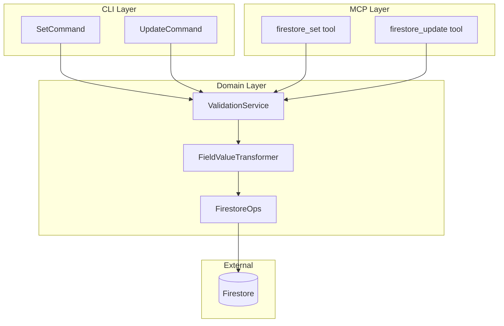
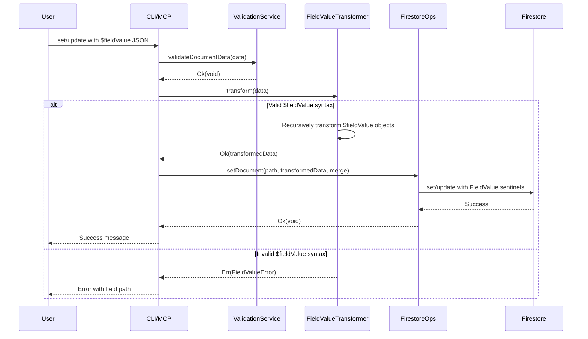

# Design: fieldvalue-support

## Overview

**Purpose**: firex の set/update コマンドおよび MCP ツールにおいて、Firestore FieldValue オペレーション（serverTimestamp、increment、arrayUnion、arrayRemove、delete）を JSON 内で `$fieldValue` オブジェクト形式で指定できるようにする。

**Users**: 開発者（CLI ユーザー）および AI アシスタント（MCP 経由）が、サーバータイムスタンプの自動設定、数値のインクリメント、配列操作、フィールド削除などの高度な Firestore 操作を実行できる。

**Impact**: 既存の set/update コマンドと MCP ツールのデータ処理パイプラインに FieldValue 変換層を追加。既存機能に対する後方互換性を維持。

### Goals
- 5 種類の FieldValue（serverTimestamp, increment, arrayUnion, arrayRemove, delete）を `$fieldValue` 構文でサポート
- CLI（set, update）と MCP（firestore_set, firestore_update）の両方で一貫した動作
- 明確なエラーメッセージによるデバッグ容易性
- 既存の i18n 機構を活用した日英対応エラーメッセージ

### Non-Goals
- GeoPoint, DocumentReference 等の他の特殊型のサポート（将来の拡張として検討）
- バッチ書き込み（import コマンド）での FieldValue サポート
- クエリ条件での FieldValue 使用

## Architecture

### Existing Architecture Analysis

現在の set/update 処理フロー:
1. CLI/MCP がユーザー入力（JSON 文字列またはファイル）を受け取る
2. JSON をパースして `Record<string, unknown>` に変換
3. `ValidationService.validateDocumentData()` でバリデーション
4. `FirestoreOps.setDocument()` で Firestore に書き込み

**拡張ポイント**: バリデーション後、Firestore 書き込み前に FieldValue 変換層を挿入。

### Architecture Pattern & Boundary Map



**Architecture Integration**:
- Selected pattern: Transformer Pattern（データ変換専用サービス）
- Domain boundaries: FieldValueTransformer は Domain 層に配置、他のサービスから独立
- Existing patterns preserved: neverthrow Result 型、ValidationService パターン、i18n
- New components rationale: 変換ロジックを分離することで単一責任を維持
- Steering compliance: TypeScript strict mode、neverthrow による明示的エラーハンドリング

### Technology Stack

| Layer | Choice / Version | Role in Feature | Notes |
|-------|------------------|-----------------|-------|
| Backend / Services | TypeScript 5.x | 型安全な変換ロジック | 既存スタック |
| Backend / Services | firebase-admin 13.x | FieldValue センチネル生成 | 既存依存 |
| Backend / Services | zod | $fieldValue 構文のスキーマ検証 | 既存依存 |
| Backend / Services | neverthrow | Result 型によるエラーハンドリング | 既存依存 |

## System Flows

### FieldValue 変換フロー



**Key Decisions**:
- 変換はバリデーション成功後、Firestore 書き込み前に実行
- エラー発生時はフィールドパスを含むメッセージを返却
- 変換後のデータは FieldValue センチネルを含む

## Requirements Traceability

| Requirement | Summary | Components | Interfaces | Flows |
|-------------|---------|------------|------------|-------|
| 1.1 | serverTimestamp 変換 | FieldValueTransformer | TransformService | Transform Flow |
| 1.2 | increment 変換 | FieldValueTransformer | TransformService | Transform Flow |
| 1.3 | arrayUnion 変換 | FieldValueTransformer | TransformService | Transform Flow |
| 1.4 | arrayRemove 変換 | FieldValueTransformer | TransformService | Transform Flow |
| 1.5 | delete 変換 | FieldValueTransformer | TransformService | Transform Flow |
| 1.6 | ネスト対応 | FieldValueTransformer | TransformService | Transform Flow |
| 2.1 | CLI set 対応 | SetCommand | - | Set Command Flow |
| 2.2 | CLI set --from-file 対応 | SetCommand | - | Set Command Flow |
| 2.3 | CLI set --merge 対応 | SetCommand | - | Set Command Flow |
| 3.1 | CLI update 対応 | UpdateCommand | - | Update Command Flow |
| 3.2 | CLI update --from-file 対応 | UpdateCommand | - | Update Command Flow |
| 3.3 | CLI update delete 対応 | UpdateCommand | - | Update Command Flow |
| 4.1 | MCP set 対応 | MCP set tool | - | MCP Flow |
| 4.2 | MCP set merge 対応 | MCP set tool | - | MCP Flow |
| 5.1 | MCP update 対応 | MCP update tool | - | MCP Flow |
| 5.2 | MCP update increment 対応 | MCP update tool | - | MCP Flow |
| 5.3 | MCP update arrayUnion 対応 | MCP update tool | - | MCP Flow |
| 6.1 | 不正タイプエラー | FieldValueTransformer | TransformService | Error Flow |
| 6.2 | increment operand エラー | FieldValueTransformer | TransformService | Error Flow |
| 6.3 | array elements エラー | FieldValueTransformer | TransformService | Error Flow |
| 6.4 | 形式不正エラー | FieldValueTransformer | TransformService | Error Flow |
| 6.5 | フィールドパス表示 | FieldValueTransformer | TransformService | Error Flow |
| 7.1 | CLI help 更新 | SetCommand, UpdateCommand | - | - |
| 7.2 | MCP スキーマ説明 | MCP tools | - | - |
| 7.3 | examples コマンド更新 | ExamplesCommand | - | - |

## Components and Interfaces

| Component | Domain/Layer | Intent | Req Coverage | Key Dependencies | Contracts |
|-----------|--------------|--------|--------------|------------------|-----------|
| FieldValueTransformer | Domain | $fieldValue 構文を FieldValue センチネルに変換 | 1.1-1.6, 6.1-6.5 | firebase-admin (P0) | Service |
| SetCommand | Commands | CLI set コマンド拡張 | 2.1-2.3 | FieldValueTransformer (P0) | - |
| UpdateCommand | Commands | CLI update コマンド拡張 | 3.1-3.3 | FieldValueTransformer (P0) | - |
| MCP set tool | MCP | MCP firestore_set 拡張 | 4.1-4.2 | FieldValueTransformer (P0) | - |
| MCP update tool | MCP | MCP firestore_update 拡張 | 5.1-5.3 | FieldValueTransformer (P0) | - |
| i18n | Shared | エラーメッセージ多言語対応 | 6.1-6.5 | - | - |
| ExamplesCommand | Commands | 使用例の追加 | 7.3 | - | - |

### Domain Layer

#### FieldValueTransformer

| Field | Detail |
|-------|--------|
| Intent | JSON 内の `$fieldValue` オブジェクトを Firestore FieldValue センチネルに再帰的に変換する |
| Requirements | 1.1, 1.2, 1.3, 1.4, 1.5, 1.6, 6.1, 6.2, 6.3, 6.4, 6.5 |

**Responsibilities & Constraints**
- $fieldValue オブジェクトの検出と変換
- ネストされたオブジェクト・配列の再帰的処理
- 変換エラー時のフィールドパス付きエラー生成
- 通常のデータはそのまま保持

**Dependencies**
- External: firebase-admin/firestore FieldValue - センチネル生成 (P0)
- External: neverthrow - Result 型 (P0)

**Contracts**: Service [x]

##### Service Interface

```typescript
import { FieldValue } from 'firebase-admin/firestore';
import { Result } from 'neverthrow';

/**
 * FieldValue 操作タイプ
 */
type FieldValueType =
  | 'serverTimestamp'
  | 'increment'
  | 'arrayUnion'
  | 'arrayRemove'
  | 'delete';

/**
 * $fieldValue オブジェクトの構造
 */
interface FieldValueSpec {
  $fieldValue: FieldValueType;
  operand?: number;      // increment 用
  elements?: unknown[];  // arrayUnion/arrayRemove 用
}

/**
 * 変換エラー型
 */
type FieldValueTransformError =
  | { type: 'INVALID_FIELD_VALUE_TYPE'; message: string; fieldPath: string; value: string }
  | { type: 'INVALID_OPERAND'; message: string; fieldPath: string; expected: string; actual: string }
  | { type: 'INVALID_ELEMENTS'; message: string; fieldPath: string }
  | { type: 'INVALID_FORMAT'; message: string; fieldPath: string };

/**
 * FieldValue 変換サービス
 */
interface FieldValueTransformerService {
  /**
   * データ内の $fieldValue オブジェクトを FieldValue センチネルに変換
   * @param data 変換対象のデータ
   * @returns 変換後のデータまたはエラー
   */
  transform(data: Record<string, unknown>): Result<Record<string, unknown>, FieldValueTransformError>;

  /**
   * オブジェクトが $fieldValue 構文かどうかを判定
   * @param value 判定対象の値
   * @returns $fieldValue オブジェクトならば true
   */
  isFieldValueSpec(value: unknown): value is FieldValueSpec;
}
```

- Preconditions: 入力データは有効な JSON オブジェクト
- Postconditions: 出力データの `$fieldValue` オブジェクトはすべて FieldValue センチネルに変換済み
- Invariants: 通常のフィールドは変換されない

**Implementation Notes**
- Integration: CLI/MCP のデータ処理パイプラインに挿入
- Validation: 変換前に $fieldValue オブジェクトの形式を検証
- Risks: 深いネストでのパフォーマンス（実用上問題なし）

### Commands Layer

#### SetCommand (拡張)

| Field | Detail |
|-------|--------|
| Intent | FieldValueTransformer を統合して $fieldValue 構文をサポート |
| Requirements | 2.1, 2.2, 2.3 |

**Implementation Notes**
- Integration: `validateDocumentData` 後、`setDocument` 前に `transform` を呼び出し
- Validation: 変換エラー時は `handleError` で処理

#### UpdateCommand (拡張)

| Field | Detail |
|-------|--------|
| Intent | FieldValueTransformer を統合して $fieldValue 構文をサポート |
| Requirements | 3.1, 3.2, 3.3 |

**Implementation Notes**
- Integration: SetCommand と同様のパターン

### MCP Layer

#### firestore_set tool (拡張)

| Field | Detail |
|-------|--------|
| Intent | MCP firestore_set で $fieldValue 構文をサポート |
| Requirements | 4.1, 4.2 |

**Implementation Notes**
- Integration: data パラメータを transform で変換後に FirestoreOps へ
- Validation: スキーマ説明に $fieldValue 構文の使用例を追加

#### firestore_update tool (拡張)

| Field | Detail |
|-------|--------|
| Intent | MCP firestore_update で $fieldValue 構文をサポート |
| Requirements | 5.1, 5.2, 5.3 |

**Implementation Notes**
- Integration: firestore_set と同様のパターン

### Shared Layer

#### i18n (拡張)

| Field | Detail |
|-------|--------|
| Intent | FieldValue 関連エラーメッセージの多言語対応 |
| Requirements | 6.1, 6.2, 6.3, 6.4, 6.5 |

**追加メッセージキー**:
- `err.fieldValue.invalidType`: 不正な FieldValue タイプ
- `err.fieldValue.invalidOperand`: operand が数値でない
- `err.fieldValue.invalidElements`: elements が配列でない
- `err.fieldValue.invalidFormat`: $fieldValue オブジェクト形式不正
- `err.fieldValue.atPath`: フィールドパス接頭辞

## Data Models

### Domain Model

#### FieldValueSpec (Value Object)

```typescript
/**
 * $fieldValue オブジェクトの構造を表す値オブジェクト
 */
interface FieldValueSpec {
  $fieldValue: FieldValueType;
  operand?: number;      // increment 用（必須）
  elements?: unknown[];  // arrayUnion/arrayRemove 用（必須）
}

/**
 * サポートする FieldValue 操作タイプ
 */
type FieldValueType =
  | 'serverTimestamp'  // 引数なし
  | 'increment'        // operand 必須
  | 'arrayUnion'       // elements 必須
  | 'arrayRemove'      // elements 必須
  | 'delete';          // 引数なし
```

**Business Rules & Invariants**:
- `serverTimestamp`: 追加パラメータ不可
- `increment`: `operand` は数値型必須
- `arrayUnion`/`arrayRemove`: `elements` は配列型必須
- `delete`: 追加パラメータ不可、update または set --merge モードでのみ有効
  - **set（非 merge）での delete 使用時**: 警告を出力し、該当フィールドを変換から除外（通常オブジェクトとして扱う）。エラーにはしないが、意図しない結果になることをユーザーに通知

### Logical Data Model

**$fieldValue 構文パターン**:

```json
// serverTimestamp - パラメータなし
{"createdAt": {"$fieldValue": "serverTimestamp"}}

// increment - operand 必須（数値）
{"count": {"$fieldValue": "increment", "operand": 5}}
{"balance": {"$fieldValue": "increment", "operand": -10}}

// arrayUnion - elements 必須（配列）
{"tags": {"$fieldValue": "arrayUnion", "elements": ["new", "tags"]}}

// arrayRemove - elements 必須（配列）
{"tags": {"$fieldValue": "arrayRemove", "elements": ["old"]}}

// delete - パラメータなし
{"obsoleteField": {"$fieldValue": "delete"}}

// ネストされた使用例
{
  "metadata": {
    "updatedAt": {"$fieldValue": "serverTimestamp"},
    "version": {"$fieldValue": "increment", "operand": 1}
  }
}
```

## Error Handling

### Error Strategy

FieldValue 変換エラーはすべてフィールドパスを含む明確なメッセージを返却。

### Error Categories and Responses

**User Errors (Validation)**:
| Error Type | Condition | Message Example (ja) |
|------------|-----------|---------------------|
| INVALID_FIELD_VALUE_TYPE | 不正な $fieldValue タイプ | `フィールド "metadata.type" の FieldValue タイプ "unknown" は無効です。有効な値: serverTimestamp, increment, arrayUnion, arrayRemove, delete` |
| INVALID_OPERAND | increment の operand が数値でない | `フィールド "count" の operand は数値である必要があります。指定された値: "string"` |
| INVALID_ELEMENTS | arrayUnion/arrayRemove の elements が配列でない | `フィールド "tags" の elements は配列である必要があります` |
| INVALID_FORMAT | $fieldValue オブジェクト形式不正 | `フィールド "data" の $fieldValue オブジェクト形式が不正です` |

### Monitoring

既存の CLI エラーハンドリング機構を使用。追加のモニタリングは不要。

## Testing Strategy

### Unit Tests
- FieldValueTransformer.transform: 各 FieldValue タイプの正常変換
- FieldValueTransformer.transform: ネストされたオブジェクトの再帰変換
- FieldValueTransformer.transform: 各エラーパターンの検証
- FieldValueTransformer.isFieldValueSpec: 判定ロジックのエッジケース

### Integration Tests
- SetCommand + FieldValueTransformer: CLI から Firestore 書き込みまでの E2E
- UpdateCommand + FieldValueTransformer: update 操作の E2E
- MCP set/update + FieldValueTransformer: MCP ツール経由の E2E
- エラーメッセージの i18n 切り替え動作

### E2E Tests
- `firex set` with serverTimestamp: 実際の Firestore エミュレータでタイムスタンプ確認
- `firex update` with increment: カウンター増減の確認
- `firex update` with arrayUnion/arrayRemove: 配列操作の確認
- `firex update` with delete: フィールド削除の確認
- 複合操作: 複数の FieldValue を同時に使用

## Optional Sections

### Security Considerations

本機能はデータ変換のみを行い、新たな認証・認可要件は追加しない。既存のセキュリティモデルを維持:
- Firebase Admin SDK の認証情報による Firestore アクセス制御
- ユーザー入力のバリデーションによるインジェクション防止

### Performance & Scalability

- 変換処理は同期的に実行、大量のフィールドでも実用上問題なし
- **最大再帰深度**: 100 レベルに制限。これを超えた場合は `INVALID_FORMAT` エラーを返却
- 現実的なユースケースではパフォーマンス影響は無視可能

## Supporting References

### $fieldValue 構文の完全仕様

```typescript
// Zod スキーマによる構文定義
import { z } from 'zod';

const ServerTimestampSpec = z.object({
  $fieldValue: z.literal('serverTimestamp'),
});

const IncrementSpec = z.object({
  $fieldValue: z.literal('increment'),
  operand: z.number(),
});

const ArrayUnionSpec = z.object({
  $fieldValue: z.literal('arrayUnion'),
  elements: z.array(z.unknown()),
});

const ArrayRemoveSpec = z.object({
  $fieldValue: z.literal('arrayRemove'),
  elements: z.array(z.unknown()),
});

const DeleteSpec = z.object({
  $fieldValue: z.literal('delete'),
});

const FieldValueSpec = z.union([
  ServerTimestampSpec,
  IncrementSpec,
  ArrayUnionSpec,
  ArrayRemoveSpec,
  DeleteSpec,
]);
```

### 使用例（examples コマンド追加分）

**日本語**:
```
# サーバータイムスタンプの設定
  サーバー側でタイムスタンプを自動設定します
  $ firex set users/user123 '{"createdAt": {"$fieldValue": "serverTimestamp"}}'

# カウンターのインクリメント
  数値フィールドを増減します
  $ firex update posts/post1 '{"viewCount": {"$fieldValue": "increment", "operand": 1}}'

# 配列への要素追加
  配列に要素を追加します（重複は無視）
  $ firex update users/user123 '{"tags": {"$fieldValue": "arrayUnion", "elements": ["premium"]}}'

# 配列から要素削除
  配列から要素を削除します
  $ firex update users/user123 '{"tags": {"$fieldValue": "arrayRemove", "elements": ["trial"]}}'

# フィールドの削除
  フィールドをドキュメントから削除します
  $ firex update users/user123 '{"obsoleteField": {"$fieldValue": "delete"}}'
```
