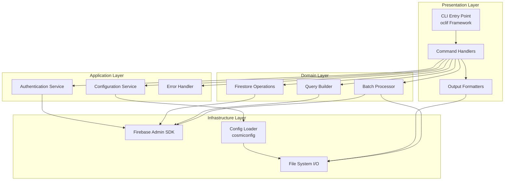
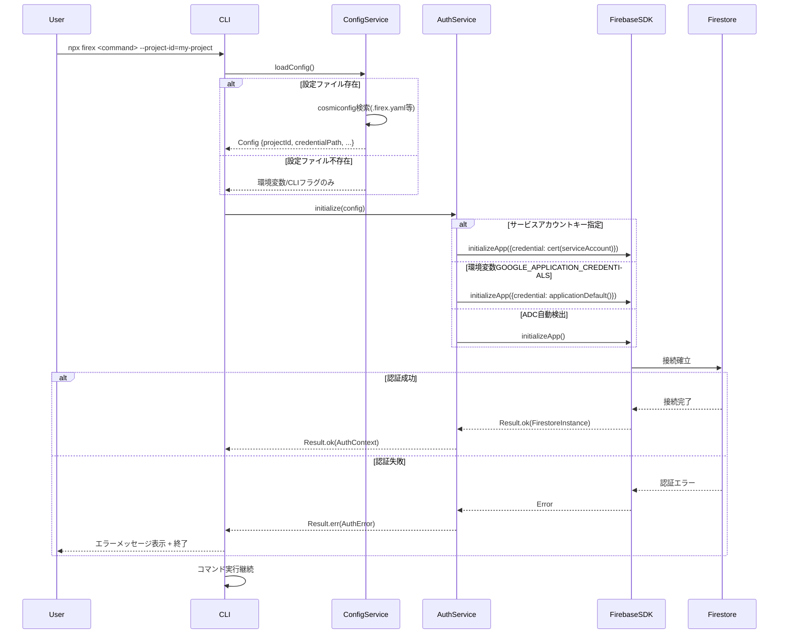
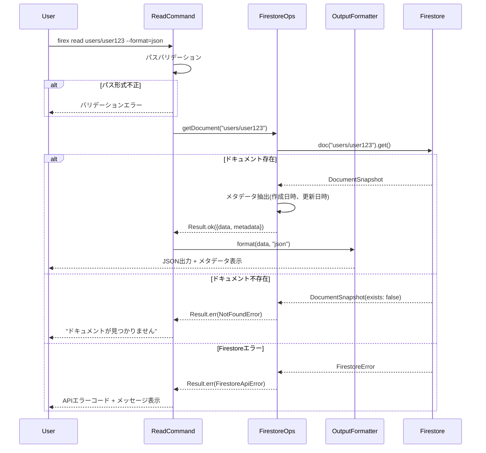
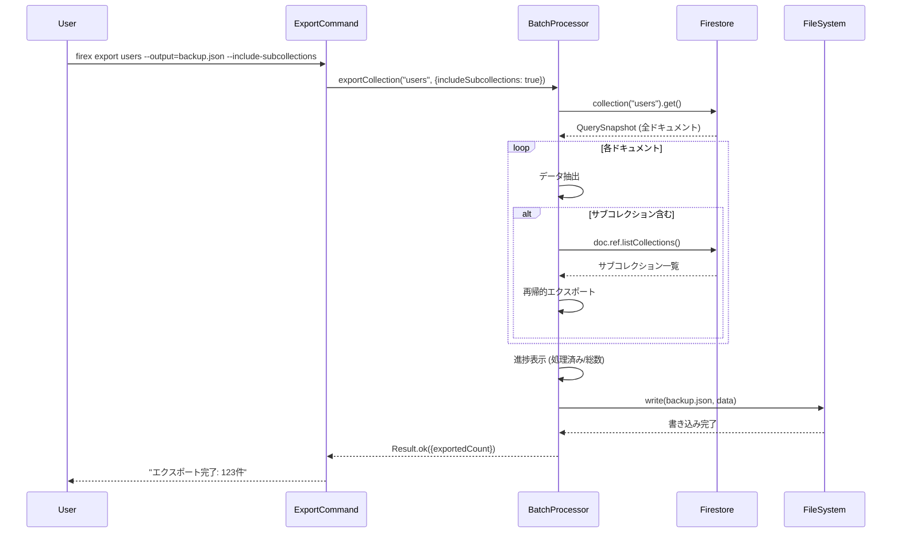
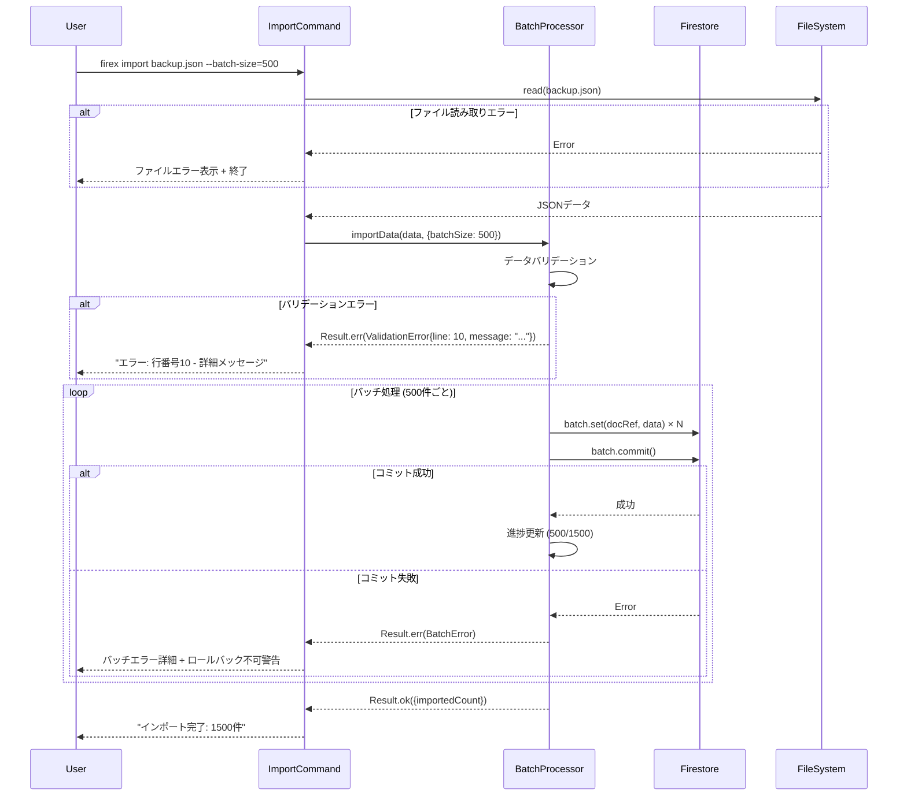
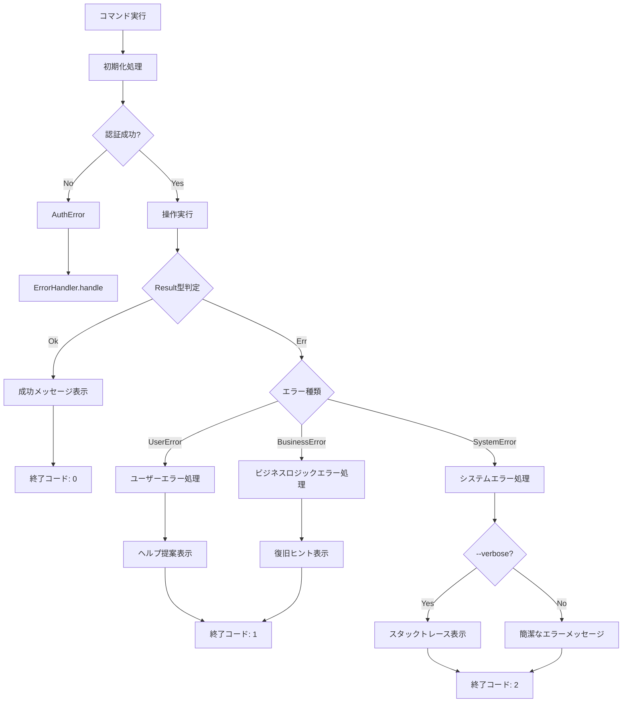

# Design: firestore-cli-tool

## Overview

本機能は、Firebase Firestoreデータベースに対してコマンドラインから直接操作を行うためのTypeScript製CLIツール「firex」を提供します。開発者は`npx firex [command]`コマンドで、Firestoreのドキュメント読み取り・書き込み・削除、クエリ実行、バッチ操作、リアルタイム監視などの機能を利用できます。

**目的**: 開発者がFirestoreのデータ操作をGUIコンソールに依存せず、コマンドラインから効率的に実行できるツールを提供し、開発・デバッグ・データメンテナンス作業を効率化する。

**対象ユーザー**: Firebase/Firestoreを利用するバックエンド・フルスタック開発者、DevOpsエンジニア、データベース管理者。CI/CDパイプラインでのデータ操作、ローカル開発環境でのテストデータ投入、本番環境でのデータメンテナンスなどに活用される。

**影響**: 新規プロジェクトのため、既存システムへの影響はない。npm公開後、グローバルにインストール可能な独立したCLIツールとして動作する。

### Goals

- Firebase Admin SDK (v13.6.0) を使用したFirestoreへの認証済み接続を実現
- CRUD操作、クエリ実行、バッチ処理をCLIから実行可能にする
- onSnapshotによるリアルタイムデータ監視機能を提供
- `npx firex`で即座に実行可能なゼロインストールCLI体験を実現
- 型安全性を重視したTypeScript実装により、実行時エラーを最小化
- 多様な出力フォーマット(JSON, YAML, Table)と設定ファイルによる柔軟性を提供

### Non-Goals

- Firestore以外のFirebaseサービス(Authentication, Storage, Functions等)の管理機能
- GUI/Web UIの提供
- Firestoreのセキュリティルール編集・管理機能
- マルチプロジェクト間のデータレプリケーション機能

## Architecture

### Existing Architecture Analysis

本プロジェクトは新規開発(greenfield)のため、既存アーキテクチャの制約は存在しません。ただし、以下の外部システムとの統合が必要です：

- **Firebase Admin SDK**: Google Cloud Platformの認証・認可メカニズムに準拠
- **Firestore API**: Firebase Admin SDKが提供するFirestore APIの制約とベストプラクティスに従う
- **npm/npx エコシステム**: Node.jsパッケージマネージャーの標準規約に準拠

### Architecture Pattern & Boundary Map

**選択パターン**: **Layered Architecture with Command Pattern**

本CLIツールは以下のレイヤー構造を採用します：



**アーキテクチャの統合方針**:

- **選択パターン**: Layered Architecture - 各レイヤーの責任を明確に分離し、テスタビリティとメンテナンス性を向上
- **ドメイン/機能境界**:
  - **Presentation Layer**: ユーザー入力の解析と出力フォーマット
  - **Application Layer**: 横断的関心事（認証、設定、エラーハンドリング）
  - **Domain Layer**: Firestoreビジネスロジック（CRUD、クエリ、バッチ処理）
  - **Infrastructure Layer**: 外部依存（Firebase SDK、ファイルシステム）
- **既存パターンの保持**: 新規プロジェクトのため該当なし
- **新規コンポーネントの根拠**: 各コンポーネントは単一責任原則に基づき設計され、テスト容易性と再利用性を確保
- **Steering準拠**: 型安全性、明示的エラーハンドリング、フォーマルなドキュメント化を重視

### Technology Stack

| Layer | Choice / Version | Role in Feature | Notes |
|-------|------------------|-----------------|-------|
| CLI Framework | oclif v3.x | コマンド定義、引数パース、ヘルプ生成、プラグインシステム | TypeScript完全対応、エンタープライズグレード、Heroku/Salesforce CLIで実績 |
| Interactive Prompts | @inquirer/prompts v7.x | ユーザー入力、確認プロンプト機能 | 軽量化された最新版、パフォーマンス改善、型安全性向上 |
| Firebase SDK | firebase-admin v13.6.0 | Firestore認証・接続・操作のコアAPI | Node.js 18+必須、@google-cloud/firestore v7採用 |
| Error Handling | neverthrow v7.x | 型安全なResult<T, E>パターンによる明示的エラー処理 | 実行時例外を最小化、コンパイル時エラー検出 |
| Configuration | cosmiconfig v9.x | 設定ファイル検索・読み込み（.firex.yaml, package.json等） | JSON/YAML/JS対応、業界標準 |
| Output Formatting | cli-table3 v0.6.x | テーブル形式出力 | 軽量、Unicode対応 |
| Output Formatting | js-yaml v4.x | YAML形式出力 | 標準的なYAMLパーサー |
| Runtime | Node.js 18+ | 実行環境 | Firebase Admin SDK v13要件、ESM/CJS両対応 |
| Build Tool | tsup v8.x | TypeScript→JavaScript変換、CJS/ESM両出力 | 高速、設定不要 |
| Package Manager | npm/pnpm | 依存関係管理、npx実行 | npm標準互換 |

**技術選定の根拠**:

- **oclif**: Commander.jsやYargsと比較し、TypeScript完全対応、プラグインアーキテクチャ、エンタープライズ実績（Heroku CLI等）により選定。複雑なコマンド階層とサブコマンド管理に最適。
- **@inquirer/prompts**: 最新版は従来版から全面刷新され、パッケージサイズ削減とパフォーマンス向上を実現。削除確認プロンプトなどのユーザー入力に使用。
- **neverthrow**: TypeScriptの型システムを活用し、エラーハンドリングを明示的かつ安全に実装。従来のtry-catch比でコンパイル時エラー検出が可能。
- **Firebase Admin SDK v13.6.0**: 最新安定版。@google-cloud/firestore v7への更新、preferRest設定追加、新型エクスポート対応。
- **cosmiconfig**: Prettier、ESLint等の業界標準ツールで採用される設定ローダー。複数フォーマット・検索パス対応。

### oclif フレームワーク統合設定

**概要**: firexはoclifフレームワークを使用してCLIを構築します。oclifが正しく動作するには、以下の設定が**必須**です。

#### package.json oclif 設定セクション

```json
{
  "oclif": {
    "bin": "firex",
    "dirname": "firex",
    "commands": "./dist/commands",
    "topicSeparator": " "
  }
}
```

| 設定項目 | 説明 | 必須 |
|---------|------|------|
| `bin` | CLIコマンド名（`firex`） | Yes |
| `dirname` | 設定ディレクトリ名 | Yes |
| `commands` | コンパイル済みコマンドディレクトリパス | Yes |
| `topicSeparator` | サブコマンド区切り文字 | No |

#### CLIエントリーポイント（src/index.ts）

oclifでCLIを起動するには、`@oclif/core`の`execute`関数を呼び出す必要があります：

```typescript
// src/index.ts
import { execute } from '@oclif/core';

/**
 * CLI エントリーポイント
 * oclifフレームワークを通じてコマンドルーターを起動
 */
export async function run(): Promise<void> {
  await execute({ dir: import.meta.url });
}
```

**重要**: `execute`関数は以下を行います：
1. コマンドライン引数をパース
2. 対応するコマンドハンドラーを検索
3. コマンドの`run()`メソッドを実行
4. `--help`、`--version`フラグを自動処理

#### bin/run.js（npm bin エントリー）

```javascript
#!/usr/bin/env node

// dist/index.js の run() 関数を呼び出し
import('../dist/index.js')
  .then((module) => module.run())
  .catch((error) => {
    console.error('Failed to start CLI:', error);
    process.exit(1);
  });
```

#### コマンドファイル配置規約

oclifはコマンドディレクトリ内のファイル名をコマンド名として認識します：

```
src/commands/
├── get.ts      → firex get
├── set.ts      → firex set
├── list.ts     → firex list
├── delete.ts   → firex delete
├── export.ts   → firex export
├── import.ts   → firex import
├── config.ts   → firex config
├── update.ts   → firex update
└── examples.ts → firex examples
```

**コマンドクラス要件**:
- `@oclif/core`の`Command`クラスを継承
- `static`プロパティで`description`、`examples`、`flags`、`args`を定義
- `async run()`メソッドでコマンドロジックを実装
- **default export**としてエクスポート

#### oclif統合チェックリスト

実装完了の判定基準として、以下をすべて確認する必要があります：

- [ ] package.jsonに`oclif`セクションが存在する
- [ ] `oclif.commands`がビルド出力先（`./dist/commands`）を指している
- [ ] src/index.tsで`@oclif/core`の`execute`を呼び出している
- [ ] bin/run.jsがdist/index.jsを正しくインポートしている
- [ ] `npx firex --help`で利用可能なコマンド一覧が表示される
- [ ] `npx firex get --help`で個別コマンドのヘルプが表示される
- [ ] `npx firex --version`でバージョンが表示される
- [ ] 存在しないコマンド（例: `npx firex foo`）でエラーメッセージが表示される

## System Flows

### 認証と初期化フロー



**フロー決定事項**:
- 設定優先順位: CLIフラグ > 環境変数 > 設定ファイル > デフォルト値
- 認証失敗時は即座に終了し、リトライ不可エラーとして扱う
- Firebase Admin SDKの初期化は全コマンド実行前に1回のみ実行

### ドキュメント読み取りフロー



### バッチインポート/エクスポートフロー





**フロー決定事項**:
- バッチサイズ上限500件はFirestore制約に準拠
- インポート失敗時、部分コミット済みデータはロールバック不可（べき等性確保のため、実装ノートで対応策記載）
- 進捗表示は100件ごとに更新（パフォーマンスとUX両立）

## Requirements Traceability

| Requirement | Summary | Components | Interfaces | Flows |
|-------------|---------|------------|------------|-------|
| 1.1 | サービスアカウント認証 | AuthService | ServiceInterface | 認証と初期化フロー |
| 1.2 | プロジェクトID指定 | ConfigService, AuthService | ConfigContract | 認証と初期化フロー |
| 1.3 | 認証情報エラーハンドリング | ErrorHandler, AuthService | ErrorTypes | 認証と初期化フロー |
| 1.4 | 接続タイムアウトエラー | ErrorHandler | ErrorTypes | - |
| 1.5 | 環境変数サポート | ConfigService, AuthService | ConfigContract | 認証と初期化フロー |
| 1.6 | Emulator接続 | AuthService | ServiceInterface | 認証と初期化フロー |
| 2.1 | ドキュメント読み取り | GetCommand, FirestoreOps | FirestoreServiceInterface | ドキュメント読み取りフロー |
| 2.2 | 出力フォーマット選択 | OutputFormatter | OutputContract | ドキュメント読み取りフロー |
| 2.3 | 存在しないドキュメントエラー | ErrorHandler, FirestoreOps | ErrorTypes | ドキュメント読み取りフロー |
| 2.4 | メタデータ表示 | FirestoreOps, OutputFormatter | FirestoreServiceInterface | ドキュメント読み取りフロー |
| 2.5 | --watchフラグによる監視 | GetCommand, WatchService | WatchServiceInterface | リアルタイム監視フロー |
| 2.6 | 変更タイプ表示(watch) | WatchService, OutputFormatter | WatchServiceInterface | リアルタイム監視フロー |
| 3.1 | ドキュメント作成/上書き | SetCommand, FirestoreOps | FirestoreServiceInterface | - |
| 3.2 | マージ更新 | SetCommand, FirestoreOps | FirestoreServiceInterface | - |
| 3.3 | updateコマンド(setエイリアス) | UpdateCommand, FirestoreOps | FirestoreServiceInterface | - |
| 3.4 | JSONファイル読み込み | SetCommand, UpdateCommand, FileSystemService | FileSystemContract | - |
| 3.5 | JSONバリデーション | SetCommand, UpdateCommand, ValidationService | ValidationContract | - |
| 3.6 | 書き込み権限エラー | ErrorHandler | ErrorTypes | - |
| 3.7 | 書き込み成功確認 | SetCommand, UpdateCommand | - | - |
| 4.1 | ドキュメント削除 | DeleteCommand, FirestoreOps | FirestoreServiceInterface | - |
| 4.2 | コレクション再帰削除 | DeleteCommand, BatchProcessor | BatchContract | - |
| 4.3 | 削除確認プロンプト | DeleteCommand, PromptService | PromptContract | - |
| 4.4 | 存在しないドキュメント警告 | ErrorHandler | ErrorTypes | - |
| 4.5 | 削除件数表示 | DeleteCommand | - | - |
| 5.1 | コレクション一覧取得 | ListCommand, FirestoreOps | FirestoreServiceInterface | - |
| 5.2 | フィルタークエリ | ListCommand, QueryBuilder | QueryServiceInterface | - |
| 5.3 | ソート順指定 | ListCommand, QueryBuilder | QueryServiceInterface | - |
| 5.4 | 取得件数制限 | ListCommand, QueryBuilder | QueryServiceInterface | - |
| 5.5 | 複合クエリ条件 | ListCommand, QueryBuilder | QueryServiceInterface | - |
| 5.6 | クエリ結果0件メッセージ | ListCommand | - | - |
| 5.7 | クエリ実行時間表示 | ListCommand | - | - |
| 5.8 | デフォルトlimit=100 | ListCommand, ConfigService | ConfigContract | - |
| 5.9 | --watchフラグによる監視 | ListCommand, WatchService | WatchServiceInterface | リアルタイム監視フロー |
| 5.10 | 変更されたドキュメントのみ出力 | WatchService, OutputFormatter | WatchServiceInterface | リアルタイム監視フロー |
| 5.11 | --watch+--limit禁止 | ListCommand | - | - |
| 6.1 | コレクションエクスポート | ExportCommand, BatchProcessor | BatchContract | バッチエクスポートフロー |
| 6.2 | JSONファイルインポート | ImportCommand, BatchProcessor | BatchContract | バッチインポートフロー |
| 6.3 | バッチサイズ指定 | BatchProcessor | BatchContract | バッチインポートフロー |
| 6.4 | インポートバリデーション | ValidationService, ImportCommand | ValidationContract | バッチインポートフロー |
| 6.5 | バッチ進捗表示 | BatchProcessor | - | バッチインポート/エクスポートフロー |
| 6.6 | サブコレクション含むエクスポート | BatchProcessor | BatchContract | バッチエクスポートフロー |
| 8.1 | エラー種類と原因表示 | ErrorHandler | ErrorTypes | 全フロー |
| 8.2 | 詳細モード(verbose) | ErrorHandler, LoggingService | LoggingContract | - |
| 8.3 | ログファイル出力 | LoggingService | LoggingContract | - |
| 8.4 | Firestore APIエラー表示 | ErrorHandler | ErrorTypes | 全フロー |
| 8.5 | ネットワークエラー再試行ヒント | ErrorHandler | ErrorTypes | - |
| 8.6 | listデフォルト件数設定 | ConfigService | ConfigContract | - |
| 8.7 | watch初期出力設定 | ConfigService | ConfigContract | - |
| 9.1 | 設定ファイル保存 | ConfigService | ConfigContract | - |
| 9.2 | プロファイル指定 | ConfigService | ConfigContract | 認証と初期化フロー |
| 9.3 | 設定表示コマンド | ConfigCommand | - | - |
| 9.4 | .firex.yaml自動読み込み | ConfigService | ConfigContract | 認証と初期化フロー |
| 9.5 | CLIフラグ優先順位 | ConfigService | ConfigContract | 認証と初期化フロー |
| 10.1 | --helpフラグ | oclif組み込み | - | - |
| 10.2 | コマンド別--help | oclif組み込み | - | - |
| 10.3 | examplesコマンド | ExamplesCommand | - | - |
| 10.4 | バージョン表示 | oclif組み込み | - | - |
| 10.5 | エラーメッセージにヘルプ提案 | ErrorHandler | ErrorTypes | - |
| 11.1 | oclifコマンドルーター起動 | src/index.ts, @oclif/core | - | 認証と初期化フロー |
| 11.2 | コマンドルーティング | oclif組み込み | - | - |
| 11.3 | package.json oclif設定 | package.json | OclifConfig | - |
| 11.4 | CLIエントリーポイント(execute呼び出し) | src/index.ts | - | - |
| 11.5 | 存在しないコマンドエラー | oclif組み込み | - | - |
| 11.6 | bin/run.js統合 | bin/run.js | - | - |

## Components and Interfaces

### Shared Types

**配置方針**: 以下の型は`src/shared/types.ts`に集約し、全モジュールから参照可能にする

**共有型リスト**:
- `Result<T, E>` - neverthrowからre-export
- `AppError` - アプリケーション共通エラー型
- `DocumentWithMeta` - メタデータ付きドキュメント型
- `OutputFormat` - 出力フォーマット列挙型（'json' | 'yaml' | 'table'）

**ローカル型**: 各サービス固有のエラー型（AuthError, ConfigError等）は各サービスファイルで定義

### コンポーネントサマリー

| Component | Domain/Layer | Intent | Req Coverage | Key Dependencies (P0/P1) | Contracts |
|-----------|--------------|--------|--------------|--------------------------|-----------|
| AuthService | Application | Firebase認証・初期化管理 | 1.1, 1.2, 1.3, 1.4, 1.5 | firebase-admin (P0), ConfigService (P0) | Service |
| ConfigService | Application | 設定ファイル・環境変数読み込み | 1.2, 1.5, 8.6, 8.7, 9.1, 9.2, 9.3, 9.4, 9.5 | cosmiconfig (P0) | Service, State |
| ErrorHandler | Application | 統一エラーハンドリング・ロギング | 1.3, 1.4, 2.3, 3.6, 4.4, 8.1, 8.4, 8.5, 10.5 | LoggingService (P1) | Service |
| LoggingService | Application | ログ出力・ファイル記録 | 8.2, 8.3 | - | Service |
| FirestoreOps | Domain | Firestore CRUD操作 | 2.1, 2.4, 3.1, 3.2, 3.3, 4.1, 5.1 | firebase-admin/firestore (P0) | Service |
| QueryBuilder | Domain | Firestoreクエリ構築 | 5.2, 5.3, 5.4, 5.5 | firebase-admin/firestore (P0) | Service |
| BatchProcessor | Domain | バッチ操作・インポート/エクスポート | 4.2, 6.1, 6.2, 6.3, 6.5, 6.6 | firebase-admin/firestore (P0), FileSystemService (P0) | Batch |
| ValidationService | Domain | データバリデーション | 3.5, 6.4 | - | Service |
| WatchService | Domain | Firestoreリアルタイム監視 | 2.5, 2.6, 5.9, 5.10, 5.11 | firebase-admin/firestore (P0), OutputFormatter (P0) | Service |
| OutputFormatter | Presentation | 出力フォーマット変換 | 2.2, 2.4, 2.6, 5.10 | cli-table3 (P0), js-yaml (P0) | Service |
| FileSystemService | Infrastructure | ファイルI/O操作 | 3.4, 6.1, 6.2 | fs/promises (P0) | Service |
| PromptService | Presentation | ユーザープロンプト | 4.3 | @inquirer/prompts (P0) | Service |
| GetCommand | Presentation | ドキュメント読み取りコマンド | 2.1, 2.2, 2.3, 2.4, 2.5, 2.6 | FirestoreOps (P0), WatchService (P0), OutputFormatter (P0) | - |
| SetCommand | Presentation | ドキュメント作成/上書きコマンド | 3.1, 3.2, 3.4, 3.5, 3.6, 3.7 | FirestoreOps (P0), ValidationService (P0), FileSystemService (P1) | - |
| UpdateCommand | Presentation | ドキュメント部分更新コマンド | 3.3, 3.4, 3.5, 3.6, 3.7 | FirestoreOps (P0), ValidationService (P0), FileSystemService (P1) | - |
| DeleteCommand | Presentation | ドキュメント削除コマンド | 4.1, 4.2, 4.3, 4.4, 4.5 | FirestoreOps (P0), BatchProcessor (P0), PromptService (P0) | - |
| ListCommand | Presentation | コレクション一覧/クエリコマンド | 5.1, 5.2, 5.3, 5.4, 5.5, 5.6, 5.7, 5.8, 5.9, 5.10, 5.11 | QueryBuilder (P0), WatchService (P0), OutputFormatter (P0), ConfigService (P0) | - |
| ExportCommand | Presentation | エクスポートコマンド | 6.1, 6.5, 6.6 | BatchProcessor (P0) | - |
| ImportCommand | Presentation | インポートコマンド | 6.2, 6.3, 6.4, 6.5 | BatchProcessor (P0), ValidationService (P0) | - |
| ConfigCommand | Presentation | 設定表示コマンド | 9.3 | ConfigService (P0) | - |
| ExamplesCommand | Presentation | 使用例表示コマンド | 10.3 | - | - |

### Application Layer

#### AuthService

| Field | Detail |
|-------|--------|
| Intent | Firebase Admin SDKの初期化と認証管理を担当 |
| Requirements | 1.1, 1.2, 1.3, 1.4, 1.5 |
| Owner / Reviewers | - |

**Responsibilities & Constraints**
- Firebase Admin SDKの初期化を1回のみ実行し、アプリケーションライフサイクル全体でインスタンスを保持
- 認証情報の優先順位（CLIフラグ > 環境変数 > 設定ファイル）を管理
- 認証失敗時は即座にエラーを返し、リトライ不可とする
- Firestoreインスタンスへの参照を他サービスに提供

**Dependencies**
- Inbound: 各Commandクラス — 初期化要求 (P0)
- Outbound: firebase-admin/app, firebase-admin/firestore — SDK初期化・認証 (P0)
- Outbound: ConfigService — 認証情報取得 (P0)

**Contracts**: Service [x]

##### Service Interface

```typescript
import { Result } from 'neverthrow';
import { Firestore } from 'firebase-admin/firestore';

interface AuthService {
  /**
   * Firebase Admin SDKを初期化し、Firestoreインスタンスを返す
   *
   * Preconditions:
   * - ConfigServiceから有効な設定が取得可能であること
   * - 認証情報（サービスアカウントキーまたは環境変数）が利用可能であること
   *
   * Postconditions:
   * - 成功時、Firestoreインスタンスが返される
   * - 失敗時、AuthErrorが返される
   * - 初期化は1回のみ実行され、2回目以降は既存インスタンスを返す
   *
   * Invariants:
   * - Firestoreインスタンスはシングルトン
   * - 認証失敗後の再試行は許可されない
   */
  initialize(config: FirebaseConfig): Promise<Result<Firestore, AuthError>>;

  /**
   * 初期化済みFirestoreインスタンスを取得
   *
   * Preconditions:
   * - initialize()が事前に呼ばれていること
   *
   * Postconditions:
   * - 初期化済みの場合、Firestoreインスタンスを返す
   * - 未初期化の場合、UninitializedErrorを返す
   */
  getFirestore(): Result<Firestore, UninitializedError>;
}

interface FirebaseConfig {
  projectId?: string;
  credentialPath?: string;
  databaseURL?: string;
}

type AuthError =
  | { type: 'INVALID_CREDENTIALS'; message: string; originalError: Error }
  | { type: 'CONNECTION_TIMEOUT'; message: string; retryable: boolean }
  | { type: 'PROJECT_NOT_FOUND'; projectId: string }
  | { type: 'PERMISSION_DENIED'; message: string };

type UninitializedError = { type: 'UNINITIALIZED'; message: string };
```

**Implementation Notes**
- Integration: oclif hookでコマンド実行前に自動初期化するか、各コマンドで明示的に呼び出すか要検討（→ oclif `init` hookを使用）
- Validation: credentialPathが指定された場合、ファイル存在確認を実施
- Emulator対応: 環境変数`FIRESTORE_EMULATOR_HOST`が設定されている場合、Emulatorに自動接続（Firebase Admin SDKの標準動作）
- パーミッション警告: credentialPathのパーミッション確認を実施し、0600（所有者のみ読み書き可能）以外の場合は警告メッセージを表示（例: "警告: サービスアカウントキーのパーミッションが緩いです。chmod 600を推奨"）
- Risks: なし

#### ConfigService

| Field | Detail |
|-------|--------|
| Intent | 設定ファイル、環境変数、CLIフラグから設定を読み込み、マージして提供 |
| Requirements | 1.2, 1.5, 9.1, 9.2, 9.3, 9.4, 9.5 |
| Owner / Reviewers | - |

**Responsibilities & Constraints**
- cosmiconfigを使用して複数フォーマット（.firex.yaml, .firex.json, package.json等）の設定ファイルを検索・読み込み
- 環境変数（GOOGLE_APPLICATION_CREDENTIALS, FIRESTORE_PROJECT_ID等）の読み込み
- CLIフラグ、環境変数、設定ファイルの優先順位を適用してマージ
- プロファイル機能のサポート（例: `--profile=staging`）

**Dependencies**
- Inbound: AuthService — 認証情報取得 (P0)
- Inbound: 各Commandクラス — 設定値取得 (P0)
- Outbound: cosmiconfig — 設定ファイル検索・読み込み (P0)
- Outbound: process.env — 環境変数読み取り (P0)

**Contracts**: Service [x] / State [x]

##### Service Interface

```typescript
import { Result } from 'neverthrow';

interface ConfigService {
  /**
   * 設定をロードし、優先順位に従ってマージする
   * 優先順位: CLIフラグ > 環境変数 > 設定ファイル > デフォルト値
   *
   * Preconditions:
   * - なし（設定ファイルが存在しない場合も許容）
   *
   * Postconditions:
   * - 成功時、マージされた設定オブジェクトを返す
   * - 設定ファイル解析エラー時、ConfigErrorを返す
   */
  loadConfig(cliFlags: CliFlags, profile?: string): Promise<Result<Config, ConfigError>>;

  /**
   * 現在の設定を取得（キャッシュ済み）
   */
  getConfig(): Result<Config, ConfigError>;

  /**
   * 設定ファイルに設定を保存
   */
  saveConfig(config: Partial<Config>, path?: string): Promise<Result<void, ConfigError>>;
}

interface Config {
  projectId?: string;
  credentialPath?: string;
  databaseURL?: string;
  defaultFormat: 'json' | 'yaml' | 'table';
  defaultListLimit: number; // listコマンドのデフォルト取得件数（デフォルト: 100）
  batchSize: number; // デフォルト: 500（Firestore上限）
  logLevel: 'error' | 'warn' | 'info' | 'debug';
  logFile?: string;
  watchShowInitial: boolean; // --watchモード時の初期出力有無（デフォルト: true）
}

interface CliFlags {
  projectId?: string;
  credentialPath?: string;
  format?: string;
  verbose?: boolean;
  [key: string]: unknown;
}

type ConfigError =
  | { type: 'PARSE_ERROR'; path: string; message: string }
  | { type: 'INVALID_PROFILE'; profile: string }
  | { type: 'FILE_NOT_WRITABLE'; path: string };
```

##### State Management

- **State model**: 設定ファイルから読み込んだConfigオブジェクトをメモリにキャッシュ
- **Persistence & consistency**: 設定ファイルへの書き込みは明示的なsaveConfig()呼び出し時のみ
- **Concurrency strategy**: CLIツールは単一プロセスのため、並行アクセス制御不要

**Implementation Notes**
- Integration: cosmiconfigの`moduleName`を`"firex"`とし、検索パスは`[".firex.yaml", ".firex.yml", ".firex.json", "package.json"]`
- Validation: プロファイル指定時、設定ファイル内のprofilesキー配下に該当プロファイルが存在することを確認
- デフォルト値: batchSize=500（Firestore上限）、defaultListLimit=100、watchShowInitial=true
- **CLI引数→設定プロパティ命名規約**:
  - CLIフラグ: kebab-case（例: --show-initial, --batch-size）
  - 設定ファイルプロパティ: camelCase（例: watchShowInitial, batchSize）
  - 変換ルール: ハイフン区切り→キャメルケース（lodashのcamelCase関数等を使用）
- **設定ファイル検索順序**:
  1. カレントディレクトリ
  2. 親ディレクトリ（再帰的にプロジェクトルートまで遡る）
  3. ホームディレクトリ（~/.firex.yaml等）
  **優先順位**: カレントディレクトリに最も近いファイルを優先
  **Requirementとの整合性**: Requirement 8.4の「ホームディレクトリ」は最終フォールバック先として解釈し、cosmiconfigの標準的なディレクトリ遡り検索を採用
- Risks: YAML解析エラー時のエラーメッセージが不明瞭になる可能性（cosmiconfigのエラーメッセージをラップして改善）

#### ErrorHandler

| Field | Detail |
|-------|--------|
| Intent | アプリケーション全体のエラーハンドリングと統一的なエラー表示 |
| Requirements | 1.3, 1.4, 2.4, 3.5, 4.4, 8.1, 8.4, 8.5, 10.5 |
| Owner / Reviewers | - |

**Responsibilities & Constraints**
- Result<T, E>型のエラーを受け取り、ユーザーフレンドリーなエラーメッセージを生成
- エラーの種類（User Error, System Error, Business Logic Error）に応じたメッセージフォーマット
- Firestore APIエラーコードの解釈と日本語メッセージへの変換
- エラー発生時のヘルプコマンド提案
- 詳細モード(--verbose)時のスタックトレース表示

**Dependencies**
- Inbound: 全Commandクラス — エラーハンドリング (P0)
- Outbound: LoggingService — エラーログ記録 (P1)
- Outbound: console.error — エラー出力 (P0)

**Contracts**: Service [x]

##### Service Interface

```typescript
import { Result, Err } from 'neverthrow';

interface ErrorHandler {
  /**
   * エラーを処理し、ユーザーフレンドリーなメッセージを出力
   *
   * Preconditions:
   * - なし
   *
   * Postconditions:
   * - エラーメッセージが標準エラー出力に表示される
   * - verbose=trueの場合、スタックトレースが表示される
   * - 適切な終了コードが返される
   */
  handle(error: AppError, verbose?: boolean): number;

  /**
   * Firebase/Firestore APIエラーを解釈
   */
  parseFirestoreError(error: Error): FirestoreApiError;
}

type AppError =
  | AuthError
  | ConfigError
  | FirestoreApiError
  | ValidationError
  | NotFoundError
  | PermissionError
  | NetworkError;

interface FirestoreApiError {
  type: 'FIRESTORE_API_ERROR';
  code: string; // 例: 'permission-denied', 'not-found', 'resource-exhausted'
  message: string;
  retryable: boolean;
  originalError: Error;
}

interface ValidationError {
  type: 'VALIDATION_ERROR';
  field?: string;
  message: string;
  line?: number; // インポートファイルの行番号
}

interface NotFoundError {
  type: 'NOT_FOUND';
  resourceType: 'document' | 'collection';
  path: string;
}

interface PermissionError {
  type: 'PERMISSION_ERROR';
  operation: string;
  path: string;
  message: string;
}

interface NetworkError {
  type: 'NETWORK_ERROR';
  message: string;
  retryable: boolean;
}
```

**Implementation Notes**
- Integration: oclif組み込みエラーハンドリングと統合（`catch`ブロックでErrorHandlerを呼び出す）
- Validation: Firestoreエラーコードマッピングテーブルを定義（permission-denied → 権限エラー、unavailable → ネットワークエラー等）
- Risks: Firebase SDKのエラーコード変更時にマッピングが陳腐化（定期的なSDKアップデート時に確認）

#### LoggingService

| Field | Detail |
|-------|--------|
| Intent | ログレベル別のログ出力とファイル記録 |
| Requirements | 8.2, 8.3 |
| Owner / Reviewers | - |

**Responsibilities & Constraints**
- ログレベル（error, warn, info, debug）に応じたログ出力
- ログファイルへの出力（オプション）
- タイムスタンプとログレベルのフォーマット
- 操作履歴の記録

**Dependencies**
- Inbound: ErrorHandler, 各サービス — ログ記録 (P1)
- Outbound: fs/promises — ファイル書き込み (P0)
- Outbound: console — コンソール出力 (P0)

**Contracts**: Service [x]

##### Service Interface

```typescript
interface LoggingService {
  error(message: string, context?: Record<string, unknown>): void;
  warn(message: string, context?: Record<string, unknown>): void;
  info(message: string, context?: Record<string, unknown>): void;
  debug(message: string, context?: Record<string, unknown>): void;

  /**
   * ログファイルへの出力を有効化
   */
  enableFileLogging(filePath: string): Promise<Result<void, Error>>;
}
```

**Implementation Notes**
- Integration: ConfigServiceから`logLevel`と`logFile`を取得して初期化
- Validation: ログファイルパスの書き込み権限確認
- verbose=trueの場合のデバッグ情報: 以下を出力
  1. Firestore API呼び出しログ（リクエスト/レスポンス）
  2. 認証情報の読み込み元（環境変数/ファイルパス）
  3. 設定ファイルの読み込みパス
  4. エラー発生時のスタックトレース
- Risks: ログファイルサイズが無制限に増加する可能性（ローテーション機能は非対応、ユーザー責任とする）

### Domain Layer

#### FirestoreOps

| Field | Detail |
|-------|--------|
| Intent | Firestore CRUD操作のラッパー |
| Requirements | 2.1, 2.2, 2.5, 3.1, 3.2, 4.1 |
| Owner / Reviewers | - |

**Responsibilities & Constraints**
- Firestoreのドキュメント取得・作成・更新・削除操作
- ドキュメントメタデータ（作成日時、更新日時）の抽出
- コレクション一覧取得
- エラーをResult型でラップして返す

**Dependencies**
- Inbound: ReadCommand, WriteCommand, DeleteCommand — CRUD操作 (P0)
- Outbound: firebase-admin/firestore — Firestore API (P0)
- Outbound: AuthService — Firestoreインスタンス取得 (P0)

**Contracts**: Service [x]

##### Service Interface

```typescript
import { Result } from 'neverthrow';
import { Firestore, DocumentData, DocumentSnapshot } from 'firebase-admin/firestore';

interface FirestoreOps {
  /**
   * ドキュメントを取得
   *
   * Preconditions:
   * - pathが有効なドキュメントパス形式（collection/doc）であること
   *
   * Postconditions:
   * - ドキュメント存在時、データとメタデータを返す
   * - 存在しない場合、NotFoundErrorを返す
   *
   * Invariants:
   * - Firestoreの読み取り課金が発生
   */
  getDocument(path: string): Promise<Result<DocumentWithMeta, NotFoundError | FirestoreApiError>>;

  /**
   * コレクション内の全ドキュメントを取得
   */
  listDocuments(collectionPath: string, limit?: number): Promise<Result<DocumentWithMeta[], FirestoreApiError>>;

  /**
   * ドキュメントを作成または上書き
   *
   * Preconditions:
   * - dataが有効なFirestoreデータ型であること（undefined, function等を含まない）
   *
   * Postconditions:
   * - ドキュメントが作成または上書きされる
   * - 成功時、書き込み後のドキュメント参照を返す
   */
  setDocument(path: string, data: DocumentData, merge?: boolean): Promise<Result<void, FirestoreApiError | PermissionError>>;

  /**
   * ドキュメントを削除
   */
  deleteDocument(path: string): Promise<Result<void, FirestoreApiError | PermissionError>>;
}

interface DocumentWithMeta {
  id: string;
  path: string;
  data: DocumentData;
  metadata: {
    createTime?: Date;
    updateTime?: Date;
  };
}
```

**Implementation Notes**
- Integration: Firestoreパス形式バリデーションを実装（正規表現: `/^[^/]+\/[^/]+$/` for document, `/^[^/]+$/` for collection）
- Validation: setDocument時、Firestore非対応データ型（undefined, function, symbol）をチェック
- Risks: 大規模コレクションのlistDocuments実行時のメモリ消費（limit推奨、デフォルト1000件）

#### QueryBuilder

| Field | Detail |
|-------|--------|
| Intent | Firestoreクエリの構築と実行 |
| Requirements | 5.1, 5.2, 5.3, 5.4 |
| Owner / Reviewers | - |

**Responsibilities & Constraints**
- where条件、orderBy、limitを組み合わせたクエリ構築
- 複合クエリ（AND, OR）のサポート
- クエリ実行とパフォーマンス測定
- ページネーションサポート（cursor-based）

**Dependencies**
- Inbound: QueryCommand — クエリ構築・実行 (P0)
- Outbound: firebase-admin/firestore — Firestore Query API (P0)
- Outbound: AuthService — Firestoreインスタンス取得 (P0)

**Contracts**: Service [x]

##### Service Interface

```typescript
import { Result } from 'neverthrow';
import { DocumentData } from 'firebase-admin/firestore';

interface QueryBuilder {
  /**
   * クエリを構築して実行
   *
   * Preconditions:
   * - collectionPathが有効なコレクションパス
   * - whereConditionsが有効なFirestore演算子を使用
   *
   * Postconditions:
   * - クエリ結果と実行時間を返す
   */
  executeQuery(options: QueryOptions): Promise<Result<QueryResult, FirestoreApiError>>;
}

interface QueryOptions {
  collectionPath: string;
  whereConditions?: WhereCondition[];
  orderBy?: OrderByClause[];
  limit?: number;
  startAfter?: unknown; // カーソルベースページネーション
}

interface WhereCondition {
  field: string;
  operator: '==' | '!=' | '<' | '<=' | '>' | '>=' | 'array-contains' | 'in' | 'array-contains-any';
  value: unknown;
}

interface OrderByClause {
  field: string;
  direction: 'asc' | 'desc';
}

interface QueryResult {
  documents: DocumentData[];
  count: number;
  executionTime: number; // ミリ秒
  hasMore: boolean; // ページネーション用
  lastDocument?: unknown; // 次のstartAfter用
}
```

**Implementation Notes**
- Integration: Firestore複合クエリ制約（複数フィールドのrange条件は複合インデックス必須）をドキュメント化
- Validation: whereCondition演算子の妥当性確認、orderByとwhereの組み合わせ検証
- Risks: 複合インデックス未作成時のエラー（エラーメッセージでインデックス作成URLを提示）

#### BatchProcessor

| Field | Detail |
|-------|--------|
| Intent | バッチ操作、インポート/エクスポート処理 |
| Requirements | 4.2, 6.1, 6.2, 6.3, 6.5, 6.6 |
| Owner / Reviewers | - |

**Responsibilities & Constraints**
- Firestoreバッチ書き込み（500件制限遵守）
- コレクション再帰削除
- エクスポート（JSON形式、サブコレクション対応）
- インポート（バリデーション、進捗表示）
- べき等性確保（インポート失敗時の部分コミット対応）

**Dependencies**
- Inbound: DeleteCommand, ExportCommand, ImportCommand — バッチ処理要求 (P0)
- Outbound: firebase-admin/firestore — バッチAPI (P0)
- Outbound: FileSystemService — ファイルI/O (P0)
- Outbound: AuthService — Firestoreインスタンス取得 (P0)

**Contracts**: Batch [x]

##### Batch / Job Contract

**Trigger**: Commandクラスからの明示的呼び出し

**Input / validation**:
- インポート時: JSONファイルパス、バッチサイズ（デフォルト500）
- エクスポート時: コレクションパス、出力ファイルパス、サブコレクション含むフラグ

**Output / destination**:
- インポート: Firestoreへの書き込み結果（成功件数、失敗件数）
- エクスポート: JSONファイル（フォーマット: `{ documents: [...], subcollections: {...} }`）

**Idempotency & recovery**:
- インポート: ドキュメントIDベースのべき等性確保（同じIDで再実行可能）
- バッチコミット失敗時、部分コミット済みデータはロールバック不可（警告メッセージ表示）
- 再試行時は未処理データのみを処理するよう、進捗ファイル（.firex-import-progress.json）に記録

##### Service Interface

```typescript
import { Result } from 'neverthrow';

interface BatchProcessor {
  /**
   * コレクションをエクスポート
   *
   * Preconditions:
   * - collectionPathが有効
   * - outputPathに書き込み権限がある
   *
   * Postconditions:
   * - JSONファイルにエクスポート完了
   * - 進捗表示
   */
  exportCollection(options: ExportOptions): Promise<Result<ExportResult, BatchError>>;

  /**
   * JSONファイルからインポート
   *
   * Preconditions:
   * - inputPathが存在し、有効なJSON
   * - バッチサイズが1-500の範囲
   *
   * Postconditions:
   * - Firestoreに書き込み完了
   * - 進捗ファイル削除
   *
   * Invariants:
   * - バッチサイズ上限500件を遵守
   */
  importData(options: ImportOptions): Promise<Result<ImportResult, BatchError>>;

  /**
   * コレクション再帰削除
   */
  deleteCollection(collectionPath: string, confirmCallback: () => Promise<boolean>): Promise<Result<DeleteResult, BatchError>>;
}

interface ExportOptions {
  collectionPath: string;
  outputPath: string;
  includeSubcollections: boolean;
  progressCallback?: (current: number, total: number) => void;
}

interface ImportOptions {
  inputPath: string;
  batchSize: number;
  progressCallback?: (current: number, total: number) => void;
}

interface ExportResult {
  exportedCount: number;
  filePath: string;
}

interface ImportResult {
  importedCount: number;
  skippedCount: number;
  failedCount: number;
}

interface DeleteResult {
  deletedCount: number;
}

type BatchError =
  | { type: 'BATCH_COMMIT_ERROR'; message: string; partialSuccess: boolean; committedCount: number }
  | { type: 'FILE_IO_ERROR'; path: string; message: string }
  | { type: 'VALIDATION_ERROR'; errors: ValidationError[] };
```

**Implementation Notes**
- Integration: 進捗コールバックは100件ごとに呼び出し（パフォーマンスとUX両立）
- Validation: インポートファイルのスキーマ検証（documents配列の存在確認、各ドキュメントのid/dataフィールド必須）
- バッチコミット失敗時のユーザー向け復旧手順:
  1. 進捗ファイル（.firex-import-progress.json）を確認し、失敗箇所を特定
  2. インポートJSONファイルの該当行を修正
  3. 同じインポートコマンドを再実行（進捗ファイルが存在する場合、自動的に未処理データから再開）
- Risks:
  - 大規模エクスポート時のメモリ消費（ストリーミング書き込み検討）
  - バッチコミット失敗時の部分コミット（進捗ファイルで対応）

#### ValidationService

| Field | Detail |
|-------|--------|
| Intent | データバリデーション |
| Requirements | 3.4, 6.4 |
| Owner / Reviewers | - |

**Responsibilities & Constraints**
- JSONデータ形式検証
- Firestoreデータ型検証（undefined, function等の除外）
- インポートファイルスキーマ検証
- パスフォーマット検証

**Dependencies**
- Inbound: WriteCommand, ImportCommand — データバリデーション (P0)
- Outbound: なし

**Contracts**: Service [x]

##### Service Interface

```typescript
import { Result } from 'neverthrow';

interface ValidationService {
  /**
   * Firestoreドキュメントデータを検証
   */
  validateDocumentData(data: unknown): Result<DocumentData, ValidationError>;

  /**
   * インポートファイルのスキーマを検証
   */
  validateImportFile(data: unknown): Result<ImportFileSchema, ValidationError>;

  /**
   * Firestoreパスフォーマットを検証
   */
  validatePath(path: string, type: 'document' | 'collection'): Result<string, ValidationError>;
}

interface ImportFileSchema {
  documents: Array<{
    id: string;
    data: DocumentData;
  }>;
  subcollections?: Record<string, ImportFileSchema>;
}
```

**Implementation Notes**
- Integration: JSON Schema検証ライブラリ（ajv）の使用を検討
- Validation: Firestore非対応型（undefined, function, symbol, BigInt）を明示的に検出
- Risks: ネストされたオブジェクトの深さ制限なし（Firestore制限に依存）

#### WatchService

| Field | Detail |
|-------|--------|
| Intent | Firestoreリアルタイム監視 |
| Requirements | 2.5, 2.6, 5.9, 5.10, 5.11 |
| Owner / Reviewers | - |

**Responsibilities & Constraints**
- onSnapshotを使用したドキュメント/コレクションの変更監視
- 変更タイプ（added/modified/removed）の検出と報告
- 監視セッションの管理とクリーンアップ
- 接続エラー時の自動再接続

**Dependencies**
- Inbound: GetCommand, ListCommand — リアルタイム監視 (P0)
- Outbound: firebase-admin/firestore — onSnapshot API (P0)
- Outbound: AuthService — Firestoreインスタンス取得 (P0)
- Outbound: OutputFormatter — 変更出力フォーマット (P0)

**Contracts**: Service [x]

##### Service Interface

```typescript
import { Result } from 'neverthrow';
import { DocumentData, Unsubscribe } from 'firebase-admin/firestore';

interface WatchService {
  /**
   * ドキュメントの変更を監視
   *
   * Preconditions:
   * - pathが有効なドキュメントパス形式であること
   * - showInitialがtrueの場合、初期データを出力
   *
   * Postconditions:
   * - ドキュメント変更時にonChangeコールバックが呼ばれる
   * - Unsubscribe関数が返される（Ctrl+C時の cleanup用）
   *
   * Invariants:
   * - 接続エラー時は自動再接続を試みる
   */
  watchDocument(
    path: string,
    onChange: (change: DocumentChange) => void,
    onError: (error: Error) => void,
    showInitial?: boolean
  ): Promise<Result<Unsubscribe, FirestoreApiError>>;

  /**
   * コレクションの変更を監視
   *
   * Preconditions:
   * - collectionPathが有効なコレクションパス形式であること
   * - queryOptionsが有効なクエリ条件であること
   * - showInitialがtrueの場合、初期データを出力
   *
   * Postconditions:
   * - コレクション変更時に変更されたドキュメントのみonChangeコールバックが呼ばれる
   * - Unsubscribe関数が返される
   */
  watchCollection(
    collectionPath: string,
    queryOptions: QueryOptions | undefined,
    onChange: (changes: DocumentChange[]) => void,
    onError: (error: Error) => void,
    showInitial?: boolean
  ): Promise<Result<Unsubscribe, FirestoreApiError>>;
}

interface DocumentChange {
  type: 'added' | 'modified' | 'removed';
  document: DocumentWithMeta;
}

interface QueryOptions {
  whereConditions?: WhereCondition[];
  orderBy?: OrderByClause[];
  limit?: number;
}
```

**Implementation Notes**
- Integration: Firestore onSnapshot APIを使用、自動再接続ロジックを実装
- Validation: --watchと--limitの同時指定を禁止（GetCommand/ListCommandでバリデーション）
- 長時間実行時のメモリリーク対策:
  1. onSnapshotリスナーの適切なクリーンアップ（Unsubscribe関数の確実な呼び出し）
  2. オプション: 最大監視時間設定（例: --max-watch-time=3600）
  3. オプション: メモリ使用量監視と警告表示（process.memoryUsage()）
- Risks: 長時間実行によるFirestore読み取り課金増加（ユーザーに警告表示）
- Error Handling: 接続エラー時は最大3回再接続を試み、失敗時にエラーメッセージを表示
- Performance: showInitial=falseの場合、初期スナップショットはスキップ（変更のみ監視）

### Presentation Layer

#### OutputFormatter

| Field | Detail |
|-------|--------|
| Intent | 出力フォーマット変換（JSON, YAML, Table） |
| Requirements | 2.3, 2.5 |
| Owner / Reviewers | - |

**Responsibilities & Constraints**
- DocumentDataをJSON/YAML/Table形式に変換
- メタデータの整形表示
- カラーコード対応（オプション）

**Dependencies**
- Inbound: ReadCommand, QueryCommand — フォーマット変換 (P0)
- Outbound: cli-table3 — テーブル形式出力 (P0)
- Outbound: js-yaml — YAML形式出力 (P0)

**Contracts**: Service [x]

##### Service Interface

```typescript
interface OutputFormatter {
  /**
   * データを指定フォーマットで出力
   */
  format(data: DocumentData | DocumentData[], format: OutputFormat, options?: FormatOptions): string;

  /**
   * メタデータを整形
   */
  formatMetadata(metadata: DocumentMetadata): string;
}

type OutputFormat = 'json' | 'yaml' | 'table';

interface FormatOptions {
  pretty?: boolean; // JSON整形
  colors?: boolean; // カラーコード使用
}

interface DocumentMetadata {
  createTime?: Date;
  updateTime?: Date;
}
```

**Implementation Notes**
- Integration: JSONはJSON.stringify、YAMLはjs-yaml.dump、Tableはcli-table3を使用
- Validation: Tableフォーマット時、ネストされたオブジェクトをJSON文字列として表示
- Risks: 巨大データのTable表示時の可読性低下（JSON/YAML推奨メッセージ表示）

#### FileSystemService

| Field | Detail |
|-------|--------|
| Intent | ファイルI/O操作 |
| Requirements | 3.3, 6.1, 6.2 |
| Owner / Reviewers | - |

**Responsibilities & Constraints**
- ファイル読み取り・書き込み
- JSONパース
- ファイル存在確認
- ストリーミング読み書き（オプション）

**Dependencies**
- Inbound: WriteCommand, BatchProcessor — ファイルI/O (P0)
- Outbound: fs/promises — Node.js File System API (P0)

**Contracts**: Service [x]

##### Service Interface

```typescript
import { Result } from 'neverthrow';

interface FileSystemService {
  /**
   * JSONファイルを読み込む
   */
  readJSON<T>(path: string): Promise<Result<T, FileError>>;

  /**
   * JSONファイルに書き込む
   */
  writeJSON(path: string, data: unknown, pretty?: boolean): Promise<Result<void, FileError>>;

  /**
   * ファイル存在確認
   */
  exists(path: string): Promise<boolean>;
}

type FileError =
  | { type: 'FILE_NOT_FOUND'; path: string }
  | { type: 'PARSE_ERROR'; path: string; message: string }
  | { type: 'WRITE_ERROR'; path: string; message: string };
```

**Implementation Notes**
- Integration: fs/promises使用（非同期I/O）
- Validation: ファイルパスの正規化（path.resolve）
- Risks: 大規模ファイルのメモリ消費（ストリーミングは将来対応）

#### PromptService

| Field | Detail |
|-------|--------|
| Intent | ユーザー確認プロンプト |
| Requirements | 4.3 |
| Owner / Reviewers | - |

**Responsibilities & Constraints**
- Yes/No確認プロンプト表示
- インタラクティブ入力受付
- デフォルト値設定

**Dependencies**
- Inbound: DeleteCommand — 削除確認 (P0)
- Outbound: @inquirer/prompts — プロンプト表示 (P0)

**Contracts**: Service [x]

##### Service Interface

```typescript
interface PromptService {
  /**
   * Yes/No確認プロンプトを表示
   */
  confirm(message: string, defaultValue?: boolean): Promise<boolean>;

  /**
   * テキスト入力プロンプトを表示
   */
  input(message: string, defaultValue?: string): Promise<string>;
}
```

**Implementation Notes**
- Integration: @inquirer/promptsの`confirm`と`input`関数を使用
- Validation: なし
- Risks: CI/CD環境での実行時、非インタラクティブモード（--yesフラグ）必須

### Command Layer (Presentation)

全てのCommandクラスはoclifの`Command`基底クラスを継承し、以下の共通パターンに従います：

**共通実装パターン**:
```typescript
import { Command, Flags } from '@oclif/core';
import { Result } from 'neverthrow';

abstract class BaseCommand extends Command {
  // 共通フラグ
  static baseFlags = {
    verbose: Flags.boolean({ char: 'v', description: '詳細モード' }),
    'project-id': Flags.string({ description: 'Firebase Project ID' }),
    'credential-path': Flags.string({ description: 'サービスアカウントキーパス' }),
  };

  // 共通初期化処理
  protected async init(): Promise<Result<void, Error>> {
    const config = await this.configService.loadConfig(this.flags);
    if (config.isErr()) return config;

    const auth = await this.authService.initialize(config.value);
    if (auth.isErr()) {
      return Result.err(this.errorHandler.handle(auth.error, this.flags.verbose));
    }

    return Result.ok(undefined);
  }
}
```

#### GetCommand

| Field | Detail |
|-------|--------|
| Intent | ドキュメント読み取り |
| Requirements | 2.1, 2.2, 2.3, 2.4, 2.5, 2.6 |

**コマンド仕様**:
```bash
firex get <document-path> [--format=json|yaml|table] [--watch] [--verbose]

# 例
firex get users/user123 --format=json
firex get users/user123 --watch  # リアルタイム監視
```

**Implementation Notes**:
- ドキュメントパス（偶数セグメント）のみ受け付ける
- --watchフラグ指定時、WatchService.watchDocument()を呼び出し、変更を継続的に出力
- --watchなしの場合、FirestoreOps.getDocument()で単発取得
- OutputFormatter.format()で整形して出力

#### SetCommand

| Field | Detail |
|-------|--------|
| Intent | ドキュメント作成/上書き |
| Requirements | 3.1, 3.2, 3.4, 3.5, 3.6, 3.7 |

**コマンド仕様**:
```bash
firex set <document-path> <json-data> [--merge] [--from-file=<path>]

# 例
firex set users/user123 '{"name": "Alice", "age": 30}'
firex set users/user123 '{"age": 31}' --merge  # 部分更新
firex set users/user123 --from-file=user.json --merge
```

**Implementation Notes**:
- ValidationService.validateDocumentData()でバリデーション後、FirestoreOps.setDocument()で書き込み
- --mergeフラグ指定時は既存データを保持しながら指定フィールドのみ更新

#### UpdateCommand

| Field | Detail |
|-------|--------|
| Intent | ドキュメント部分更新 |
| Requirements | 3.3, 3.4, 3.5, 3.6, 3.7 |

**コマンド仕様**:
```bash
firex update <document-path> <json-data> [--from-file=<path>]

# 例
firex update users/user123 '{"age": 31}'
firex update users/user123 --from-file=update.json
```

**Implementation Notes**:
- `set --merge`のエイリアスとして動作
- ValidationService.validateDocumentData()でバリデーション後、FirestoreOps.setDocument(path, data, merge=true)で書き込み

#### DeleteCommand

| Field | Detail |
|-------|--------|
| Intent | ドキュメント/コレクション削除 |
| Requirements | 4.1, 4.2, 4.3, 4.4, 4.5 |

**コマンド仕様**:
```bash
firex delete <path> [--recursive] [--yes]

# 例
firex delete users/user123
firex delete users --recursive --yes
```

**Implementation Notes**: `--yes`フラグがない場合、PromptService.confirm()で確認プロンプト表示

#### ListCommand

| Field | Detail |
|-------|--------|
| Intent | コレクション一覧取得/クエリ実行 |
| Requirements | 5.1, 5.2, 5.3, 5.4, 5.5, 5.6, 5.7, 5.8, 5.9, 5.10, 5.11 |

**コマンド仕様**:
```bash
firex list <collection-path> [--where="field==value"] [--order-by="field:asc"] [--limit=N] [--watch] [--verbose]

# 例
firex list users  # デフォルト100件
firex list users --where="age>=18" --order-by="age:desc" --limit=10
firex list posts --where="status==published" --where="author==alice"
firex list users --watch  # リアルタイム監視（limitと同時指定不可）
```

**Implementation Notes**:
- コレクションパス（奇数セグメント）のみ受け付ける
- `--where`フラグを複数受け付け、WhereCondition配列に変換
- デフォルトlimit=100（設定ファイルでカスタマイズ可能）
- --watchと--limitの同時指定を禁止（バリデーションエラー）
- --watchフラグ指定時、WatchService.watchCollection()を呼び出し、変更されたドキュメントのみを出力
- 実行時間を`console.time/timeEnd`で測定

#### ExportCommand, ImportCommand

| Field | Detail |
|-------|--------|
| Intent | エクスポート/インポート |
| Requirements | 6.1, 6.2, 6.3, 6.4, 6.5, 6.6 |

**コマンド仕様**:
```bash
firex export <collection> --output=<file> [--include-subcollections]
firex import <file> [--batch-size=500]

# 例
firex export users --output=users.json --include-subcollections
firex import users.json --batch-size=250
```

#### ConfigCommand

| Field | Detail |
|-------|--------|
| Intent | 設定表示 |
| Requirements | 9.3 |

**コマンド仕様**:
```bash
firex config [--show] [--set="key=value"]

# 例
firex config --show
firex config --set="defaultFormat=yaml"
```

#### ExamplesCommand

| Field | Detail |
|-------|--------|
| Intent | 使用例表示 |
| Requirements | 10.3 |

**コマンド仕様**:
```bash
firex examples

# 出力: よくある使用例のリスト
```

## Data Models

### Domain Model

Firestoreの既存ドメインモデルをラップする形で設計します：

**Aggregates**:
- **DocumentAggregate**: Firestoreドキュメント（データ + メタデータ）
- **CollectionAggregate**: Firestoreコレクション（ドキュメントリスト）

**Entities**:
- **Document**: ドキュメントID、パス、データ、メタデータ
- **Collection**: コレクションパス、ドキュメントリスト

**Value Objects**:
- **DocumentPath**: コレクション名/ドキュメントID（例: users/user123）
- **CollectionPath**: コレクション名（例: users）
- **DocumentData**: キー・バリューペアのマップ
- **DocumentMetadata**: 作成日時、更新日時

**Business Rules & Invariants**:
- ドキュメントパスは常に偶数セグメント（collection/doc/subcollection/subdoc...）
- コレクションパスは常に奇数セグメント（collection/doc/subcollection...）
- Firestoreドキュメントサイズ上限1MB（SDKが自動検証）
- バッチ書き込み上限500件

### Logical Data Model

本CLIツールはFirestoreスキーマを定義しません（スキーマレス）。ただし、以下のメタデータ構造を扱います：

**Structure Definition**:
```typescript
interface DocumentEntity {
  id: string; // ドキュメントID（必須）
  path: string; // フルパス（例: users/user123）
  data: Record<string, unknown>; // Firestoreデータ
  metadata: {
    createTime?: Timestamp;
    updateTime?: Timestamp;
    readTime?: Timestamp;
  };
}
```

**Consistency & Integrity**:
- Firestoreのトランザクション境界に準拠（単一ドキュメント書き込みはアトミック）
- バッチ書き込みは全件成功または全件失敗（部分成功なし）
- カスケード削除なし（再帰削除は明示的に実装）

### Physical Data Model

本ツールはFirestoreの物理モデルに依存し、独自のストレージ構造を持ちません。参考として、Firestoreの物理特性：

**Document Store特性**:
- コレクション構造: `/collection/{docId}/subcollection/{subdocId}`
- インデックス: 単一フィールド自動作成、複合インデックス手動作成必須
- シャーディングキー: Firestore自動管理（ドキュメントID分散）

### Data Contracts & Integration

#### API Data Transfer

本CLIツールの入出力データフォーマット：

**Request schemas**:
- WriteCommand: JSON文字列またはファイルパス（スキーマフリー）
- QueryCommand: フィルター条件文字列（例: `field==value`）

**Response schemas**:
```typescript
// JSON出力例
{
  "id": "user123",
  "path": "users/user123",
  "data": {
    "name": "Alice",
    "age": 30
  },
  "metadata": {
    "createTime": "2025-12-15T10:00:00Z",
    "updateTime": "2025-12-15T12:00:00Z"
  }
}

// エクスポートファイルスキーマ
// - サブコレクションの最大ネスト深さ: 10階層（Firestoreの実用的制限に準拠）
// - メタデータ（createTime/updateTime）: エクスポートファイルに含めない（ファイルサイズ削減とインポート時の整合性のため）
{
  "documents": [
    {
      "id": "user123",
      "data": { "name": "Alice" }
    }
  ],
  "subcollections": {
    "posts": {
      "documents": [...],
      "subcollections": {
        // 再帰的なサブコレクション定義（最大10階層）
      }
    }
  }
}
```

**Serialization format**: JSON（デフォルト）、YAML（オプション）

#### Event Schemas

本CLIツールはイベント駆動ではないため、イベントスキーマは定義しません。

#### Cross-Service Data Management

Firestore Admin SDKとの統合のみ。分散トランザクションや同期は不要。

## Error Handling

### Error Strategy

本CLIツールは**Result型パターン（neverthrow）**を採用し、エラーを明示的に処理します。

**エラー処理フロー**:
1. 各サービス層でResult<T, E>を返す
2. Command層でResult.isErr()判定
3. ErrorHandler.handle()でユーザーフレンドリーなメッセージに変換
4. 適切な終了コード（0=成功、1=ユーザーエラー、2=システムエラー）を返す

### Error Categories and Responses

#### User Errors (終了コード: 1)

| Error Type | Cause | User Message | Recovery Action |
|------------|-------|--------------|-----------------|
| ValidationError | 不正なJSON、パス形式エラー | "バリデーションエラー: {詳細}" | 入力データ修正 |
| NotFoundError | ドキュメント不存在 | "ドキュメントが見つかりません: {path}" | パス確認 |
| ConfigError | 設定ファイル構文エラー | "設定ファイルエラー: {path} - {詳細}" | YAMLファイル修正 |

#### System Errors (終了コード: 2)

| Error Type | Cause | User Message | Recovery Action |
|------------|-------|--------------|-----------------|
| AuthError | 認証失敗 | "認証エラー: 認証情報を確認してください" | サービスアカウントキー確認 |
| NetworkError | ネットワーク切断 | "ネットワークエラー: 再試行してください" | ネットワーク確認後再実行 |
| FirestoreApiError | Firestore APIエラー | "Firestore API エラー: {code} - {message}" | エラーコードに応じた対応 |

#### Business Logic Errors (終了コード: 1)

| Error Type | Cause | User Message | Recovery Action |
|------------|-------|--------------|-----------------|
| PermissionError | 権限不足 | "権限エラー: {operation}の権限がありません" | Firestoreセキュリティルール確認 |
| BatchError | バッチコミット失敗 | "バッチ処理エラー: {詳細} ({committedCount}件は成功)" | 進捗ファイル確認後再試行 |

### Error Flow Visualization



### Monitoring

**エラートラッキング**:
- 全エラーを標準エラー出力に出力
- `--verbose`フラグ時、スタックトレースをログ
- `--log-file`指定時、ファイルに記録

**ヘルスモニタリング**:
- CLIツールのため、常駐プロセス監視は不要
- Firestore接続エラー時、接続状態をチェック（`admin.firestore().listCollections()`）

**ログフォーマット**:
```
[2025-12-15T10:00:00.000Z] ERROR AuthError: Invalid credentials
  at AuthService.initialize (auth-service.ts:45)
  ...
```

## Testing Strategy

### Unit Tests

**対象**: 各サービス層の単体機能（Firebase Admin SDKはモック化）

1. **AuthService.initialize()**:
   - 正常系: サービスアカウントキー指定時、Firestoreインスタンス取得成功
   - 異常系: 認証情報不正時、AuthError返却
   - 境界値: 環境変数のみ指定時、ADC使用成功

2. **ConfigService.loadConfig()**:
   - 正常系: .firex.yaml読み込み成功、優先順位適用確認
   - 異常系: YAML構文エラー時、ConfigError返却
   - 境界値: 設定ファイル不存在時、デフォルト値使用

3. **ValidationService.validateDocumentData()**:
   - 正常系: 有効なJSONデータ通過
   - 異常系: undefined含むデータでValidationError返却
   - 境界値: ネストされたオブジェクト（10階層）検証

4. **QueryBuilder.executeQuery()**:
   - 正常系: 単一where条件クエリ実行成功
   - 異常系: 複合インデックス不足時、FirestoreApiError返却
   - 境界値: limit=0指定時、空配列返却

5. **OutputFormatter.format()**:
   - 正常系: JSON/YAML/Table各フォーマット変換成功
   - 境界値: 空データ配列時、適切なメッセージ表示

### Integration Tests

**対象**: サービス層間の連携（Firestore Emulatorを使用）

1. **認証→ドキュメント読み取りフロー**:
   - AuthService.initialize() → FirestoreOps.getDocument() → OutputFormatter.format()の連携確認

2. **設定読み込み→認証フロー**:
   - ConfigService.loadConfig() → AuthService.initialize()のCLIフラグ優先順位確認

3. **バッチインポートフロー**:
   - FileSystemService.readJSON() → ValidationService.validateImportFile() → BatchProcessor.importData()の連携確認

4. **エラーハンドリングフロー**:
   - FirestoreOps.getDocument()エラー時、ErrorHandler.handle()の適切なメッセージ変換確認

### E2E Tests

**対象**: 実際のCLIコマンド実行（Firestore Emulator + oclif test framework）

1. **ドキュメント読み取りコマンド**:
   - `firex read users/user123 --format=json`実行時、JSONフォーマット出力確認

2. **バッチエクスポート/インポートコマンド**:
   - `firex export users --output=test.json` → `firex import test.json`実行時、データ整合性確認

3. **クエリコマンド**:
   - `firex query users --where="age>=18" --limit=10`実行時、結果件数と実行時間表示確認

4. **エラーハンドリング**:
   - 認証失敗時、適切なエラーメッセージと終了コード1確認

### Performance/Load Tests

**対象**: 大規模データ処理のパフォーマンス検証

1. **大規模コレクション読み取り**:
   - 10,000件のドキュメント取得時、メモリ消費量と実行時間測定（目標: <5秒、<500MB）

2. **バッチインポート**:
   - 5,000件のドキュメントインポート時、バッチ処理効率確認（目標: 500件/秒）

3. **クエリパフォーマンス**:
   - 複合クエリ（where + orderBy + limit）実行時、インデックス使用確認（目標: <2秒）

4. **エクスポート**:
   - サブコレクション含む大規模エクスポート時、メモリ消費量確認（目標: <1GB）

## Security Considerations

### 認証・認可

- **Firebase Admin SDK認証**: サービスアカウントキーまたはADCを使用
- **サービスアカウントキーの保護**:
  - `.gitignore`にキーファイルパスを追加するよう警告
  - 環境変数`GOOGLE_APPLICATION_CREDENTIALS`推奨
  - キーファイルパーミッション確認（読み取り専用推奨）

### データ保護

- **機密データの扱い**:
  - ログファイルに認証情報を記録しない
  - `--verbose`モード時もクレデンシャルをマスク
- **ファイル出力のセキュリティ**:
  - エクスポートファイルのパーミッション設定（デフォルト600）
  - 一時ファイルの安全な削除

### 脅威モデリング

| Threat | Mitigation |
|--------|------------|
| サービスアカウントキー漏洩 | 環境変数使用推奨、ドキュメントで警告 |
| 意図しないデータ削除 | `--yes`フラグなし時の確認プロンプト必須 |
| ログファイル経由の情報漏洩 | クレデンシャルマスキング実装 |
| 中間者攻撃 | Firebase Admin SDKのHTTPS通信に依存 |

### コンプライアンス

本CLIツールはFirestoreのセキュリティルールを尊重し、管理者権限でのアクセスを提供します。ユーザーは以下を遵守する責任があります：

- Firestoreセキュリティルールの適切な設定
- サービスアカウントの最小権限原則
- GDPR/個人情報保護法のデータ取り扱い

## Performance & Scalability

### 目標メトリクス

| Operation | Target Latency | Target Throughput | Memory Limit |
|-----------|---------------|-------------------|--------------|
| ドキュメント読み取り | <500ms | - | <100MB |
| バッチインポート（500件） | <2秒 | >250件/秒 | <500MB |
| クエリ実行（1000件） | <2秒 | - | <200MB |
| エクスポート（10,000件） | <30秒 | >300件/秒 | <1GB |

### スケーリングアプローチ

- **水平スケーリング**: 不要（CLIツールは単一プロセス実行）
- **垂直スケーリング**: Node.jsヒープサイズ制限緩和（`--max-old-space-size`）

### キャッシング戦略

- **Firestoreインスタンスキャッシュ**: 初期化後、プロセス終了まで再利用
- **設定ファイルキャッシュ**: 初回読み込み後、メモリ保持
- **クエリ結果キャッシュ**: 非実装（Firestoreリアルタイム性重視）

### 最適化技術

- **バッチ処理**: Firestore Batch Write API使用（500件単位）
- **ページネーション**: cursor-based pagination（`startAfter`）実装
- **ストリーミングI/O**: 大規模エクスポート時、ファイルストリーミング書き込み（将来対応）
- **並列処理**: バッチ削除時、Promise.all()で並列実行（Firestore API制限内）

## Deployment Strategy

### バージョン管理方針

**セマンティックバージョニング（MAJOR.MINOR.PATCH）**:
- MAJOR: 破壊的変更（CLIインターフェース変更、サポート終了等）
- MINOR: 後方互換性のある機能追加
- PATCH: バグフィックス、パフォーマンス改善

**バージョン管理ルール**:
- 初期リリース: v1.0.0
- プレリリース: v1.0.0-beta.1, v1.0.0-rc.1等
- 開発版: 0.x.y（v1.0.0リリース前のみ）

### リリースブランチ戦略

**ブランチモデル**:
- `main`: 安定版リリース（常にnpm公開可能状態）
- `develop`: 開発ブランチ（次期バージョン機能統合）
- `release/x.x.x`: リリース準備ブランチ（QA、ドキュメント最終化）
- `feature/*`: 機能開発ブランチ
- `hotfix/*`: 緊急修正ブランチ

**リリースフロー**:
1. `develop`から`release/x.x.x`ブランチ作成
2. QA実施、バグ修正、ドキュメント更新
3. `release/x.x.x`を`main`にマージ
4. `main`でタグ作成（`v1.0.0`）
5. npm公開
6. `release/x.x.x`を`develop`にマージバック

### CHANGELOG自動生成

**ツール**: conventional-changelog または standard-version

**コミットメッセージ規約**（Conventional Commits）:
```
<type>(<scope>): <subject>

<body>

<footer>
```

**タイプ**:
- `feat`: 新機能追加（MINOR）
- `fix`: バグ修正（PATCH）
- `docs`: ドキュメント変更のみ
- `refactor`: リファクタリング
- `test`: テスト追加・修正
- `chore`: ビルドプロセス、ツール設定等
- `BREAKING CHANGE`: 破壊的変更（MAJOR）

**CHANGELOG生成コマンド**:
```bash
npx standard-version
# または
npx conventional-changelog-cli -p angular -i CHANGELOG.md -s
```

### npmパッケージ公開フロー

**公開前チェックリスト**:
1. すべてのテストが通過（ユニット、統合、E2E）
2. `package.json`のバージョン更新
3. `CHANGELOG.md`更新
4. `README.md`最終確認
5. `.npmignore`確認（ソースファイル、テスト除外）
6. LICENSEファイル存在確認

**公開コマンド**:
```bash
# ドライラン（公開内容確認）
npm publish --dry-run

# 本番公開
npm publish

# プレリリース公開（beta版等）
npm publish --tag beta
```

**パッケージメタデータ（package.json）**:
```json
{
  "name": "firex",
  "version": "1.0.0",
  "description": "Firebase Firestore CLI tool for CRUD operations, queries, and batch processing",
  "keywords": ["firestore", "firebase", "cli", "database", "firebase-admin"],
  "repository": "https://github.com/your-org/firex",
  "homepage": "https://github.com/your-org/firex#readme",
  "bugs": "https://github.com/your-org/firex/issues",
  "license": "MIT"
}
```

### CI/CDパイプライン設計（GitHub Actions推奨）

**ワークフロー定義** (`.github/workflows/ci.yml`):
```yaml
name: CI

on:
  push:
    branches: [main, develop]
  pull_request:
    branches: [main, develop]

jobs:
  test:
    runs-on: ubuntu-latest
    strategy:
      matrix:
        node-version: [18.x, 20.x]
    steps:
      - uses: actions/checkout@v4
      - name: Setup Node.js
        uses: actions/setup-node@v4
        with:
          node-version: ${{ matrix.node-version }}
      - run: npm ci
      - run: npm run build
      - run: npm test
      - run: npm run lint

  publish:
    needs: test
    runs-on: ubuntu-latest
    if: github.ref == 'refs/heads/main' && startsWith(github.event.head_commit.message, 'chore(release):')
    steps:
      - uses: actions/checkout@v4
      - uses: actions/setup-node@v4
        with:
          node-version: 20.x
          registry-url: 'https://registry.npmjs.org'
      - run: npm ci
      - run: npm run build
      - run: npm publish
        env:
          NODE_AUTH_TOKEN: ${{ secrets.NPM_TOKEN }}
```

**リリースワークフロー** (`.github/workflows/release.yml`):
```yaml
name: Release

on:
  push:
    tags:
      - 'v*'

jobs:
  release:
    runs-on: ubuntu-latest
    steps:
      - uses: actions/checkout@v4
      - name: Create GitHub Release
        uses: actions/create-release@v1
        env:
          GITHUB_TOKEN: ${{ secrets.GITHUB_TOKEN }}
        with:
          tag_name: ${{ github.ref }}
          release_name: Release ${{ github.ref }}
          body_path: ./CHANGELOG.md
          draft: false
          prerelease: false
```

**自動バージョニングとタグ付け**:
```yaml
name: Version Bump

on:
  workflow_dispatch:
    inputs:
      version:
        description: 'Version type (major, minor, patch)'
        required: true
        default: 'patch'

jobs:
  bump:
    runs-on: ubuntu-latest
    steps:
      - uses: actions/checkout@v4
      - run: |
          git config user.name github-actions
          git config user.email github-actions@github.com
      - run: npx standard-version --release-as ${{ github.event.inputs.version }}
      - run: git push --follow-tags origin main
```

### リリースノート生成

**自動生成**: GitHub Actionsでタグプッシュ時にCHANGELOG.mdからリリースノートを自動生成

**手動補足**:
- 破壊的変更の詳細説明
- マイグレーションガイド（必要に応じて）
- 新機能のスクリーンショットや使用例

### パッケージ公開後の監視

**npm統計監視**: npm download統計を定期確認（https://npm-stat.com/）

**脆弱性スキャン**: Dependabot、npm auditによる自動脆弱性検出

**ユーザーフィードバック**: GitHubイシューでバグ報告・機能要望を受付

## Supporting References

### TypeScript型定義詳細

完全な型定義は各サービスファイルに記載。主要な共有型定義：

```typescript
// shared/types.ts
import { Timestamp } from 'firebase-admin/firestore';

export type Result<T, E> = import('neverthrow').Result<T, E>;

export interface FirestoreDocument {
  id: string;
  path: string;
  data: Record<string, unknown>;
  metadata: {
    createTime?: Timestamp;
    updateTime?: Timestamp;
  };
}

export type FirestoreDataType =
  | string
  | number
  | boolean
  | null
  | Timestamp
  | FirestoreDataType[]
  | { [key: string]: FirestoreDataType };
```

### Firebase Admin SDKバージョン互換性

| SDK Version | Node.js Version | Firestore Package | Breaking Changes |
|-------------|-----------------|-------------------|------------------|
| 13.6.0 | 18+ | @google-cloud/firestore v7 | preferRest設定追加、新型エクスポート |
| 12.x | 14+ | @google-cloud/firestore v6 | - |

詳細は[Firebase Admin Node.js SDK Release Notes](https://firebase.google.com/support/release-notes/admin/node)を参照。

### CLIフレームワーク比較マトリックス

| Feature | oclif | Commander.js | Yargs |
|---------|-------|--------------|-------|
| TypeScript完全対応 | ◎ | △ | △ |
| プラグインシステム | ◎ | × | × |
| サブコマンド階層 | ◎ | ○ | ○ |
| 自動ヘルプ生成 | ◎ | ○ | ◎ |
| テストフレームワーク | ◎ | × | × |
| エンタープライズ実績 | Heroku, Salesforce | npm CLI | webpack CLI |

### 参考リンク

- [Firebase Admin SDK Documentation](https://firebase.google.com/docs/admin/setup)
- [oclif Documentation](https://oclif.io/)
- [Inquirer.js GitHub](https://github.com/SBoudrias/Inquirer.js)
- [neverthrow Documentation](https://github.com/supermacro/neverthrow)
- [Firestore Query Documentation](https://firebase.google.com/docs/firestore/query-data/queries)
- [Firestore Batch Operations](https://firebase.google.com/docs/firestore/manage-data/transactions)

---

## 調査ソース

本設計書は以下の調査結果に基づいて作成されました：

- [Firebase Admin Node.js SDK Release Notes](https://firebase.google.com/support/release-notes/admin/node)
- [Firebase Admin Node.js SDK (npm)](https://www.npmjs.com/package/firebase-admin)
- [Add the Firebase Admin SDK to your server](https://firebase.google.com/docs/admin/setup)
- [Building CLI Applications Made Easy with These NodeJS Frameworks](https://ibrahim-haouari.medium.com/building-cli-applications-made-easy-with-these-nodejs-frameworks-2c06d1ff7a51)
- [oclif: The Open CLI Framework](https://oclif.io/)
- [Building a TypeScript CLI with Node.js and Commander](https://blog.logrocket.com/building-typescript-cli-node-js-commander/)
- [Inquirer.js (npm)](https://www.npmjs.com/package/inquirer)
- [Inquirer.js GitHub](https://github.com/SBoudrias/Inquirer.js)
- [Creating an npx Command - Deepgram Blog](https://deepgram.com/learn/npx-script)
- [Build and publish an npx command to npm with Typescript](https://www.sandromaglione.com/articles/build-and-publish-an-npx-command-to-npm-with-typescript)
- [Paginate data with query cursors | Firestore](https://firebase.google.com/docs/firestore/query-data/query-cursors)
- [Firestore Query & Record Limitations](https://estuary.dev/blog/firestore-limitations/)
- [neverthrow - Type-Safe Errors for JS & TypeScript](https://github.com/supermacro/neverthrow)
- [Practically Safe TypeScript Using Neverthrow](https://www.solberg.is/neverthrow)
- [Error Handling with Result Types](https://typescript.tv/best-practices/error-handling-with-result-types/)
- [cosmiconfig - Find and load configuration](https://github.com/cosmiconfig/cosmiconfig)
- [cosmiconfig (npm)](https://www.npmjs.com/package/cosmiconfig/v/1.0.1)
