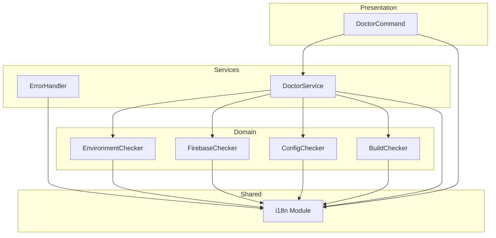

# Design Document: i18n-full-coverage

## Overview

**Purpose**: 本機能は、firex CLIのすべてのユーザー向けメッセージ（エラー、診断結果、ヘルプ）を多言語化し、日本語/英語の自動切替を実現する。

**Users**: firex CLIを使用する開発者、DevOpsエンジニア、およびAIアシスタント（MCP経由）が、自身のロケール設定に応じた言語でメッセージを受け取る。

**Impact**: 既存のi18nモジュール（src/shared/i18n.ts）を拡張し、約95個の新規メッセージキーを追加。error-handler.ts、doctor-service.ts、各チェッカーモジュールのハードコードメッセージをt()関数経由に置換。

### Goals

- すべてのユーザー向けメッセージをt()関数経由で取得可能にする
- 既存のMessages interfaceを拡張し、型安全性を維持する
- 日本語と英語の完全な翻訳カバレッジを達成する
- 既存コードとの後方互換性を100%維持する

### Non-Goals

- 日本語/英語以外の言語サポート（将来の拡張として検討）
- 外部翻訳ファイル（JSON/YAML）への移行
- プレースホルダー構文（テンプレートリテラル）の導入
- ICU MessageFormat等の高度なi18n機能

## Architecture

### Existing Architecture Analysis

現在のi18nシステムは以下の構造を持つ：

- `Messages` interface: 全メッセージキーの型定義（約100キー）
- `jaMessages` / `enMessages`: 各言語の翻訳オブジェクト
- `t(key)`: 型安全なメッセージ取得関数
- `detectLocale()`: 環境変数からのロケール自動検出

**既存の拡張ポイント**:
- Messages interfaceへのキー追加
- jaMessages/enMessagesへの翻訳追加

**維持すべきパターン**:
- 階層的キー命名（`category.subcategory.item`）
- 単一ファイル内での翻訳管理
- 型安全なt()関数アクセス

### Architecture Pattern & Boundary Map



**Architecture Integration**:
- **Selected pattern**: モジュール拡張（既存i18nモジュールの拡張）
- **Domain/feature boundaries**: i18nモジュールは共有層に位置し、全レイヤーから参照可能
- **Existing patterns preserved**: Messages interface + t()関数パターン
- **New components rationale**: 新規コンポーネントなし、既存モジュールの拡張のみ
- **Steering compliance**: tech.mdのTypeScript厳格モード、structure.mdのレイヤー構成に準拠

### Technology Stack

| Layer | Choice / Version | Role in Feature | Notes |
|-------|------------------|-----------------|-------|
| Shared | TypeScript 5.x | Messages interface拡張、型安全なキー管理 | 既存のstrict mode維持 |

> 本機能は既存スタックの拡張のみであり、新規依存関係なし。

## Requirements Traceability

| Requirement | Summary | Components | Interfaces | Flows |
|-------------|---------|------------|------------|-------|
| 1.1-1.6 | エラーハンドラーの多言語化 | ErrorHandler | Messages（err.handler.*キー） | Error Flow |
| 2.1-2.6 | 診断サービスの多言語化 | DoctorService, DoctorCommand | Messages（doctor.*キー） | Doctor Flow |
| 3.1-3.5 | i18nモジュールの拡張 | i18n Module | Messages interface | - |
| 4.1-4.3 | ヘルプ提案メッセージの多言語化 | ErrorHandler | Messages（err.handler.help.*キー） | Error Flow |
| 5.1-5.4 | 後方互換性の維持 | i18n Module | 既存t()関数 | - |
| 6.1-6.4 | 診断チェッカーの多言語化 | Environment/Firebase/Config/BuildChecker | Messages（doctor.check.*キー） | Doctor Flow |
| 7.1-7.4 | メッセージ品質の保証 | i18n Module Tests | - | Test Flow |

## Components and Interfaces

| Component | Domain/Layer | Intent | Req Coverage | Key Dependencies | Contracts |
|-----------|--------------|--------|--------------|------------------|-----------|
| i18n Module | Shared | メッセージキー定義と翻訳管理 | 3.1-3.5, 5.1-5.4, 7.1-7.4 | なし | Messages Interface |
| ErrorHandler | Services | エラーメッセージのローカライズ | 1.1-1.6, 4.1-4.3 | i18n (P0) | - |
| DoctorService | Services | 診断進捗・エラーメッセージのローカライズ | 2.1-2.6 | i18n (P0), Checkers (P0) | - |
| DoctorCommand | Commands | フラグ説明・エラーメッセージのローカライズ | 2.5-2.6 | i18n (P0) | - |
| EnvironmentChecker | Domain/Doctor | 環境チェックメッセージのローカライズ | 6.1 | i18n (P0) | - |
| FirebaseChecker | Domain/Doctor | Firebaseチェックメッセージのローカライズ | 6.2 | i18n (P0) | - |
| ConfigChecker | Domain/Doctor | 設定チェックメッセージのローカライズ | 6.3 | i18n (P0) | - |
| BuildChecker | Domain/Doctor | ビルドチェックメッセージのローカライズ | 6.4 | i18n (P0) | - |

### Shared Layer

#### i18n Module

| Field | Detail |
|-------|--------|
| Intent | 全メッセージキーの型定義と日本語/英語翻訳の管理 |
| Requirements | 3.1, 3.2, 3.3, 3.4, 3.5, 5.1, 5.2, 5.3, 5.4, 7.1, 7.2 |

**Responsibilities & Constraints**
- Messages interfaceで全キーを型定義し、コンパイル時の安全性を保証
- jaMessages/enMessagesで両言語の翻訳を保持
- 既存のt()関数インターフェースを変更しない

**Dependencies**
- Inbound: ErrorHandler, DoctorService, DoctorCommand, 各Checker — メッセージ取得 (P0)
- External: なし

**Contracts**: Service [x]

##### Service Interface

```typescript
// 拡張されたMessages interface（新規キーのみ抜粋）
interface Messages {
  // === 既存キー（変更なし） ===
  // cmd.*, arg.*, flag.*, msg.*, err.*, prompt.*

  // === 新規キー: エラーハンドラー ===
  // 認証エラー
  'err.handler.auth.invalid': string;
  'err.handler.auth.timeout': string;
  'err.handler.auth.retryHint': string;
  'err.handler.auth.projectNotFound': string;
  'err.handler.auth.checkProjectId': string;
  'err.handler.auth.permissionDenied': string;
  'err.handler.auth.checkPermission': string;
  'err.handler.auth.uninitialized': string;
  'err.handler.auth.generic': string;

  // 設定エラー
  'err.handler.config.fileNotFound': string;
  'err.handler.config.parseError': string;
  'err.handler.config.validationError': string;
  'err.handler.config.generic': string;

  // Firestoreエラー
  'err.handler.firestore.notFound': string;
  'err.handler.firestore.permissionDenied': string;
  'err.handler.firestore.checkRules': string;
  'err.handler.firestore.quotaExceeded': string;
  'err.handler.firestore.waitAndRetry': string;
  'err.handler.firestore.unavailable': string;
  'err.handler.firestore.checkConnection': string;
  'err.handler.firestore.timeout': string;
  'err.handler.firestore.retry': string;
  'err.handler.firestore.alreadyExists': string;
  'err.handler.firestore.invalidArgument': string;
  'err.handler.firestore.generic': string;

  // バリデーションエラー
  'err.handler.validation.withField': string;
  'err.handler.validation.generic': string;

  // スタックトレース
  'err.handler.stackTrace': string;

  // ヘルプ提案
  'err.handler.help.showHelp': string;
  'err.handler.help.configHelp': string;
  'err.handler.help.commandHelp': string;

  // === 新規キー: 診断サービス ===
  // 進捗メッセージ
  'doctor.progress.starting': string;
  'doctor.progress.emulatorMode': string;
  'doctor.progress.checkingNode': string;
  'doctor.progress.checkingFirebaseCli': string;
  'doctor.progress.checkingAuth': string;
  'doctor.progress.resolvingProjectId': string;
  'doctor.progress.checkingEmulator': string;
  'doctor.progress.checkingFirestoreApi': string;
  'doctor.progress.checkingFirestoreAccess': string;
  'doctor.progress.checkingConfig': string;
  'doctor.progress.validatingSyntax': string;
  'doctor.progress.validatingSchema': string;
  'doctor.progress.validatingPaths': string;
  'doctor.progress.checkingBuild': string;
  'doctor.progress.complete': string;

  // エラーメッセージ
  'doctor.error.checkFailed': string;
  'doctor.error.executionFailed': string;
  'doctor.error.formatFailed': string;

  // フラグ説明
  'flag.doctor.json': string;

  // === 新規キー: チェッカーモジュール ===
  // EnvironmentChecker
  'doctor.check.node.installed': string;
  'doctor.check.node.minVersion': string;
  'doctor.check.node.belowMinimum': string;
  'doctor.check.node.currentVersion': string;
  'doctor.check.node.upgradeHint': string;
  'doctor.check.firebaseCli.installed': string;
  'doctor.check.firebaseCli.notInstalled': string;
  'doctor.check.firebaseCli.installHint': string;
  'doctor.check.auth.info': string;
  'doctor.check.auth.emulatorMode': string;
  'doctor.check.auth.serviceAccount': string;
  'doctor.check.auth.adc': string;
  'doctor.check.auth.fileNotFound': string;
  'doctor.check.auth.setCredentialHint': string;
  'doctor.check.auth.notFound': string;
  'doctor.check.auth.notConfigured': string;
  'doctor.check.auth.setupHint': string;

  // FirebaseChecker
  'doctor.check.firebaserc.found': string;
  'doctor.check.firebaserc.noDefault': string;
  'doctor.check.firebaserc.useProjectHint': string;
  'doctor.check.firebaserc.parseError': string;
  'doctor.check.firebaserc.checkJsonHint': string;
  'doctor.check.firebaserc.notFound': string;
  'doctor.check.firebaserc.searchPath': string;
  'doctor.check.firebaserc.initHint': string;
  'doctor.check.firestoreApi.enabled': string;
  'doctor.check.firestoreApi.notInitialized': string;
  'doctor.check.firestoreApi.checkProject': string;
  'doctor.check.firestoreApi.rerunHint': string;
  'doctor.check.firestoreApi.notEnabled': string;
  'doctor.check.firestoreApi.enableHint': string;
  'doctor.check.firestoreApi.checkFailed': string;
  'doctor.check.firestoreApi.consoleHint': string;
  'doctor.check.firestoreAccess.hasAccess': string;
  'doctor.check.firestoreAccess.collectionsFound': string;
  'doctor.check.firestoreAccess.noPermission': string;
  'doctor.check.firestoreAccess.grantRoleHint': string;
  'doctor.check.firestoreAccess.checkFailed': string;
  'doctor.check.emulator.connected': string;
  'doctor.check.emulator.httpStatus': string;
  'doctor.check.emulator.unexpectedResponse': string;
  'doctor.check.emulator.checkRunning': string;
  'doctor.check.emulator.connectionFailed': string;
  'doctor.check.emulator.host': string;
  'doctor.check.emulator.startHint': string;
  'doctor.check.projectId.resolved': string;
  'doctor.check.projectId.notResolved': string;
  'doctor.check.projectId.setupHint': string;
  'doctor.check.projectId.source.gcloudProject': string;
  'doctor.check.projectId.source.googleCloudProject': string;
  'doctor.check.projectId.source.firebaseProject': string;
  'doctor.check.projectId.source.firebaserc': string;
  'doctor.check.projectId.source.serviceAccount': string;
  'doctor.check.projectId.source.unknown': string;

  // ConfigChecker
  'doctor.check.config.found': string;
  'doctor.check.config.filePath': string;
  'doctor.check.config.notFound': string;
  'doctor.check.config.usingDefaults': string;
  'doctor.check.config.searchPath': string;
  'doctor.check.config.createHint': string;
  'doctor.check.syntax.yamlValid': string;
  'doctor.check.syntax.yamlError': string;
  'doctor.check.syntax.position': string;
  'doctor.check.syntax.yamlHint': string;
  'doctor.check.syntax.jsonValid': string;
  'doctor.check.syntax.jsonError': string;
  'doctor.check.syntax.jsonHint': string;
  'doctor.check.schema.valid': string;
  'doctor.check.schema.invalid': string;
  'doctor.check.schema.validFields': string;
  'doctor.check.paths.noTargets': string;
  'doctor.check.paths.allValid': string;
  'doctor.check.paths.invalid': string;
  'doctor.check.paths.invalidPaths': string;
  'doctor.check.paths.segmentHint': string;

  // BuildChecker
  'doctor.check.build.npmPackage': string;
  'doctor.check.build.skipped': string;
  'doctor.check.build.noDistDir': string;
  'doctor.check.build.expectedPath': string;
  'doctor.check.build.runBuildHint': string;
  'doctor.check.build.builtEnv': string;
  'doctor.check.build.noSrcDir': string;
  'doctor.check.build.rebuildRequired': string;
  'doctor.check.build.newestSource': string;
  'doctor.check.build.newestBuild': string;
  'doctor.check.build.upToDate': string;
}

// 既存関数（変更なし）
function t(key: keyof Messages): string;
function detectLocale(): SupportedLocale;
function getLocale(): SupportedLocale;
function setLocale(locale: SupportedLocale): void;
function getMessages(): Messages;
function isJapanese(): boolean;
```

- **Preconditions**: なし
- **Postconditions**: 指定されたキーに対応するローカライズ済み文字列を返す
- **Invariants**: 全キーが日本語・英語の両方で定義されている

**Implementation Notes**
- Integration: 各コンポーネントはimport { t } from '../shared/i18n'でアクセス
- Validation: TypeScriptコンパイラが未定義キーを検出
- Risks: i18n.tsファイルサイズ増大（約800行→約1200行）

### Services Layer

#### ErrorHandler

| Field | Detail |
|-------|--------|
| Intent | 認証/設定/Firestore/バリデーションエラーのローカライズ表示 |
| Requirements | 1.1, 1.2, 1.3, 1.4, 1.5, 1.6, 4.1, 4.2, 4.3 |

**Responsibilities & Constraints**
- ハードコードされた日本語メッセージをt()関数呼び出しに置換
- エラーカテゴリに応じた適切なメッセージキーを選択
- 動的な値（パス、エラーメッセージ）は文字列連結で組み込み

**Dependencies**
- Inbound: BaseCommand — エラー表示 (P0)
- Outbound: i18n Module — メッセージ取得 (P0)

**Contracts**: Service [x]

##### Service Interface

```typescript
class ErrorHandler {
  // 既存メソッド（シグネチャ変更なし、内部実装のみ変更）
  handleAuthError(error: AuthError): string;
  handleConfigError(error: ConfigError): string;
  handleFirestoreError(error: Error): string;
  handleValidationError(field: string | undefined, message: string): string;
  formatErrorWithStack(error: Error): string;
  suggestHelp(context?: string): string;
  getExitCode(errorCategory?: ErrorCategory): number;
}
```

**Implementation Notes**
- Integration: 各メソッド内でt()を使用してメッセージ取得
- Validation: 返却文字列が空でないことをテストで検証
- Dynamic values pattern: 動的な値は文字列連結で組み込む
  ```typescript
  // 例1: パスを含むエラーメッセージ
  return t('err.handler.config.fileNotFound') + ': ' + error.path;

  // 例2: フィールド名を含むバリデーションエラー
  return t('err.handler.validation.withField').replace('{field}', field) + ': ' + message;

  // 例3: 複数の動的値
  return `${t('doctor.check.node.currentVersion')}: ${version}`;
  ```

#### DoctorService

| Field | Detail |
|-------|--------|
| Intent | 診断進捗・エラーメッセージのローカライズ表示 |
| Requirements | 2.1, 2.2, 2.3, 2.4, 2.6 |

**Responsibilities & Constraints**
- verbose時の進捗メッセージをt()経由で取得
- エラー結果作成時のメッセージをt()経由で取得
- 既存のconsole.log出力パターンを維持

**Dependencies**
- Inbound: DoctorCommand — 診断実行 (P0)
- Outbound: i18n Module — メッセージ取得 (P0)
- Outbound: Checkers — 診断チェック実行 (P0)

**Contracts**: Service [x]

##### Service Interface

```typescript
class DoctorService {
  // 既存メソッド（シグネチャ変更なし）
  detectEmulatorMode(): boolean;
  runDiagnostics(options: DoctorServiceOptions): Promise<Result<DiagnosticReport, DoctorError>>;
}
```

**Implementation Notes**
- Integration: runDiagnostics内の文字列リテラルをt()呼び出しに置換
- Risks: 既存のテストがメッセージ文字列をハードコードしている可能性

### Domain Layer (Doctor Checkers)

#### EnvironmentChecker

| Field | Detail |
|-------|--------|
| Intent | Node.js/Firebase CLI/認証状態チェックメッセージのローカライズ |
| Requirements | 6.1 |

**Responsibilities & Constraints**
- checkNodeVersion, checkFirebaseCLI, checkAuthStatusの各メッセージをt()経由で取得
- createCheckResult呼び出し時のmessage/details/guidanceをローカライズ

**Dependencies**
- Outbound: i18n Module — メッセージ取得 (P0)

**Contracts**: Service [x]

##### Service Interface

```typescript
class EnvironmentChecker {
  checkNodeVersion(): Result<CheckResult, CheckerError>;
  checkFirebaseCLI(): Promise<Result<CheckResult, CheckerError>>;
  checkAuthStatus(): Promise<Result<CheckResult, CheckerError>>;
  detectAuthInfo(): AuthInfo;
  getGcloudAccount(): Promise<string | undefined>;
}
```

#### FirebaseChecker

| Field | Detail |
|-------|--------|
| Intent | プロジェクトID/エミュレータ/Firestore APIチェックメッセージのローカライズ |
| Requirements | 6.2 |

**Responsibilities & Constraints**
- checkProjectId, checkEmulatorConnection, checkFirestoreAPI, checkFirestoreAccessの各メッセージをt()経由で取得

**Dependencies**
- Outbound: i18n Module — メッセージ取得 (P0)

**Contracts**: Service [x]

##### Service Interface

```typescript
class FirebaseChecker {
  checkFirebaseRC(searchPath?: string): Promise<Result<CheckResult, CheckerError>>;
  checkFirestoreAPI(projectId: string): Promise<Result<CheckResult, CheckerError>>;
  checkFirestoreAccess(config: Config): Promise<Result<CheckResult, CheckerError>>;
  checkEmulatorConnection(host: string): Promise<Result<CheckResult, CheckerError>>;
  resolveProjectId(searchPath?: string): ProjectIdInfo;
  checkProjectId(searchPath?: string): Result<CheckResult, CheckerError>;
}
```

#### ConfigChecker

| Field | Detail |
|-------|--------|
| Intent | 設定ファイル検出/構文/スキーマ検証メッセージのローカライズ |
| Requirements | 6.3 |

**Responsibilities & Constraints**
- checkConfigFile, validateConfigSyntax, validateConfigSchema, validateCollectionPathsの各メッセージをt()経由で取得

**Dependencies**
- Outbound: i18n Module — メッセージ取得 (P0)

**Contracts**: Service [x]

##### Service Interface

```typescript
class ConfigChecker {
  readFile(filePath: string): Promise<Result<string, CheckerError>>;
  parseConfig(filePath: string, content: string): Result<unknown, CheckerError>;
  checkConfigFile(searchPath?: string): Promise<Result<CheckResult, CheckerError>>;
  validateConfigSyntax(filePath: string, content: string): Result<CheckResult, CheckerError>;
  validateConfigSchema(config: unknown): Result<CheckResult, CheckerError>;
  validateCollectionPaths(paths: string[]): Result<CheckResult, CheckerError>;
}
```

#### BuildChecker

| Field | Detail |
|-------|--------|
| Intent | ビルド状態チェックメッセージのローカライズ |
| Requirements | 6.4 |

**Responsibilities & Constraints**
- checkBuildStatusの各メッセージをt()経由で取得

**Dependencies**
- Outbound: i18n Module — メッセージ取得 (P0)

**Contracts**: Service [x]

##### Service Interface

```typescript
class BuildChecker {
  isNpmPackageInstall(): boolean;
  checkBuildStatus(projectRoot?: string): Promise<Result<CheckResult, CheckerError>>;
}
```

### Commands Layer

#### DoctorCommand

| Field | Detail |
|-------|--------|
| Intent | --jsonフラグ説明とエラーメッセージのローカライズ |
| Requirements | 2.5, 2.6 |

**Responsibilities & Constraints**
- Flags.booleanのdescriptionをt()経由で取得
- エラー時のloggingService.error呼び出しメッセージをt()経由で取得

**Dependencies**
- Outbound: i18n Module — メッセージ取得 (P0)
- Outbound: DoctorService — 診断実行 (P0)

**Contracts**: Service [x]

##### Service Interface

```typescript
class DoctorCommand extends BaseCommand {
  static flags: {
    verbose: Flags.Boolean;
    json: Flags.Boolean;
  };
  run(): Promise<void>;
}
```

## Data Models

### Domain Model

本機能ではデータモデルの変更なし。既存のMessages型定義を拡張するのみ。

```typescript
// 既存の型（変更なし）
type SupportedLocale = 'ja' | 'en';

// Messages interfaceは約95個の新規プロパティを追加（上記Service Interfaceで定義済み）
```

## Error Handling

### Error Strategy

既存のエラー処理パターンを維持しつつ、エラーメッセージのみをローカライズ。

### Error Categories and Responses

**User Errors (4xx相当)**:
- 認証エラー → `err.handler.auth.*`キーでローカライズ
- 設定エラー → `err.handler.config.*`キーでローカライズ
- バリデーションエラー → `err.handler.validation.*`キーでローカライズ

**System Errors (5xx相当)**:
- Firestoreエラー → `err.handler.firestore.*`キーでローカライズ

**Business Logic Errors**:
- 診断チェック失敗 → `doctor.error.*`および`doctor.check.*`キーでローカライズ

### Monitoring

既存のloggingServiceパターンを維持。ログ出力自体は英語のまま（開発者向け）、ユーザー向けメッセージのみローカライズ。

## Testing Strategy

### Unit Tests

| テスト対象 | テスト内容 |
|-----------|-----------|
| i18n Module | 全キーが日本語/英語で定義されていることを検証 |
| i18n Module | 各キーの値が空でないことを検証 |
| i18n Module | setLocale後に正しい言語のメッセージが返されることを検証 |
| ErrorHandler | 各エラータイプでt()が正しく呼び出されることを検証 |
| DoctorService | verbose時の進捗メッセージがローカライズされることを検証 |

### Integration Tests

| テスト対象 | テスト内容 |
|-----------|-----------|
| ErrorHandler + i18n | ロケール切替後のエラーメッセージ言語切替を検証 |
| DoctorService + Checkers + i18n | 診断結果の全メッセージがローカライズされることを検証 |
| DoctorCommand + i18n | フラグ説明のローカライズを検証 |

### E2E Tests

| テスト対象 | テスト内容 |
|-----------|-----------|
| LANG=ja firex doctor | 日本語メッセージが出力されることを検証 |
| LANG=en firex doctor | 英語メッセージが出力されることを検証 |
| エラー発生時 | ロケールに応じたエラーメッセージ表示を検証 |

## Supporting References

メッセージキーの完全な一覧と翻訳内容の詳細は`research.md`を参照。

---

## Design Amendment: Inspection-2 Critical Issue Fix

### Issue Overview

**Identified in**: inspection-1.md, inspection-2.md
**Location**: `src/services/doctor-service.ts:161-162`
**Severity**: Critical

現在の実装では、設定ファイルの検出とパス抽出にローカライズされたメッセージ内容を使用している：

```typescript
// 問題のあるコード
if (configResult.value.message.includes('設定ファイルが見つかりました')) {
  const pathMatch = configResult.value.details?.match(/ファイルパス: (.+)$/);
```

これにより、英語ロケールユーザーでは設定ファイルの構文・スキーマ検証がスキップされる。

### Design Principle Violation

**i18nの基本原則**: メッセージはユーザー表示専用であり、ランタイムロジックに使用してはならない。

### Fix Approach: Structured Return Data

#### Option A: CheckResult拡張（推奨）

`CheckResult`型に構造化メタデータを追加：

```typescript
// domain/doctor/types.ts - CheckResult拡張
interface CheckResult {
  status: CheckStatus;
  category: CheckCategory;
  message: string;
  details?: string;
  guidance?: string;
  // 新規追加: ロジック用構造化データ
  metadata?: Record<string, unknown>;
}
```

ConfigCheckerの`checkConfigFile`が`metadata.filePath`を返す：

```typescript
// config-checker.ts
return ok(
  createCheckResult(
    'success',
    'config-file',
    `${t('doctor.check.config.found')}: ${filename}`,
    `${t('doctor.check.config.filePath')}: ${filePath}`,
    undefined,
    { filePath, found: true }  // metadata
  )
);
```

DoctorServiceでメタデータを使用：

```typescript
// doctor-service.ts
if (configResult.isOk() && configResult.value.metadata?.found) {
  configFilePath = configResult.value.metadata.filePath as string;
}
```

#### Rationale

1. **後方互換性**: 既存のCheckResult構造を破壊しない
2. **型安全性**: TypeScriptで型チェック可能
3. **拡張性**: 他のチェッカーでも同様のパターンを使用可能
4. **明確な分離**: 表示用メッセージとロジック用データを分離

### Implementation Changes Required

| File | Change |
|------|--------|
| `src/domain/doctor/types.ts` | CheckResultにmetadata?フィールド追加、createCheckResult関数拡張 |
| `src/domain/doctor/config-checker.ts` | checkConfigFileでmetadataを返す |
| `src/services/doctor-service.ts` | メッセージ内容ではなくmetadataを参照 |
| `src/services/doctor-service.test.ts` | テストのモックを更新 |

### Test Update Required

既存テストのモックは日本語メッセージをハードコードしている。これらをmetadataベースの検証に更新する必要がある。

---

**Status**: Generated

**Amendment Status**: Pending Implementation

**Next Step**: Review and approve design, then run `/kiro:spec-tasks i18n-full-coverage` to generate implementation tasks.
