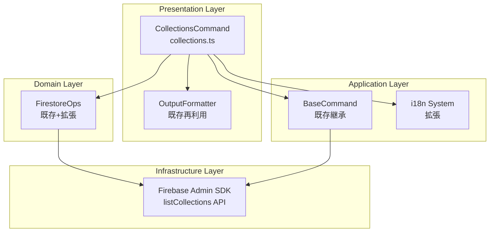
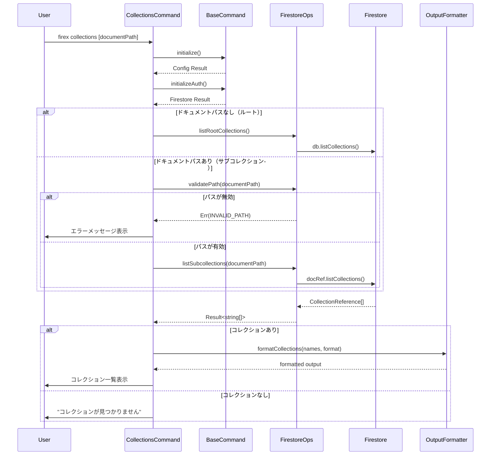

# Design: list-root-collections

## Overview

本機能は、Firebase Admin SDKの`listCollections()`メソッドを活用して、Firestoreデータベースのルートレベルコレクション一覧およびドキュメント配下のサブコレクション一覧を取得・表示する`firex collections`コマンドを提供します。

**目的**: 開発者がFirestoreデータベースの構造を把握し、操作対象のコレクションを特定するための探索機能を提供する。

**対象ユーザー**: Firebase/Firestoreを利用する開発者、DevOpsエンジニア。データベース構造の確認、サブコレクションの探索、スクリプト連携などに活用される。

**影響**: 既存のfirex CLIに新規コマンドを追加。既存のBaseCommand、OutputFormatter、i18nシステムを再利用し、一貫したユーザー体験を維持する。

### Goals

- ルートレベルコレクション一覧の取得・表示機能を実装
- ドキュメントパス指定によるサブコレクション一覧取得機能を実装
- 複数出力フォーマット（プレーンテキスト、JSON、YAML、テーブル）のサポート
- 既存のCLIコマンド群と一貫したエラーハンドリングとi18n対応を実現
- `--quiet`フラグによるスクリプト連携対応

### Non-Goals

- コレクション内のドキュメント一覧表示（既存の`list`コマンドで対応）
- 再帰的なコレクション構造の完全探索（階層が深い場合のパフォーマンス考慮）
- コレクションの作成・削除・名前変更機能

## Architecture

### Existing Architecture Analysis

本機能は既存のfirex CLIアーキテクチャに統合されます。以下の既存コンポーネントを再利用します：

- **BaseCommand**: 認証、設定読み込み、共通フラグ処理を継承
- **FirestoreOps**: パス検証ロジック（`isDocumentPath`）を活用
- **OutputFormatter**: JSON/YAML/テーブル形式出力を再利用
- **i18nシステム**: コマンド説明・エラーメッセージのローカライズ
- **ErrorHandler**: 認証エラー、権限エラー等の標準化されたエラー処理

### Architecture Pattern & Boundary Map

**選択パターン**: 既存のLayered Architecture with Command Patternに準拠



**アーキテクチャ統合方針**:

- **選択パターン**: 既存のCommand Patternを踏襲し、新規`CollectionsCommand`を追加
- **ドメイン/機能境界**:
  - コマンド層: ユーザー入力解析と結果出力を担当
  - ドメイン層: Firestoreとの通信ロジックを集約（`FirestoreOps`拡張）
- **既存パターンの保持**: `BaseCommand`継承、`OutputFormatter`再利用、Result型によるエラーハンドリング
- **新規コンポーネントの根拠**:
  - `CollectionsCommand`: コレクション一覧専用のコマンドハンドラー
  - `FirestoreOps`拡張: `listCollections`ラッパーメソッド追加
- **Steering準拠**: 型安全性、明示的エラーハンドリング、既存パターンとの一貫性

### Technology Stack

| Layer | Choice / Version | Role in Feature | Notes |
|-------|------------------|-----------------|-------|
| CLI Framework | oclif v3.x（既存） | コマンド定義、引数パース | 既存フレームワークを活用 |
| Firebase SDK | firebase-admin v13.6.0（既存） | `listCollections()` API | Firestore/DocumentReference.listCollections() |
| Output Formatting | cli-table3, yaml（既存） | 出力フォーマット | OutputFormatter再利用 |
| Error Handling | neverthrow v7.x（既存） | Result型によるエラー処理 | 既存パターン踏襲 |

## System Flows

### コレクション一覧取得フロー



## Requirements Traceability

| Requirement | Summary | Components | Interfaces | Flows |
|-------------|---------|------------|------------|-------|
| 1.1 | ルートコレクション一覧表示 | CollectionsCommand, FirestoreOps | listRootCollections() | コレクション一覧取得フロー |
| 1.2 | 取得コレクション数表示 | CollectionsCommand | formatOutput() | 出力フォーマット処理 |
| 1.3 | コレクション未検出時メッセージ | CollectionsCommand | i18n messages | エラーハンドリング |
| 2.1 | サブコレクション一覧表示 | CollectionsCommand, FirestoreOps | listSubcollections() | コレクション一覧取得フロー |
| 2.2 | 無効パスエラー | CollectionsCommand, FirestoreOps | isDocumentPath() | バリデーション処理 |
| 2.3 | ドキュメント未検出エラー | CollectionsCommand, FirestoreOps | getDocument() | エラーハンドリング |
| 2.4 | サブコレクション未検出メッセージ | CollectionsCommand | i18n messages | 出力処理 |
| 3.1 | JSON出力（デフォルト） | CollectionsCommand, OutputFormatter | formatCollections() | 出力フォーマット処理 |
| 3.2 | JSON出力 | CollectionsCommand, OutputFormatter | --json flag | 出力フォーマット処理 |
| 3.3 | YAML出力 | CollectionsCommand, OutputFormatter | --yaml flag | 出力フォーマット処理 |
| 3.4 | テーブル出力 | CollectionsCommand, OutputFormatter | --table flag | 出力フォーマット処理 |
| 3.5 | Quiet出力 | CollectionsCommand | --quiet flag | 出力フォーマット処理 |
| 4.1 | 認証エラーハンドリング | BaseCommand, ErrorHandler | handleAuthError() | エラーハンドリング |
| 4.2 | 権限エラーハンドリング | BaseCommand, ErrorHandler | handleFirestoreError() | エラーハンドリング |
| 4.3 | ネットワークエラーハンドリング | BaseCommand, ErrorHandler | handleFirestoreError() | エラーハンドリング |
| 4.4 | BaseCommand継承 | CollectionsCommand | extends BaseCommand | アーキテクチャ統合 |
| 5.1 | コマンド説明i18n | i18n | cmd.collections.description | ローカライズ |
| 5.2 | エラーメッセージi18n | i18n | err.* messages | ローカライズ |
| 5.3 | ヘルプテキストi18n | i18n | arg.*, flag.* | ローカライズ |

## Components and Interfaces

| Component | Domain/Layer | Intent | Req Coverage | Key Dependencies | Contracts |
|-----------|--------------|--------|--------------|------------------|-----------|
| CollectionsCommand | Presentation | コレクション一覧表示コマンド | 1.1-1.3, 2.1-2.4, 3.1-3.5, 4.4 | BaseCommand (P0), FirestoreOps (P0), OutputFormatter (P1) | Service |
| FirestoreOps (拡張) | Domain | コレクション一覧取得ロジック | 1.1, 2.1-2.3 | Firebase Admin SDK (P0) | Service |
| i18n (拡張) | Application | コレクションコマンド用メッセージ | 5.1-5.3 | - | State |
| OutputFormatter (拡張) | Presentation | コレクション名リスト出力 | 3.1-3.5 | cli-table3, yaml (P1) | Service |

### Presentation Layer

#### CollectionsCommand

| Field | Detail |
|-------|--------|
| Intent | Firestoreコレクション一覧を取得・表示するCLIコマンド |
| Requirements | 1.1, 1.2, 1.3, 2.1, 2.2, 2.3, 2.4, 3.1, 3.2, 3.3, 3.4, 3.5, 4.4 |

**Responsibilities & Constraints**
- ルートコレクションおよびサブコレクションの一覧取得・表示
- 引数としてオプショナルなドキュメントパスを受け取る
- 出力フォーマット（プレーンテキスト/JSON/YAML/テーブル）の選択
- `--quiet`フラグによる補足メッセージ抑制

**Dependencies**
- Inbound: CLI (oclif) -- コマンド実行 (P0)
- Outbound: FirestoreOps -- コレクション一覧取得 (P0)
- Outbound: OutputFormatter -- 出力フォーマット (P1)
- Inherited: BaseCommand -- 認証・設定・共通フラグ (P0)

**Contracts**: Service [x]

##### Service Interface

```typescript
// src/commands/collections.ts

import { Args, Flags } from '@oclif/core';
import { BaseCommand } from './base-command';
import { FirestoreOps } from '../domain/firestore-ops';
import { OutputFormatter } from '../presentation/output-formatter';
import { t } from '../shared/i18n';
import type { OutputFormat } from '../shared/types';

export class CollectionsCommand extends BaseCommand {
  static override hidden = false;
  static override description = t('cmd.collections.description');

  static override examples = [
    '<%= config.bin %> collections',
    '<%= config.bin %> collections users/user123',
    '<%= config.bin %> collections --json',
    '<%= config.bin %> collections users/user123 --yaml',
    '<%= config.bin %> collections --table',
    '<%= config.bin %> collections --quiet',
  ];

  static override args = {
    documentPath: Args.string({
      description: t('arg.documentPathOptional'),
      required: false,
    }),
  };

  static override flags = {
    ...BaseCommand.baseFlags,
    quiet: Flags.boolean({
      char: 'q',
      description: t('flag.quiet'),
      default: false,
    }),
  };

  async run(): Promise<void>;
}
```

- Preconditions: Firebase認証が成功していること
- Postconditions: コレクション一覧が指定フォーマットで出力される
- Invariants: ドキュメントパス指定時は偶数セグメントであること

### Domain Layer

#### FirestoreOps (拡張)

| Field | Detail |
|-------|--------|
| Intent | Firestore操作の抽象化レイヤー（コレクション一覧取得を追加） |
| Requirements | 1.1, 2.1, 2.2, 2.3 |

**Responsibilities & Constraints**
- ルートコレクション一覧取得（`db.listCollections()`のラッパー）
- サブコレクション一覧取得（`docRef.listCollections()`のラッパー）
- ドキュメント存在確認（サブコレクション取得前）
- Result型による型安全なエラーハンドリング

**Dependencies**
- Inbound: CollectionsCommand -- コレクション一覧取得要求 (P0)
- External: Firebase Admin SDK -- Firestore API (P0)

**Contracts**: Service [x]

##### Service Interface

```typescript
// src/domain/firestore-ops.ts (追加メソッド)

import type { Firestore } from 'firebase-admin/firestore';
import { Result } from '../shared/types';

export type FirestoreOpsError =
  | { type: 'INVALID_PATH'; message: string; path: string }
  | { type: 'NOT_FOUND'; message: string; path: string }
  | { type: 'FIRESTORE_ERROR'; message: string; originalError: Error };

export class FirestoreOps {
  constructor(private firestore: Firestore) {}

  /**
   * ルートレベルのコレクション一覧を取得
   * @returns コレクション名の配列
   */
  async listRootCollections(): Promise<Result<string[], FirestoreOpsError>>;

  /**
   * 指定ドキュメント配下のサブコレクション一覧を取得
   * @param documentPath ドキュメントパス（例: "users/user123"）
   * @returns サブコレクション名の配列
   */
  async listSubcollections(documentPath: string): Promise<Result<string[], FirestoreOpsError>>;

  // 既存メソッド
  isDocumentPath(path: string): boolean;
  validatePath(path: string): Result<void, FirestoreOpsError>;
  async getDocument(path: string): Promise<Result<DocumentWithMeta, FirestoreOpsError>>;
}
```

- Preconditions: Firestoreインスタンスが初期化済みであること
- Postconditions: 成功時はコレクション名配列、失敗時はエラー型を返却
- Invariants: 空配列は成功とみなす（コレクション0件）

**Implementation Notes**
- Integration: `listCollections()`は`CollectionReference[]`を返すため、`.id`プロパティでコレクション名を抽出
- Validation: サブコレクション取得時は事前にドキュメントパス形式を検証（偶数セグメント）
- Risks: `listCollections()`は全参照をメモリにロードするため、大量コレクション時のメモリ使用量に注意

### Application Layer

#### i18n System (拡張)

| Field | Detail |
|-------|--------|
| Intent | コレクションコマンド用のローカライズメッセージ追加 |
| Requirements | 5.1, 5.2, 5.3 |

**Contracts**: State [x]

##### State Management

```typescript
// src/shared/i18n.ts (追加メッセージ)

export interface Messages {
  // 既存メッセージ...

  // コレクションコマンド用
  'cmd.collections.description': string;
  'arg.documentPathOptional': string;
  'msg.collectionsFound': string;
  'msg.noCollectionsFound': string;
  'msg.noSubcollectionsFound': string;
  'err.documentNotFoundForSubcollections': string;
}

// 日本語メッセージ追加
const jaMessages: Messages = {
  // 既存...
  'cmd.collections.description': 'コレクション一覧を表示する',
  'arg.documentPathOptional': 'サブコレクションを取得するドキュメントパス（省略時はルートコレクション）',
  'msg.collectionsFound': '件のコレクションが見つかりました',
  'msg.noCollectionsFound': 'コレクションが見つかりません',
  'msg.noSubcollectionsFound': 'サブコレクションが見つかりません',
  'err.documentNotFoundForSubcollections': 'ドキュメントが見つかりません。サブコレクションを取得できません',
};

// 英語メッセージ追加
const enMessages: Messages = {
  // 既存...
  'cmd.collections.description': 'List collections',
  'arg.documentPathOptional': 'Document path for subcollections (omit for root collections)',
  'msg.collectionsFound': 'collection(s) found',
  'msg.noCollectionsFound': 'No collections found',
  'msg.noSubcollectionsFound': 'No subcollections found',
  'err.documentNotFoundForSubcollections': 'Document not found. Cannot retrieve subcollections',
};
```

### Presentation Layer

#### OutputFormatter (拡張)

| Field | Detail |
|-------|--------|
| Intent | コレクション名リストの出力フォーマット |
| Requirements | 3.1, 3.2, 3.3, 3.4 |

**Contracts**: Service [x]

##### Service Interface

```typescript
// src/presentation/output-formatter.ts (追加メソッド)

export class OutputFormatter {
  // 既存メソッド...

  /**
   * コレクション名一覧をフォーマット
   * @param collections コレクション名の配列
   * @param format 出力形式
   * @returns フォーマット済み文字列
   */
  formatCollections(
    collections: string[],
    format: OutputFormat
  ): Result<string, FormatError>;
}
```

**Implementation Notes**
- JSON（デフォルト）: `{ "collections": ["collection1", ...], "count": N }`形式
- プレーンテキスト: 改行区切りでコレクション名を出力
- YAML: YAML配列形式
- テーブル: 単一カラム（Collection Name）のテーブル

## Data Models

### Domain Model

本機能は新規データモデルを導入しません。Firebase Admin SDKの`CollectionReference`からコレクション名（`id`プロパティ）を抽出して使用します。

### Logical Data Model

**出力データ構造**:

```typescript
// JSON出力（デフォルト）
type JsonOutput = {
  collections: string[];  // コレクション名の配列
  count: number;          // コレクション数
};

// プレーンテキスト出力
type PlainOutput = string; // 改行区切りのコレクション名

// YAML出力
type YamlOutput = string; // YAML形式の配列文字列

// テーブル出力
type TableOutput = string; // cli-table3によるテーブル文字列

// --quiet時のJSON出力（collectionsのみ、countなし）
type QuietJsonOutput = string[]; // コレクション名の配列のみ
```

## Error Handling

### Error Strategy

既存のErrorHandlerパターンを踏襲し、Result型によるエラーハンドリングを実装します。

### Error Categories and Responses

**User Errors (Exit Code 1)**:
- 無効なドキュメントパス (`INVALID_PATH`) -> パス形式の説明とヘルプ案内
- ドキュメント未検出 (`NOT_FOUND`) -> パスの確認を促すメッセージ

**System Errors (Exit Code 2)**:
- 認証エラー (`AUTH_ERROR`) -> 認証情報の確認を促すメッセージ
- 権限エラー (`PERMISSION_DENIED`) -> Firestoreルールの確認を促すメッセージ
- ネットワークエラー (`CONNECTION_TIMEOUT`) -> 接続の確認と再試行を促すメッセージ
- Firestoreエラー (`FIRESTORE_ERROR`) -> 詳細エラーメッセージと再試行案内

### Monitoring

既存のLoggingServiceを使用し、`--verbose`フラグでデバッグ情報を出力します。

## Testing Strategy

### Unit Tests

1. **CollectionsCommand**
   - コマンド設定（description, args, flags）の検証
   - ルートコレクション取得時のFirestoreOps呼び出し検証
   - サブコレクション取得時のドキュメントパス検証
   - 各出力フォーマットの動作検証
   - `--quiet`フラグの動作検証

2. **FirestoreOps.listRootCollections()**
   - 正常系: コレクションが存在する場合
   - 正常系: コレクションが存在しない場合（空配列）
   - 異常系: Firestoreエラー時のエラー型検証

3. **FirestoreOps.listSubcollections()**
   - 正常系: サブコレクションが存在する場合
   - 正常系: サブコレクションが存在しない場合（空配列）
   - 異常系: 無効なドキュメントパス
   - 異常系: ドキュメントが存在しない場合

4. **OutputFormatter.formatCollections()**
   - プレーンテキスト出力の形式検証
   - JSON出力の形式検証
   - YAML出力の形式検証
   - テーブル出力の形式検証
   - 空配列の出力検証

5. **i18n**
   - 日本語メッセージの存在確認
   - 英語メッセージの存在確認

### Integration Tests

1. **認証からコレクション取得まで**
   - 正常な認証フローでルートコレクション取得
   - 認証エラー時の適切なエラーハンドリング

2. **サブコレクション取得フロー**
   - 有効なドキュメントパスでサブコレクション取得
   - 存在しないドキュメントに対するエラーハンドリング

3. **出力フォーマット**
   - 各フォーマットオプションでの出力検証

### E2E Tests (Emulator使用)

1. **ルートコレクション一覧**
   - `firex collections`実行時の出力検証
   - `firex collections --json`実行時のJSON出力検証

2. **サブコレクション一覧**
   - `firex collections users/user1`実行時の出力検証
   - 存在しないドキュメントパス指定時のエラー検証
