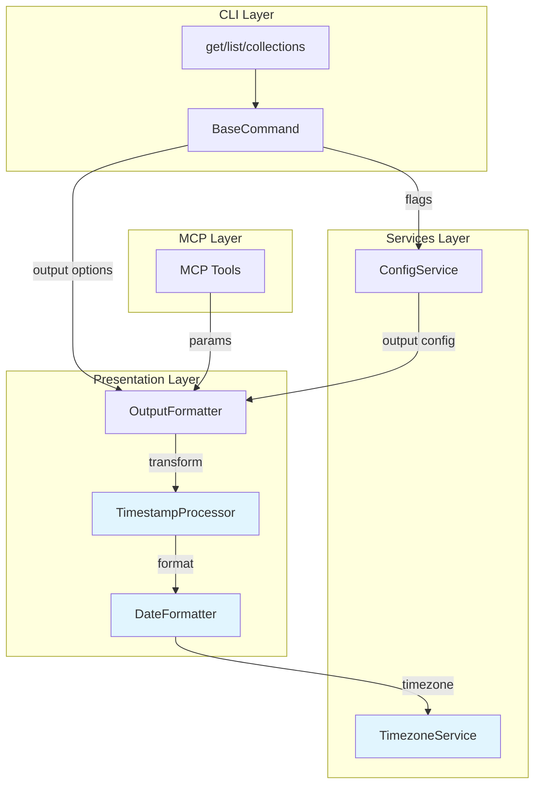
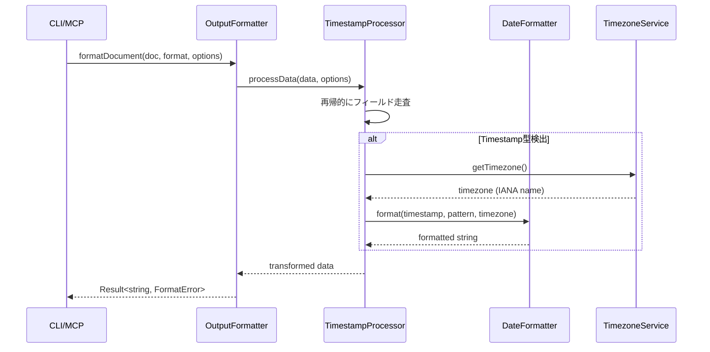
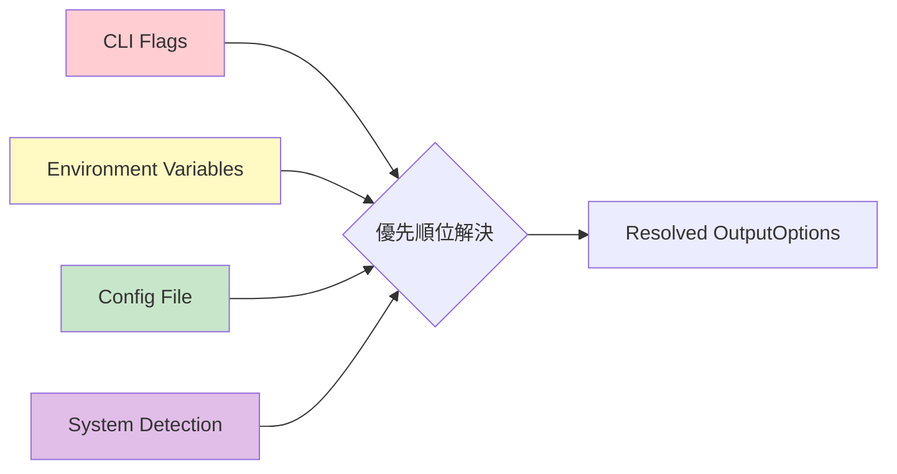

# Design: timestamp-formatting

## Overview

**目的**: Firestore Timestamp型フィールドを人間が読みやすいISO 8601形式で出力し、開発者のデバッグ効率とデータ可読性を向上させる。

**ユーザー**: firex CLIユーザー、MCPツールを利用するAIアシスタント（Claude等）が、Firestoreデータを確認する際に本機能を利用する。

**影響**: 既存の`OutputFormatter`にTimestamp変換レイヤーを追加し、`ConfigService`に出力設定を拡張する。既存の出力形式（JSON/YAML/Table/Toon）との互換性を維持しつつ、日時データの可読性を改善する。

### Goals

- Timestamp型フィールドをISO 8601形式（yyyy-MM-dd'T'HH:mm:ssXXX）で自動変換
- システムタイムゾーンの自動検出と、設定による上書きを実現
- 既存の設定優先順位（CLIオプション > 環境変数 > 設定ファイル > デフォルト）に準拠
- 将来のライブラリ差し替えに備えた抽象化レイヤーの提供

### Non-Goals

- ロケール対応（i18n）の日時フォーマット（例: "2024年1月15日"）
- Firestoreの他の特殊型（GeoPoint, Reference等）の変換
- リアルタイム同期における日時のローカライゼーション
- カスタム日付パーサー機能

## Architecture

### Existing Architecture Analysis

現行アーキテクチャの関連箇所:

| レイヤー | コンポーネント | 役割 |
|---------|--------------|------|
| Presentation | `OutputFormatter` | JSON/YAML/Table/Toon形式への変換 |
| Services | `ConfigService` | 設定ファイル・環境変数の読み込み |
| Commands | `BaseCommand` | CLIフラグ定義・初期化処理 |
| MCP | `tools/*.ts` | MCPツールハンドラ |

**統合ポイント**:
- `OutputFormatter.formatDocument/formatDocuments`: データ変換前にTimestamp処理を挿入
- `ConfigService.loadConfig`: 新規出力設定項目の読み込み
- `BaseCommand.baseFlags`: 新規CLIオプションの追加
- MCPツール: パラメータ拡張とフォーマットオプションの伝播

### Architecture Pattern & Boundary Map



**Architecture Integration**:
- **Selected pattern**: Strategy Pattern for DateFormatter abstraction（将来の実装差し替えに対応）
- **Domain boundaries**: Presentation層にTimestamp変換ロジックを配置（出力整形の責務）
- **Existing patterns preserved**: neverthrow Result型、cosmiconfig設定読み込み、oclif CLIフラグ
- **New components**: `DateFormatter`（インターフェース）、`DateFnsFormatter`（実装）、`TimestampProcessor`（再帰変換）、`TimezoneService`（タイムゾーン検出）
- **Steering compliance**: 設定優先順位（CLI > env > config > default）維持

### Technology Stack

| Layer | Choice / Version | Role in Feature | Notes |
|-------|------------------|-----------------|-------|
| Date Library | date-fns 4.x + @date-fns/tz | Timestamp変換・フォーマット | 軽量（TZDateMini: ~916B）、Tree-shaking対応 |
| Timezone Detection | Intl.DateTimeFormat API | システムタイムゾーン自動検出 | Node.js 18+標準サポート |
| Validation | zod | フォーマット・タイムゾーン検証 | 既存依存関係を活用 |

**Technology Decision Rationale**:
- **date-fns v4 + @date-fns/tz vs date-fns-tz**: v4では`TZDate`クラスにより、より直感的なタイムゾーン対応が可能。バンドルサイズも小さく（コア追加300B、TZDate ~1KB）、公式サポート。
- **Intl API**: 追加依存なしでIANAタイムゾーン名を取得可能。macOS Sonoma初期バージョンでの問題はNode.js 18.18+で解決済み。

## System Flows

### Timestamp変換フロー



**フロー決定事項**:
- Timestamp検出は`_seconds`と`_nanoseconds`プロパティの存在で判定
- `rawOutput`有効時はTimestampProcessor処理をスキップ
- 無効なタイムゾーンは警告後UTCにフォールバック

### 設定解決フロー



## Requirements Traceability

| Requirement | Summary | Components | Interfaces | Flows |
|-------------|---------|------------|------------|-------|
| 1.1 | ISO 8601形式出力 | DateFnsFormatter, TimestampProcessor | DateFormatter | Timestamp変換フロー |
| 1.2 | タイムゾーンオフセット付き出力 | DateFnsFormatter | DateFormatter.format() | Timestamp変換フロー |
| 1.3 | ネストオブジェクト内Timestamp変換 | TimestampProcessor | TimestampProcessor.processData() | Timestamp変換フロー |
| 1.4 | 配列内Timestamp変換 | TimestampProcessor | TimestampProcessor.processData() | Timestamp変換フロー |
| 1.5 | date-fns/date-fns-tz使用 | DateFnsFormatter | - | - |
| 1.6 | 抽象化レイヤー | DateFormatter Interface | DateFormatter | - |
| 2.1 | システムタイムゾーン自動検出 | TimezoneService | TimezoneService.getSystemTimezone() | 設定解決フロー |
| 2.2 | --timezone オプション | BaseCommand, OutputOptions | - | 設定解決フロー |
| 2.3 | FIREX_TIMEZONE環境変数 | ConfigService | Config.output.timezone | 設定解決フロー |
| 2.4 | output.timezone設定 | ConfigService | Config.output.timezone | 設定解決フロー |
| 2.5 | 優先順位適用 | ConfigService, OutputOptionsResolver | OutputOptions | 設定解決フロー |
| 2.6 | 無効タイムゾーンフォールバック | TimezoneService | TimezoneService.validateTimezone() | Timestamp変換フロー |
| 3.1 | --date-format オプション | BaseCommand, OutputOptions | - | 設定解決フロー |
| 3.2 | FIREX_DATE_FORMAT環境変数 | ConfigService | Config.output.dateFormat | 設定解決フロー |
| 3.3 | output.dateFormat設定 | ConfigService | Config.output.dateFormat | 設定解決フロー |
| 3.4 | フォーマット優先順位 | ConfigService, OutputOptionsResolver | OutputOptions | 設定解決フロー |
| 3.5 | date-fnsトークンサポート | DateFnsFormatter | DateFormatter.format() | - |
| 3.6 | 無効フォーマットフォールバック | DateFnsFormatter | DateFormatter.format() | Timestamp変換フロー |
| 4.1 | --raw-output オプション | BaseCommand, OutputFormatter | FormatOptions | - |
| 4.2 | --no-color オプション | BaseCommand, OutputFormatter | FormatOptions | - |
| 4.3 | --no-date-format オプション | BaseCommand, OutputFormatter | FormatOptions | - |
| 4.4 | FIREX_RAW_OUTPUT環境変数 | ConfigService | Config.output.rawOutput | 設定解決フロー |
| 4.5 | FIREX_NO_COLOR環境変数 | ConfigService | Config.output.color | 設定解決フロー |
| 4.6 | NO_COLOR環境変数 | ConfigService | Config.output.color | 設定解決フロー |
| 4.7 | 出力制御優先順位 | ConfigService, OutputOptionsResolver | OutputOptions | 設定解決フロー |
| 5.1 | outputセクション追加 | ConfigService | Config.output | - |
| 5.2-5.5 | 各output設定項目 | ConfigService | OutputConfig | - |
| 5.6-5.7 | デフォルト値使用 | ConfigService | Config.output | 設定解決フロー |
| 6.1 | MCP Timestamp変換 | MCP Tools, OutputFormatter | - | Timestamp変換フロー |
| 6.2-6.4 | MCPツールパラメータ | MCP Tools | GetSchema, ListSchema | - |
| 6.5 | MCP設定継承 | MCP Server | - | 設定解決フロー |
| 7.1-7.3 | 各出力形式との互換性 | OutputFormatter | - | Timestamp変換フロー |
| 7.4-7.5 | rawOutput/noDateFormat制御 | OutputFormatter | FormatOptions | - |

## Components and Interfaces

| Component | Domain/Layer | Intent | Req Coverage | Key Dependencies | Contracts |
|-----------|--------------|--------|--------------|------------------|-----------|
| DateFormatter | Presentation | 日時フォーマット抽象化 | 1.5, 1.6 | @date-fns/tz (P0) | Service |
| DateFnsFormatter | Presentation | date-fns実装 | 1.1, 1.2, 3.5, 3.6 | DateFormatter (P0), date-fns (P0) | Service |
| TimestampProcessor | Presentation | 再帰的Timestamp変換 | 1.3, 1.4 | DateFormatter (P0) | Service |
| TimezoneService | Services | タイムゾーン検出・検証 | 2.1, 2.6 | Intl API (P0) | Service |
| OutputOptionsResolver | Services | 出力設定解決 | 2.5, 3.4, 4.7 | ConfigService (P0) | Service |
| OutputConfig | Services | 出力設定型定義 | 5.1-5.7 | - | State |
| FormatOptions (拡張) | Presentation | フォーマットオプション | 4.1-4.3, 7.4, 7.5 | - | State |

### Presentation Layer

#### DateFormatter Interface

| Field | Detail |
|-------|--------|
| Intent | 日時フォーマット処理の抽象化インターフェース |
| Requirements | 1.5, 1.6 |

**Responsibilities & Constraints**
- Timestamp型からフォーマット済み文字列への変換を抽象化
- 実装の差し替え可能性を担保（Strategy Pattern）
- フォーマット失敗時はResult型でエラーを返却

**Dependencies**
- Outbound: TimezoneService - タイムゾーン情報取得 (P1)

**Contracts**: Service [x]

##### Service Interface
```typescript
/**
 * Firestore Timestamp型の表現
 */
interface FirestoreTimestampLike {
  readonly _seconds: number;
  readonly _nanoseconds: number;
  toDate(): Date;
}

/**
 * フォーマットオプション
 */
interface DateFormatOptions {
  pattern: string;
  timezone: string;
}

/**
 * フォーマットエラー型
 */
type DateFormatError =
  | { type: 'INVALID_PATTERN'; pattern: string; message: string }
  | { type: 'INVALID_TIMEZONE'; timezone: string; message: string }
  | { type: 'FORMAT_ERROR'; message: string };

/**
 * 日時フォーマッターインターフェース
 */
interface DateFormatter {
  /**
   * Timestampを指定フォーマットで文字列に変換
   */
  format(
    timestamp: FirestoreTimestampLike,
    options: DateFormatOptions
  ): Result<string, DateFormatError>;

  /**
   * フォーマットパターンの妥当性を検証
   */
  validatePattern(pattern: string): Result<void, DateFormatError>;

  /**
   * タイムゾーンの妥当性を検証
   */
  validateTimezone(timezone: string): Result<void, DateFormatError>;
}
```

- Preconditions: timestamp._seconds >= 0, pattern は非空文字列
- Postconditions: 成功時はフォーマット済み文字列を返却
- Invariants: 同一入力に対して常に同一出力

**Implementation Notes**
- Integration: date-fns v4の`format`関数と`@date-fns/tz`の`TZDate`を使用
- Validation: パターン検証はdate-fnsの`isValid`相当の処理で実施

---

#### DateFnsFormatter

| Field | Detail |
|-------|--------|
| Intent | date-fns/date-fns-tzを使用したDateFormatterの実装 |
| Requirements | 1.1, 1.2, 3.5, 3.6 |

**Responsibilities & Constraints**
- date-fns v4 + @date-fns/tzによる日時フォーマット処理
- デフォルトパターン: `yyyy-MM-dd'T'HH:mm:ssXXX`
- 無効パターン時はデフォルトへフォールバック

**Dependencies**
- Inbound: TimestampProcessor - フォーマット処理委譲 (P0)
- External: date-fns - 日時フォーマット (P0)
- External: @date-fns/tz - タイムゾーン対応 (P0)

**Contracts**: Service [x]

##### Service Interface
```typescript
import { TZDate } from '@date-fns/tz';
import { format } from 'date-fns';

const DEFAULT_DATE_FORMAT = "yyyy-MM-dd'T'HH:mm:ssXXX";

class DateFnsFormatter implements DateFormatter {
  format(
    timestamp: FirestoreTimestampLike,
    options: DateFormatOptions
  ): Result<string, DateFormatError> {
    // Implementation uses TZDate for timezone-aware formatting
  }

  validatePattern(pattern: string): Result<void, DateFormatError> {
    // Validate date-fns format tokens
  }

  validateTimezone(timezone: string): Result<void, DateFormatError> {
    // Validate IANA timezone identifier
  }
}
```

**Implementation Notes**
- date-fns v4の`TZDate`クラスを使用してタイムゾーン対応
- `XXX`トークンでISO 8601オフセット形式（+09:00）を出力
- 無効なパターン指定時は警告ログ出力後デフォルトパターンを使用

---

#### TimestampProcessor

| Field | Detail |
|-------|--------|
| Intent | データ構造を再帰的に走査しTimestamp型を変換 |
| Requirements | 1.3, 1.4 |

**Responsibilities & Constraints**
- ネストオブジェクト・配列の再帰的走査
- Timestamp型の検出（_seconds, _nanosecondsプロパティ）
- 元データ構造の非破壊（新しいオブジェクトを返却）

**Dependencies**
- Outbound: DateFormatter - 日時フォーマット (P0)

**Contracts**: Service [x]

##### Service Interface
```typescript
interface TimestampProcessorOptions {
  dateFormat: string;
  timezone: string;
  noDateFormat: boolean;
}

class TimestampProcessor {
  constructor(private readonly formatter: DateFormatter) {}

  /**
   * データ内のTimestamp型を再帰的に変換
   */
  processData<T>(
    data: T,
    options: TimestampProcessorOptions
  ): Result<T, DateFormatError>;

  /**
   * 値がFirestore Timestamp型かどうかを判定
   */
  isTimestamp(value: unknown): value is FirestoreTimestampLike;
}
```

- Preconditions: data は null/undefined でないこと
- Postconditions: Timestamp型フィールドはすべてstring型に変換
- Invariants: 元データは変更しない（イミュータブル処理）

**Implementation Notes**
- `noDateFormat`がtrueの場合は変換をスキップ
- 循環参照は考慮しない（Firestoreデータは循環しない前提）
- 深いネストでもスタックオーバーフローしないよう注意（Firestoreの制限: 20レベル）

---

### Services Layer

#### TimezoneService

| Field | Detail |
|-------|--------|
| Intent | システムタイムゾーンの検出と検証 |
| Requirements | 2.1, 2.6 |

**Responsibilities & Constraints**
- Intl APIによるシステムタイムゾーン検出
- IANAタイムゾーン識別子の検証
- 無効なタイムゾーン時のUTCフォールバック

**Dependencies**
- External: Intl.DateTimeFormat API - タイムゾーン取得 (P0)

**Contracts**: Service [x]

##### Service Interface
```typescript
type TimezoneError = {
  type: 'INVALID_TIMEZONE';
  timezone: string;
  message: string;
};

class TimezoneService {
  /**
   * システムのタイムゾーンを取得
   */
  getSystemTimezone(): string;

  /**
   * タイムゾーン識別子の妥当性を検証
   * @returns 有効な場合は正規化されたタイムゾーン名、無効な場合はエラー
   */
  validateTimezone(timezone: string): Result<string, TimezoneError>;

  /**
   * タイムゾーンを解決（無効な場合はUTCにフォールバック）
   * @returns 有効なタイムゾーン（警告フラグ付き）
   */
  resolveTimezone(timezone: string): { timezone: string; warning?: string };
}
```

- Preconditions: なし
- Postconditions: 常に有効なIANAタイムゾーン名を返却
- Invariants: getSystemTimezone()は環境依存だが常に有効な値を返す

**Implementation Notes**
- `Intl.DateTimeFormat().resolvedOptions().timeZone`を使用
- 検証には`Intl.DateTimeFormat(undefined, { timeZone })`の例外検出を使用
- macOS Sonoma初期のundefined問題はNode.js 18.18+で解決済み

---

#### OutputOptionsResolver

| Field | Detail |
|-------|--------|
| Intent | 出力オプションの優先順位解決 |
| Requirements | 2.5, 3.4, 4.7 |

**Responsibilities & Constraints**
- CLIフラグ > 環境変数 > 設定ファイル > デフォルトの優先順位適用
- 各オプションの解決とマージ
- TimezoneServiceとの連携

**Dependencies**
- Inbound: BaseCommand - CLI フラグ (P0)
- Inbound: ConfigService - 設定値 (P0)
- Outbound: TimezoneService - タイムゾーン解決 (P1)

**Contracts**: Service [x]

##### Service Interface
```typescript
interface ResolvedOutputOptions {
  dateFormat: string;
  timezone: string;
  color: boolean;
  rawOutput: boolean;
  noDateFormat: boolean;
}

interface OutputOptionSources {
  cliFlags: Partial<{
    timezone: string;
    dateFormat: string;
    rawOutput: boolean;
    noColor: boolean;
    noDateFormat: boolean;
  }>;
  config: OutputConfig;
}

class OutputOptionsResolver {
  constructor(private readonly timezoneService: TimezoneService) {}

  /**
   * 優先順位に従って出力オプションを解決
   */
  resolve(sources: OutputOptionSources): ResolvedOutputOptions;
}
```

**Implementation Notes**
- 環境変数の読み取りは`ConfigService.loadFromEnv()`で実施済み
- `NO_COLOR`環境変数は値の有無のみで判定（値は問わない）
- `FIREX_RAW_OUTPUT`/`FIREX_NO_COLOR`は"true"または"1"で有効化

---

#### OutputConfig (Type Definition)

| Field | Detail |
|-------|--------|
| Intent | 設定ファイルのoutputセクション型定義 |
| Requirements | 5.1-5.5 |

**Contracts**: State [x]

##### State Management
```typescript
/**
 * 設定ファイルのoutputセクション
 */
interface OutputConfig {
  dateFormat?: string;
  timezone?: string;
  color?: boolean;
  rawOutput?: boolean;
}

/**
 * Config型の拡張（既存Configに追加）
 */
interface Config {
  // ... existing fields
  output?: OutputConfig;
}
```

- Persistence: .firex.yaml / .firex.json 設定ファイル
- Consistency: cosmiconfig によるファイル検索と読み込み
- Defaults: dateFormat = "yyyy-MM-dd'T'HH:mm:ssXXX", timezone = system, color = true, rawOutput = false

---

### Commands Layer

#### CLI Command Integration

| Field | Detail |
|-------|--------|
| Intent | CLIコマンドでのタイムスタンプオプション統合 |
| Requirements | 2.2, 3.1, 4.1, 4.3, 7.1-7.5 |

**Integration Points**:
- `get.ts`: `run()` で `OutputOptionsResolver` を使用し `timestampOptions` を構築、`fetchDocument()` に渡す
- `list.ts`: `run()` で同様に統合、`queryCollection()` に `timestampOptions` を渡す
- Watch モード: 将来の拡張ポイントとして `timestampOptions` を伝播（現状 `formatChange()` は未対応）

**Implementation Pattern** (from MCP tools):
```typescript
const timezoneService = new TimezoneService();
const resolver = new OutputOptionsResolver(timezoneService);
const resolved = resolver.resolve({
  cliFlags: { timezone, dateFormat, rawOutput, noColor, noDateFormat },
  config: loadedConfig?.output ?? {},
});
const timestampOptions: TimestampFormatOptions | undefined = resolved.rawOutput
  ? undefined
  : { dateFormat: resolved.dateFormat, timezone: resolved.timezone, noDateFormat: resolved.noDateFormat };
```

---

#### BaseCommand Flags Extension

| Field | Detail |
|-------|--------|
| Intent | 新規CLIオプションの追加 |
| Requirements | 2.2, 3.1, 4.1, 4.2, 4.3 |

**Contracts**: API [x]

##### API Contract

| Flag | Type | Description | Default |
|------|------|-------------|---------|
| --timezone | string | 出力タイムゾーン（IANA形式） | system |
| --date-format | string | 日時フォーマットパターン | yyyy-MM-dd'T'HH:mm:ssXXX |
| --raw-output | boolean | 全整形処理を無効化 | false |
| --no-color | boolean | ANSIカラーコード無効化 | false |
| --no-date-format | boolean | 日付フォーマットのみ無効化 | false |

```typescript
// BaseCommand.baseFlags への追加
static baseFlags = {
  // ... existing flags
  timezone: Flags.string({
    description: t('flag.timezone'),
    env: 'FIREX_TIMEZONE',
  }),
  'date-format': Flags.string({
    description: t('flag.dateFormat'),
    env: 'FIREX_DATE_FORMAT',
  }),
  'raw-output': Flags.boolean({
    description: t('flag.rawOutput'),
    default: false,
  }),
  'no-color': Flags.boolean({
    description: t('flag.noColor'),
    default: false,
  }),
  'no-date-format': Flags.boolean({
    description: t('flag.noDateFormat'),
    default: false,
  }),
};
```

---

### MCP Layer

#### MCP Tools Parameter Extension

| Field | Detail |
|-------|--------|
| Intent | MCPツールへのフォーマットパラメータ追加 |
| Requirements | 6.2, 6.3, 6.4 |

**Contracts**: API [x]

##### API Contract

```typescript
// MCP Tool Schema拡張（get, list等に共通）
const DateFormatSchema = {
  timezone: z.string().optional()
    .describe('Timezone (IANA format, e.g., Asia/Tokyo)'),
  dateFormat: z.string().optional()
    .describe('Date format pattern (e.g., yyyy-MM-dd)'),
  rawOutput: z.boolean().optional().default(false)
    .describe('Disable all formatting'),
};
```

## Data Models

### Domain Model

本機能は新規エンティティを追加せず、既存データの出力時変換のみを行う。

### Logical Data Model

**Timestamp型の検出ルール**:
```typescript
// Firestoreから取得したTimestamp型の構造
{
  _seconds: number;      // Unix timestamp (seconds)
  _nanoseconds: number;  // ナノ秒部分
  toDate(): Date;        // Date変換メソッド（存在する場合）
}
```

**変換後の出力例**:
```json
{
  "createdAt": "2024-01-15T14:30:00+09:00",
  "nested": {
    "updatedAt": "2024-01-16T09:00:00+09:00"
  },
  "timestamps": [
    "2024-01-17T10:00:00+09:00",
    "2024-01-18T11:00:00+09:00"
  ]
}
```

### Physical Data Model

**設定ファイル構造**:
```yaml
# .firex.yaml
projectId: my-project
output:
  dateFormat: "yyyy-MM-dd'T'HH:mm:ssXXX"
  timezone: Asia/Tokyo
  color: true
  rawOutput: false
```

## Error Handling

### Error Strategy

neverthrow Result型を使用し、例外ではなく戻り値でエラーを表現する既存パターンに準拠。

### Error Categories and Responses

**User Errors (Validation)**:
| Error Type | Condition | Response |
|------------|-----------|----------|
| INVALID_TIMEZONE | 無効なIANAタイムゾーン | 警告出力 + UTCフォールバック |
| INVALID_PATTERN | 無効なdate-fnsパターン | 警告出力 + デフォルトパターン使用 |

**System Errors**:
| Error Type | Condition | Response |
|------------|-----------|----------|
| FORMAT_ERROR | フォーマット処理失敗 | エラーメッセージ表示 + 元データ出力 |

### Monitoring

- 無効なタイムゾーン/パターン指定時は`LoggingService.warn()`で警告出力
- verbose モード時は解決された設定値をログ出力

## Testing Strategy

### Unit Tests

1. **DateFnsFormatter.format()**: 各種フォーマットパターンでの変換
2. **DateFnsFormatter.validateTimezone()**: 有効/無効なタイムゾーン検証
3. **TimestampProcessor.processData()**: ネスト・配列・複合構造の変換
4. **TimestampProcessor.isTimestamp()**: Timestamp型検出の境界ケース
5. **OutputOptionsResolver.resolve()**: 優先順位に従った設定解決

### Integration Tests

1. **CLI + Timestamp変換**: `firex get`コマンドでのTimestamp表示
2. **設定ファイル統合**: .firex.yaml の output 設定読み込み
3. **環境変数統合**: FIREX_TIMEZONE等の環境変数適用
4. **MCP + Timestamp変換**: MCPツール経由でのTimestamp変換

### E2E Tests

1. **全出力形式**: JSON/YAML/Table/Toon各形式でのTimestamp表示確認
2. **タイムゾーン指定**: --timezone オプションによる変換確認
3. **rawOutput**: --raw-output での元データ出力確認

### Performance Tests

1. **大量ドキュメント**: 1000件のドキュメントでの変換パフォーマンス
2. **深いネスト**: 最大ネストレベル（20）でのパフォーマンス

## Optional Sections

### Security Considerations

本機能はデータの読み取り専用であり、新たなセキュリティリスクは発生しない。タイムゾーン情報はシステムから取得するが、機密情報ではない。

### Performance & Scalability

**Target Metrics**:
- Timestamp変換: < 1ms/field
- 1000ドキュメント処理: < 100ms additional overhead

**Optimization**:
- date-fns の Tree-shaking により必要な関数のみバンドル
- TZDate インスタンスの再利用（同一タイムゾーン内）
