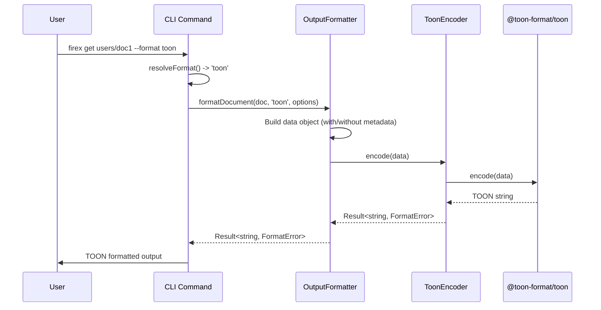

# Design: toon-output-format

## Overview

**Purpose**: 本機能はfirex CLIの出力フォーマットオプションにTOON（Token-Oriented Object Notation）形式を追加する。TOONはLLM向けに最適化されたコンパクトなJSON互換フォーマットであり、JSONと比較して約40-60%のトークン削減が可能。

**Users**: 開発者およびAIアシスタント（MCP経由）が、Firestoreデータをトークン効率良く取得するために使用する。

**Impact**: 既存のOutputFormatterクラスに新しい出力形式を追加し、OutputFormat型を拡張する。既存のjson/yaml/table形式は維持される。

### Goals

- TOONフォーマットを全てのドキュメント操作コマンドで利用可能にする
- 既存のコマンドフラグ体系（`--format`, `--toon`）と一貫性のある実装
- MCP経由でのTOON出力をサポートし、AIアシスタントとの連携を最適化
- 型安全なOutputFormat拡張

### Non-Goals

- TOON入力（デコード）のサポート（出力のみ）
- TOON形式のファイルインポート/エクスポート最適化
- カスタムTOONスキーマ定義機能

## Architecture

### Existing Architecture Analysis

現在の出力フォーマット処理は以下の構造で実装されている:

- `OutputFormatter`クラス（`src/presentation/output-formatter.ts`）がjson/yaml/tableの各形式を処理
- `OutputFormat`型（`src/shared/types.ts`）が有効な形式を型レベルで制限
- `BaseCommand`クラス（`src/commands/base-command.ts`）が`--format`フラグと`resolveFormat`メソッドを提供
- MCPツールは各ツール内で直接`JSON.stringify`を呼び出している

**パターン**:
- neverthrowによるResult型でのエラーハンドリング
- switch文による形式分岐
- FormatErrorタイプによる統一的エラー表現

### Architecture Pattern & Boundary Map

```mermaid
graph TB
    subgraph Commands Layer
        BC[BaseCommand<br/>--format toon フラグ追加]
        GetCmd[GetCommand]
        ListCmd[ListCommand]
        OtherCmds[Other Commands]
    end

    subgraph Presentation Layer
        OF[OutputFormatter<br/>formatDocument/formatDocuments<br/>formatChange/formatCollections]
        TE[ToonEncoder<br/>@toon-format/toon wrapper]
    end

    subgraph MCP Layer
        MCPTools[MCP Tools<br/>format パラメータ追加]
    end

    subgraph Shared Layer
        Types[types.ts<br/>OutputFormat型拡張]
    end

    BC --> GetCmd
    BC --> ListCmd
    BC --> OtherCmds
    GetCmd --> OF
    ListCmd --> OF
    OtherCmds --> OF
    MCPTools --> OF
    OF --> TE
    OF --> Types
    BC --> Types
```

**Architecture Integration**:
- Selected pattern: 既存のOutputFormatterへのcase追加（Strategy pattern維持）
- Domain/feature boundaries: Presentation層に閉じた変更、Domain層への影響なし
- Existing patterns preserved: Result型エラーハンドリング、switch文による形式分岐
- New components rationale: ToonEncoderラッパーを導入し、外部依存を分離
- Steering compliance: TypeScript strict mode、neverthrow、既存の出力形式パターン維持

### Technology Stack

| Layer | Choice / Version | Role in Feature | Notes |
|-------|------------------|-----------------|-------|
| External Library | @toon-format/toon (latest) | JSON to TOON変換 | 公式TypeScript SDK |
| Presentation | OutputFormatter | 出力形式統合 | 既存クラス拡張 |
| Shared | types.ts | OutputFormat型定義 | 'toon'追加 |
| CLI | BaseCommand | フラグ定義 | --toon, --format toon |

## System Flows

### TOON出力フロー



## Requirements Traceability

| Requirement | Summary | Components | Interfaces | Flows |
|-------------|---------|------------|------------|-------|
| 1.1, 1.2, 1.3 | TOON出力形式のサポート | OutputFormatter, ToonEncoder | formatDocument, formatDocuments | TOON出力フロー |
| 2.1-2.6 | ドキュメント操作でのTOON出力 | OutputFormatter, Commands | formatDocument, formatDocuments | TOON出力フロー |
| 3.1, 3.2 | メタデータのTOON形式対応 | OutputFormatter | FormatOptions.includeMetadata | TOON出力フロー |
| 4.1, 4.2 | Watch機能でのTOON出力 | OutputFormatter, WatchService | formatChange | TOON出力フロー |
| 5.1, 5.2 | コレクション一覧のTOON出力 | OutputFormatter | formatCollections | TOON出力フロー |
| 6.1, 6.2 | MCP経由でのTOON出力 | MCP Tools, OutputFormatter | format parameter | TOON出力フロー |
| 7.1, 7.2 | エラーハンドリング | OutputFormatter, ToonEncoder | FormatError | TOON出力フロー |
| 8.1, 8.2 | 型定義の更新 | types.ts, OutputFormatter | OutputFormat | - |

## Components and Interfaces

| Component | Domain/Layer | Intent | Req Coverage | Key Dependencies | Contracts |
|-----------|--------------|--------|--------------|------------------|-----------|
| OutputFormatter | Presentation | 出力形式変換の統合 | 1.1-1.3, 2.1-2.6, 3.1-3.2, 4.1-4.2, 5.1-5.2, 7.1-7.2 | ToonEncoder (P0) | Service |
| ToonEncoder | Presentation | @toon-format/toonラッパー | 1.1, 7.1-7.2 | @toon-format/toon (P0) | Service |
| BaseCommand | Commands | フラグ定義・解決 | 1.1, 8.1 | types.ts (P0) | - |
| MCP Tools | MCP | format パラメータ追加 | 6.1, 6.2 | OutputFormatter (P0) | API |
| types.ts | Shared | OutputFormat型定義 | 8.1, 8.2 | - | State |

### Presentation Layer

#### ToonEncoder

| Field | Detail |
|-------|--------|
| Intent | @toon-format/toonライブラリのラッパー、エラーハンドリング統合 |
| Requirements | 1.1, 7.1, 7.2 |

**Responsibilities & Constraints**
- @toon-format/toonの`encode`関数をラップ
- neverthrowのResult型でエラーを返却
- 変換失敗時のエラーメッセージを日本語で提供

**Dependencies**
- External: @toon-format/toon - TOON変換 (P0)

**Contracts**: Service [x]

##### Service Interface

```typescript
import { Result } from 'neverthrow';
import { FormatError } from './output-formatter';

/**
 * TOON encoder service
 * Wraps @toon-format/toon library with Result-based error handling
 */
export class ToonEncoder {
  /**
   * Encode data to TOON format
   * @param data - JSON-compatible data to encode
   * @returns Result containing TOON string or FormatError
   */
  encode(data: unknown): Result<string, FormatError>;
}
```

- Preconditions: dataはJSON互換のオブジェクト/配列/プリミティブ
- Postconditions: 成功時はTOON形式文字列、失敗時はFormatError
- Invariants: NaN/Infinityはnullに変換される（TOON仕様）

**Implementation Notes**
- Integration: @toon-format/toonの`encode`関数を使用
- Validation: 入力データの型チェックは不要（encode関数が処理）
- Risks: ライブラリのバージョン互換性

#### OutputFormatter（拡張）

| Field | Detail |
|-------|--------|
| Intent | 既存の出力形式変換に'toon'形式を追加 |
| Requirements | 1.1-1.3, 2.1-2.6, 3.1-3.2, 4.1-4.2, 5.1-5.2, 7.1-7.2 |

**Responsibilities & Constraints**
- 既存のformatDocument, formatDocuments, formatChange, formatCollectionsメソッドにtoonケースを追加
- ToonEncoderを使用してJSON互換データをTOONに変換
- 既存のjson/yaml/tableロジックは変更なし

**Dependencies**
- Inbound: Commands, MCP Tools - 出力形式変換 (P0)
- Internal: ToonEncoder - TOON変換 (P0)

**Contracts**: Service [x]

##### Service Interface（変更箇所のみ）

```typescript
import { Result } from 'neverthrow';

// 既存メソッドのformat引数がOutputFormat型を受け取る
// OutputFormatに'toon'が追加されることで自動的にサポート

/**
 * Format a single document
 * @param document - Document with metadata
 * @param format - Output format: 'json' | 'yaml' | 'table' | 'toon'
 * @param options - Format options
 */
formatDocument(
  document: DocumentWithMeta,
  format: OutputFormat,
  options?: FormatOptions
): Result<string, FormatError>;

// formatDocuments, formatChange, formatCollections も同様
```

**Implementation Notes**
- Integration: 各メソッドのswitch文にcase 'toon'を追加
- Validation: 不正な形式文字列はdefaultケースでFORMAT_ERRORを返却（既存動作）
- Risks: なし（後方互換性維持）

### Commands Layer

#### BaseCommand（拡張）

| Field | Detail |
|-------|--------|
| Intent | --toonフラグとformat optionsの拡張 |
| Requirements | 1.1, 8.1 |

**Responsibilities & Constraints**
- baseFlagsに`toon`ブールフラグを追加
- `resolveFormat`メソッドで`--toon`を処理
- formatフラグのoptions配列に'toon'を追加

**Implementation Notes**

**フラグ優先順位**:
- ブールフラグ (`--json`, `--yaml`, `--table`, `--toon`) は `--format` より優先される
- 例: `--format json --toon` の場合、`--toon` が優先され 'toon' が返却される
- この動作は既存の `--json`, `--yaml`, `--table` フラグと一貫性がある

```typescript
// baseFlags拡張
static baseFlags = {
  // ...existing flags...
  format: Flags.string({
    char: 'f',
    description: t('flag.format'),
    options: ['json', 'yaml', 'table', 'toon'],  // toon追加
    default: 'json',
  }),
  toon: Flags.boolean({
    description: t('flag.toon'),  // i18nに追加が必要
    default: false,
    exclusive: ['json', 'yaml', 'table'],
  }),
};

// resolveFormat拡張
// 優先順位: ブールフラグ > --format > デフォルト('json')
protected resolveFormat(flags: {
  format?: string;
  json?: boolean;
  yaml?: boolean;
  table?: boolean;
  toon?: boolean;
}): OutputFormat {
  if (flags.json) return 'json';
  if (flags.yaml) return 'yaml';
  if (flags.table) return 'table';
  if (flags.toon) return 'toon';
  return (flags.format || 'json') as OutputFormat;
}
```

### MCP Layer

#### MCP Tools（拡張）

| Field | Detail |
|-------|--------|
| Intent | 各MCPツールにformatパラメータを追加 |
| Requirements | 6.1, 6.2 |

**Responsibilities & Constraints**
- 各MCPツール（get, list, set, update, delete, export, collections）にformatオプションを追加
- デフォルトはjson（既存動作維持）
- OutputFormatterを使用して形式変換

**Contracts**: API [x]

##### API Contract

| Tool | Parameter | Type | Default | Description |
|------|-----------|------|---------|-------------|
| firestore_get | format | 'json' \| 'toon' | 'json' | 出力形式 |
| firestore_list | format | 'json' \| 'toon' | 'json' | 出力形式 |
| firestore_set | format | 'json' \| 'toon' | 'json' | 出力形式 |
| firestore_update | format | 'json' \| 'toon' | 'json' | 出力形式 |
| firestore_delete | format | 'json' \| 'toon' | 'json' | 出力形式 |
| firestore_export | format | 'json' \| 'toon' | 'json' | 出力形式 |
| firestore_collections | format | 'json' \| 'toon' | 'json' | 出力形式 |

**Implementation Notes**

```typescript
// 例: get.ts の変更
const GetSchema = {
  path: z.string().describe('Document path (e.g., users/user123)'),
  format: z.enum(['json', 'toon']).optional().default('json')
    .describe('Output format (json or toon)'),
};

// ツールハンドラー内
const outputFormatter = new OutputFormatter();
const formatResult = outputFormatter.formatDocument(
  { data: doc.data, metadata: doc.metadata },
  format,
  { includeMetadata: true }
);

if (formatResult.isErr()) {
  return {
    content: [{ type: 'text' as const, text: `Error: ${formatResult.error.message}` }],
    isError: true,
  };
}

return {
  content: [{ type: 'text' as const, text: formatResult.value }],
};
```

### Shared Layer

#### types.ts（拡張）

| Field | Detail |
|-------|--------|
| Intent | OutputFormat型に'toon'を追加 |
| Requirements | 8.1, 8.2 |

##### State Management

```typescript
/**
 * Output format types
 */
export type OutputFormat = 'json' | 'yaml' | 'table' | 'toon';
```

**Implementation Notes**
- 型定義のみの変更
- 既存コードは型エラーなしでコンパイル可能

### i18n拡張

```typescript
// Messages interface追加
'flag.toon': string;

// jaMessages追加
'flag.toon': 'TOON形式で出力 (--format=toon のエイリアス)',

// enMessages追加
'flag.toon': 'Output in TOON format (alias for --format=toon)',
```

## Data Models

### Domain Model

本機能はデータモデルの変更を伴わない。既存のDocumentWithMeta、DocumentMetadata、DocumentChangeの構造をそのまま使用し、出力時の形式変換のみを行う。

### Data Contracts & Integration

**TOON出力例（ドキュメント）**:
```
data:
  name: John Doe
  age: 30
  email: john@example.com
_metadata:
  id: user123
  path: users/user123
  createTime: 2025-01-01T00:00:00.000Z
  updateTime: 2025-01-15T12:30:00.000Z
```

**TOON出力例（複数ドキュメント - tabular形式）**:
```
[3]{name,age,email,_metadata}:
  John Doe,30,john@example.com,{id:user1,path:users/user1}
  Jane Doe,25,jane@example.com,{id:user2,path:users/user2}
  Bob Smith,35,bob@example.com,{id:user3,path:users/user3}
```

**注意**: TOON形式は均一な配列（同じフィールド構造を持つオブジェクト配列）で最大のトークン削減効果を発揮する。Firestoreのドキュメントリストはこのパターンに適合しやすい。

## Error Handling

### Error Strategy

TOONエンコードエラーは既存のFormatError型を使用し、一貫したエラーハンドリングを維持する。

### Error Categories and Responses

**User Errors (FORMAT_ERROR)**:
- 無効なデータ構造 -> 「TOON形式への変換に失敗しました: [詳細]」
- サポートされていない形式指定 -> 「サポートされていない出力形式です: [形式名]」（既存メッセージ）

**System Errors**:
- @toon-format/toonライブラリ内部エラー -> FormatErrorでラップして返却
- NaN/Infinity値 -> nullに変換（TOON仕様に従う、エラーではない）

### Monitoring

- 既存のLoggingServiceによるエラーログ出力
- verboseモード時の詳細エラー情報表示

## Testing Strategy

### Unit Tests

1. **ToonEncoder.encode** - 各種データ型（オブジェクト、配列、プリミティブ、null）のエンコード
2. **ToonEncoder.encode** - NaN/Infinityのnull変換確認
3. **OutputFormatter.formatDocument** - toon形式での単一ドキュメント出力
4. **OutputFormatter.formatDocuments** - toon形式での複数ドキュメント出力（tabular形式確認）
5. **OutputFormatter.formatChange** - toon形式での変更イベント出力
6. **OutputFormatter.formatCollections** - toon形式でのコレクション一覧出力
7. **BaseCommand.resolveFormat** - --toonフラグの解決

### Integration Tests

1. **get command + --format toon** - 単一ドキュメント取得のTOON出力
2. **list command + --toon** - 複数ドキュメント取得のTOON出力
3. **MCP firestore_get + format: toon** - MCP経由でのTOON出力
4. **watch mode + --format toon** - リアルタイム監視のTOON出力

### E2E Tests

1. **firex get users/doc1 --format toon** - CLI実行からTOON出力確認
2. **firex list users --toon --limit 10** - 複数ドキュメントのTOON出力確認
3. **firex collections --format toon** - コレクション一覧のTOON出力確認

## Optional Sections

### Performance & Scalability

**Token Efficiency**:
- TOON形式はJSONと比較して40-60%のトークン削減が期待される
- 均一な配列（同じスキーマのドキュメント群）で最大の効果
- 深くネストされた非均一構造ではJSONとの差が縮小

**Encoding Performance**:
- @toon-format/toonのエンコード処理は軽量
- 大量ドキュメント（1000件以上）の場合もJSON.stringifyと同等のパフォーマンス

### Security Considerations

- TOON形式は出力のみであり、セキュリティリスクは限定的
- 入力パースを行わないため、インジェクション攻撃のリスクなし
- 機密データの扱いは既存のJSON/YAML形式と同等

## Supporting References

### @toon-format/toon API

```typescript
import { encode, decode } from '@toon-format/toon';

// Encode JSON-compatible data to TOON
const toonString = encode(data);

// Decode TOON back to JSON (not used in this feature)
const jsonData = decode(toonString);
```

### TOON Format Specification

- 公式仕様: https://github.com/toon-format/spec
- TypeScript SDK: https://github.com/toon-format/toon
- NPMパッケージ: `@toon-format/toon`
