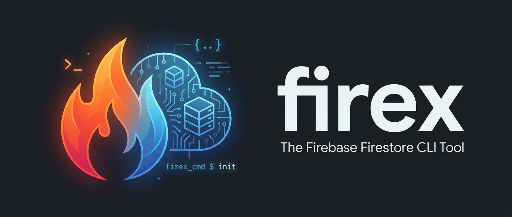

English | **[日本語](README-jp.md)**



# firex

Firebase Firestore CLI tool for command-line operations.

`firex` is a powerful command-line interface tool for managing Firebase Firestore databases. It allows developers to perform CRUD operations, execute queries, and manage data efficiently without relying on the Firebase Console GUI.

## Features

- **Document Operations**: Read, create, update, and delete Firestore documents
- **Collection Queries**: List documents with filtering, sorting, and pagination
- **Batch Operations**: Import and export collections to/from JSON files
- **Real-time Monitoring**: Watch documents and collections for changes with `--watch` flag
- **Multiple Output Formats**: JSON, YAML, and table format support
- **Configuration Profiles**: Support for multiple project configurations
- **Type-safe**: Built with TypeScript for reliability

## Installation

```bash
# Using npx (recommended - no installation required)
npx @hummer98/firex [command]

# Global installation
npm install -g @hummer98/firex

# Or with pnpm
pnpm add -g @hummer98/firex
```

## Quick Start

### 1. Authentication Setup

firex uses Firebase Admin SDK for authentication. You have several options:

**Option A: Service Account Key (Recommended for production)**
```bash
# Set environment variable
export GOOGLE_APPLICATION_CREDENTIALS=/path/to/service-account.json

# Or specify with flag
firex get users/user123 --credential-path=/path/to/service-account.json
```

**Option B: Application Default Credentials (ADC)**
```bash
# Login with gcloud
gcloud auth application-default login
```

**Option C: Firestore Emulator (for development)**
```bash
# Start the emulator
firebase emulators:start --only firestore

# Set environment variable
export FIRESTORE_EMULATOR_HOST=localhost:8080
```

### 2. Configuration File (Optional)

Create a `.firex.yaml` file in your project root:

```yaml
# .firex.yaml
projectId: your-project-id
credentialPath: ./service-account.json
defaultListLimit: 100
watchShowInitial: true

# Multiple profiles
profiles:
  staging:
    projectId: your-staging-project
  production:
    projectId: your-production-project
```

### 3. Basic Usage

```bash
# Read a document
firex get users/user123

# List documents in a collection
firex list users

# Create/update a document
firex set users/user123 '{"name": "John", "email": "john@example.com"}'

# Delete a document
firex delete users/user123

# Query with filters
firex list users --where "status==active" --limit 10

# Watch for changes
firex get users/user123 --watch
```

## Command Reference

### get - Read Document

Read a single Firestore document.

```bash
firex get <document-path> [options]
```

**Options:**
- `--format, -f <format>`: Output format (json, yaml, table). Default: json
- `--watch, -w`: Watch document for real-time changes
- `--show-initial`: Show initial data in watch mode (default: true)
- `--project-id <id>`: Firebase project ID
- `--credential-path <path>`: Path to service account key file
- `--verbose, -v`: Enable verbose output

**Examples:**
```bash
# Read document in JSON format
firex get users/user123 --format json

# Read document in table format
firex get users/user123 --format table

# Watch document for changes
firex get users/user123 --watch
```

### list - List/Query Documents

List documents in a collection with optional filtering.

```bash
firex list <collection-path> [options]
```

**Options:**
- `--where, -W <condition>`: Filter condition (field==value). Can be specified multiple times
- `--order-by, -o <field>`: Field to sort by
- `--order-dir <direction>`: Sort direction (asc, desc). Default: asc
- `--limit, -l <number>`: Maximum documents to return. Default: 100
- `--format, -f <format>`: Output format (json, yaml, table). Default: json
- `--watch, -w`: Watch collection for real-time changes

**Examples:**
```bash
# List all users
firex list users

# List with filter
firex list users --where "status==active"

# List with multiple filters and sorting
firex list products --where "category==electronics" --where "price>100" --order-by price --order-dir desc

# Watch collection for changes
firex list orders --watch
```

### set - Create/Update Document

Create a new document or overwrite an existing one.

```bash
firex set <document-path> <data> [options]
```

**Options:**
- `--merge, -m`: Merge with existing data instead of overwriting
- `--from-file <path>`: Read data from JSON file

**Examples:**
```bash
# Create/overwrite document
firex set users/user123 '{"name": "John", "email": "john@example.com"}'

# Merge with existing data
firex set users/user123 '{"phone": "123-456-7890"}' --merge

# From file
firex set users/user123 --from-file user-data.json
```

### update - Partial Update

Update specific fields of an existing document (alias for `set --merge`).

```bash
firex update <document-path> <data> [options]
```

**Examples:**
```bash
# Update specific fields
firex update users/user123 '{"lastLogin": "2024-01-15"}'

# Update from file
firex update users/user123 --from-file updates.json
```

### delete - Delete Document/Collection

Delete a document or entire collection.

```bash
firex delete <path> [options]
```

**Options:**
- `--recursive, -r`: Delete collection and all documents recursively
- `--yes, -y`: Skip confirmation prompt

**Examples:**
```bash
# Delete single document
firex delete users/user123

# Delete with confirmation skip
firex delete users/user123 --yes

# Delete entire collection
firex delete users --recursive
```

### export - Export Collection

Export a collection to a JSON file.

```bash
firex export <collection-path> [options]
```

**Options:**
- `--output, -o <path>`: Output file path. Default: <collection>.json
- `--include-subcollections`: Include subcollections in export

**Examples:**
```bash
# Export collection
firex export users --output backup.json

# Export with subcollections
firex export users --output full-backup.json --include-subcollections
```

### import - Import Data

Import documents from a JSON file.

```bash
firex import <file-path> [options]
```

**Options:**
- `--batch-size <number>`: Batch size for imports. Default: 500 (Firestore maximum)

**Examples:**
```bash
# Import data
firex import backup.json

# Import with custom batch size
firex import large-dataset.json --batch-size 250
```

### config - Show Configuration

Display current configuration settings.

```bash
firex config [options]
```

**Options:**
- `--show`: Show current configuration values

**Examples:**
```bash
# Show configuration
firex config --show
```

### examples - Show Usage Examples

Display common usage examples.

```bash
firex examples
```

## Configuration File

firex looks for configuration files in the following order:

1. `.firex.yaml` / `.firex.yml` in current directory
2. `.firex.json` in current directory
3. `firex` key in `package.json`
4. Parent directories (up to project root)
5. Home directory (`~/.firex.yaml`)

### Configuration Options

```yaml
# Project configuration
projectId: your-firebase-project-id
credentialPath: ./path/to/service-account.json
databaseURL: https://your-project.firebaseio.com

# Default settings
defaultListLimit: 100    # Default limit for list command
watchShowInitial: true   # Show initial data in watch mode

# Logging
verbose: false
logFile: ./firex.log

# Profile configurations
profiles:
  development:
    projectId: dev-project
    emulatorHost: localhost:8080
  staging:
    projectId: staging-project
  production:
    projectId: prod-project
    credentialPath: ./prod-service-account.json
```

### Using Profiles

```bash
# Use specific profile
firex list users --profile staging
```

## Environment Variables

| Variable | Description |
|----------|-------------|
| `GOOGLE_APPLICATION_CREDENTIALS` | Path to service account key file |
| `FIRESTORE_PROJECT_ID` | Firebase project ID |
| `FIRESTORE_EMULATOR_HOST` | Firestore emulator host (e.g., localhost:8080) |
| `FIRESTORE_DATABASE_URL` | Firestore database URL |
| `FIREX_DEFAULT_LIMIT` | Default limit for list command |
| `FIREX_WATCH_SHOW_INITIAL` | Show initial data in watch mode (true/false) |
| `FIREX_VERBOSE` | Enable verbose output (true/false) |
| `FIREX_LOG_FILE` | Path to log file |

## Troubleshooting

### Authentication Errors

**"INVALID_CREDENTIALS" error**
- Verify your service account key file path is correct
- Ensure the service account has necessary Firestore permissions
- Check file permissions (should be readable only by owner: `chmod 600`)

**"PROJECT_NOT_FOUND" error**
- Verify the project ID is correct
- Ensure Firestore is enabled in Firebase Console

**"PERMISSION_DENIED" error**
- Check Firestore Security Rules
- Verify service account has required IAM roles (Firebase Admin, Cloud Datastore User)

### Connection Issues

**"CONNECTION_TIMEOUT" error**
- Check network connectivity
- Verify firewall settings allow outbound HTTPS
- Try again - this error is often transient

**Emulator Connection Failed**
- Ensure emulator is running: `firebase emulators:start --only firestore`
- Check `FIRESTORE_EMULATOR_HOST` environment variable
- Verify emulator port is not in use

### Common Issues

**"INVALID_PATH" error**
- Document paths must have even segments (collection/doc)
- Collection paths must have odd segments (collection)
- Paths cannot start or end with `/`

**"VALIDATION_ERROR" for JSON data**
- Ensure JSON is valid (use a JSON validator)
- Firestore does not support `undefined`, functions, or symbols
- Nested objects must be plain objects

## Security Considerations

### Service Account Key Protection

- **Never commit** service account keys to version control
- Add to `.gitignore`:
  ```
  *-service-account.json
  service-account*.json
  *.pem
  ```
- Set file permissions to owner-only: `chmod 600 service-account.json`
- Use environment variables or secret managers in CI/CD

### Export File Security

- Exported data may contain sensitive information
- Store exports with restricted permissions
- Consider encrypting backups
- Delete temporary export files after use

### Logging

- firex automatically masks credentials in logs
- Avoid logging full document contents in production
- Review log files before sharing for debugging

## Development

### Build

```bash
npm run build      # Production build
npm run dev        # Development mode (watch)
```

### Test

```bash
npm test                    # Run all tests
npm run test:coverage       # With coverage
npm run typecheck           # TypeScript type check
```

### Project Structure

```
src/
├── shared/          # Shared types
├── services/        # Application Layer (Config, Auth, Logging)
├── domain/          # Domain Layer (FirestoreOps, QueryBuilder, etc.)
├── presentation/    # Output formatting, prompts
├── commands/        # CLI commands (get, set, list, etc.)
└── index.ts         # Entry point
```

## Requirements

- Node.js 18 or later
- Firebase project with Firestore enabled
- Service account with Firestore access (or ADC)

## License

MIT

## Contributing

Contributions are welcome! Please see [CONTRIBUTING.md](CONTRIBUTING.md) for guidelines.
